# Analyze阶段：交互表达子系统架构设计

## 1. 阶段概述

Analyze阶段是交互表达子系统开发的第二阶段，基于Ask阶段确定的需求，进行系统的整体架构设计。本阶段的目标是设计一个高效、可扩展、安全的交互表达子系统架构，能够满足多模态交互处理、情感表达与理解、个性化交互适配和上下文感知交互等核心需求，为后续的技术实施提供详细的架构指导。

## 2. 总体架构设计

### 2.1 设计原则

#### 2.1.1 模块化设计原则
- **高内聚低耦合**：各模块内部功能高度相关，模块之间依赖最小化
- **接口标准化**：定义清晰的模块间接口，便于模块替换和升级
- **功能可组合**：支持模块功能的灵活组合，满足不同场景需求
- **可测试性**：每个模块都可以独立测试，提高系统可维护性

#### 2.1.2 可扩展性设计原则
- **水平扩展能力**：支持通过增加节点实现系统处理能力的线性扩展
- **功能扩展能力**：支持新交互模态和新功能的模块化扩展
- **数据扩展能力**：支持用户数据和交互历史的大规模扩展
- **性能扩展能力**：支持系统性能的按需扩展和优化

#### 2.1.3 安全性设计原则
- **纵深防御**：多层次安全防护，确保系统安全
- **最小权限**：每个组件只授予必要的最小权限
- **数据保护**：全程加密保护用户数据和隐私
- **安全审计**：完整记录系统操作，支持安全审计

#### 2.1.4 用户体验设计原则
- **自然交互**：交互方式自然流畅，接近人类交流方式
- **响应及时**：快速响应用户输入，减少等待时间
- **个性化适配**：根据用户特点提供个性化交互体验
- **容错友好**：对用户错误输入提供友好提示和纠正

### 2.2 架构风格选择

#### 2.2.1 微服务架构
- **服务拆分**：将系统拆分为多个独立服务，每个服务负责特定功能
- **服务自治**：每个服务独立开发、部署和扩展
- **API通信**：服务间通过标准化API进行通信
- **服务发现**：实现服务的自动发现和注册

#### 2.2.2 事件驱动架构
- **事件发布订阅**：基于事件发布订阅模式实现组件间通信
- **异步处理**：支持异步事件处理，提高系统响应能力
- **事件溯源**：记录所有事件，支持系统状态回溯和恢复
- **CQRS模式**：命令查询责任分离，优化系统读写性能

#### 2.2.3 分层架构
- **表示层**：负责用户交互和界面展示
- **业务逻辑层**：实现核心业务逻辑和规则
- **数据访问层**：负责数据存储和检索
- **基础设施层**：提供通用技术服务和支撑

### 2.3 架构总览

#### 2.3.1 架构图

```mermaid
graph TB
    subgraph "交互表达子系统"
        subgraph "接入层"
            API[API网关]
            WS[WebSocket服务]
            RT[实时通信服务]
        end
        
        subgraph "处理层"
            subgraph "多模态处理服务"
                AS[音频处理服务]
                VS[视频处理服务]
                TS[文本处理服务]
                IS[图像处理服务]
                GS[手势处理服务]
            end
            
            subgraph "情感处理服务"
                ER[情感识别服务]
                EG[情感生成服务]
                EM[情感记忆服务]
                EA[情感适应服务]
            end
            
            subgraph "个性化服务"
                UP[用户画像服务]
                IS2[交互风格服务]
                CP[内容个性化服务]
                RC[节奏控制服务]
            end
            
            subgraph "上下文服务"
                SCM[短期上下文管理]
                MCM[中期上下文管理]
                LCM[长期上下文管理]
                CMF[跨模态上下文融合]
            end
        end
        
        subgraph "协调层"
            ORC[交互协调器]
            SCM2[会话管理器]
            QM[队列管理器]
            LM[负载管理器]
        end
        
        subgraph "数据层"
            subgraph "数据存储"
                UDB[(用户数据库)]
                CDB[(内容数据库)]
                IDB[(交互数据库)]
                KDB[(知识数据库)]
            end
            
            subgraph "缓存服务"
                UC[(用户缓存)]
                CC[(内容缓存)]
                SC[(会话缓存)]
            end
            
            subgraph "消息队列"
                MQ[消息队列]
                ES[事件流]
            end
        end
    end
    
    subgraph "外部系统"
        PS[感知处理子系统]
        CS[认知决策子系统]
        MS[记忆存储子系统]
        SAS[自我意识子系统]
    end
    
    PS --> ORC
    CS --> ORC
    MS --> UDB
    SAS --> ORC
    
    API --> ORC
    WS --> ORC
    RT --> ORC
    
    ORC --> AS
    ORC --> VS
    ORC --> TS
    ORC --> IS
    ORC --> GS
    
    ORC --> ER
    ORC --> EG
    ORC --> EM
    ORC --> EA
    
    ORC --> UP
    ORC --> IS2
    ORC --> CP
    ORC --> RC
    
    ORC --> SCM
    ORC --> MCM
    ORC --> LCM
    ORC --> CMF
    
    AS --> UDB
    VS --> UDB
    TS --> UDB
    IS --> UDB
    GS --> UDB
    
    ER --> IDB
    EG --> IDB
    EM --> IDB
    EA --> IDB
    
    UP --> UDB
    IS2 --> UDB
    CP --> CDB
    RC --> IDB
    
    SCM --> SC
    MCM --> SC
    LCM --> UDB
    CMF --> IDB
    
    ORC --> MQ
    MQ --> ES
```

#### 2.3.2 架构组件说明

##### 2.3.2.1 接入层
- **API网关**：统一入口，负责请求路由、认证授权、流量控制
- **WebSocket服务**：处理实时双向通信，支持低延迟交互
- **实时通信服务**：处理音视频实时流，支持实时交互场景

##### 2.3.2.2 处理层
- **多模态处理服务**：处理不同模态的输入和输出，包括音频、视频、文本、图像、手势等
- **情感处理服务**：处理情感识别、生成、记忆和适应等功能
- **个性化服务**：处理用户画像、交互风格、内容个性化和节奏控制等功能
- **上下文服务**：处理短期、中期、长期上下文管理和跨模态上下文融合

##### 2.3.2.3 协调层
- **交互协调器**：协调各服务间的交互，确保交互流程的连贯性
- **会话管理器**：管理用户会话状态，维护会话上下文
- **队列管理器**：管理任务队列，优化任务调度和执行
- **负载管理器**：监控系统负载，动态调整资源分配

##### 2.3.2.4 数据层
- **数据存储**：包括用户数据库、内容数据库、交互数据库和知识数据库
- **缓存服务**：包括用户缓存、内容缓存和会话缓存，提高访问速度
- **消息队列**：处理异步消息，支持服务间解耦通信

## 3. 核心模块架构设计

### 3.1 多模态处理模块

#### 3.1.1 模块概述
多模态处理模块是交互表达子系统的核心模块，负责处理不同模态的输入和输出，包括音频、视频、文本、图像和手势等。该模块将不同模态的数据转换为统一的内部表示，并支持多模态数据的融合和生成。

#### 3.1.2 模块架构

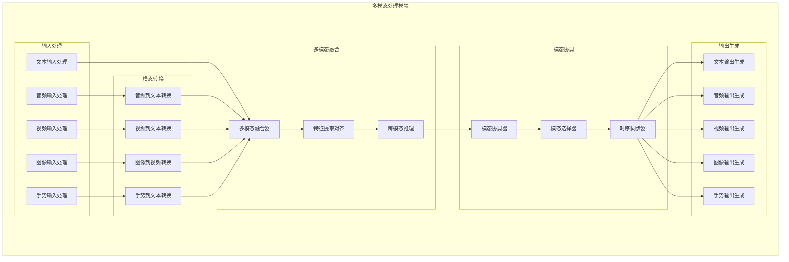

#### 3.1.3 核心组件设计

##### 3.1.3.1 音频输入处理组件
- **功能**：处理音频输入，包括语音识别、语音情感分析、语音活动检测等
- **接口**：
  - `process_audio(audio_data, metadata)`: 处理音频数据
  - `detect_speech_activity(audio_stream)`: 检测语音活动
  - `recognize_speech(audio_segment)`: 识别语音内容
  - `analyze_emotion(audio_segment)`: 分析语音情感
- **技术实现**：基于深度学习的语音识别和情感分析模型，如Wav2Vec2、HuBERT等

##### 3.1.3.2 视频输入处理组件
- **功能**：处理视频输入，包括人脸检测、表情识别、动作识别等
- **接口**：
  - `process_video(video_data, metadata)`: 处理视频数据
  - `detect_faces(video_frame)`: 检测人脸
  - `recognize_expressions(face_region)`: 识别表情
  - `recognize_actions(video_segment)`: 识别动作
- **技术实现**：基于计算机视觉的深度学习模型，如MTCNN、FaceNet、OpenPose等

##### 3.1.3.3 文本输入处理组件
- **功能**：处理文本输入，包括文本理解、意图识别、情感分析等
- **接口**：
  - `process_text(text_data, metadata)`: 处理文本数据
  - `understand_text(text)`: 理解文本内容
  - `recognize_intent(text)`: 识别用户意图
  - `analyze_sentiment(text)`: 分析文本情感
- **技术实现**：基于自然语言处理的深度学习模型，如BERT、GPT、RoBERTa等

##### 3.1.3.4 图像输入处理组件
- **功能**：处理图像输入，包括物体识别、场景理解、图像描述等
- **接口**：
  - `process_image(image_data, metadata)`: 处理图像数据
  - `recognize_objects(image)`: 识别图像中的物体
  - `understand_scene(image)`: 理解图像场景
  - `generate_description(image)`: 生成图像描述
- **技术实现**：基于计算机视觉的深度学习模型，如YOLO、R-CNN、CLIP等

##### 3.1.3.5 手势输入处理组件
- **功能**：处理手势输入，包括手势识别、手势理解、手势意图分析等
- **接口**：
  - `process_gesture(gesture_data, metadata)`: 处理手势数据
  - `recognize_gesture(gesture_sequence)`: 识别手势
  - `understand_gesture(gesture)`: 理解手势含义
  - `analyze_intent(gesture)`: 分析手势意图
- **技术实现**：基于手势识别的深度学习模型，如MediaPipe、Gesture Recognition等

##### 3.1.3.6 多模态融合器组件
- **功能**：融合不同模态的信息，生成统一的内部表示
- **接口**：
  - `fuse_modalities(modalities, context)`: 融合多模态信息
  - `extract_features(modalities)`: 提取多模态特征
  - `align_features(features)`: 对齐多模态特征
  - `cross_modal_reasoning(features)`: 跨模态推理
- **技术实现**：基于多模态融合的深度学习模型，如Multimodal Transformer、VL-BERT等

##### 3.1.3.7 模态协调器组件
- **功能**：协调不同模态的输出，确保输出的一致性和连贯性
- **接口**：
  - `coordinate_modalities(output_intents, context)`: 协调多模态输出
  - `select_modalities(output_intents)`: 选择合适的输出模态
  - `synchronize_timing(modalities)`: 同步多模态输出时序
  - `ensure_consistency(modalities)`: 确保多模态输出一致性
- **技术实现**：基于规则和机器学习的混合方法，结合领域知识进行协调

### 3.2 情感处理模块

#### 3.2.1 模块概述
情感处理模块负责处理情感识别、生成、记忆和适应等功能，使系统能够理解用户情感状态，表达适当的情感，并根据用户情感状态调整交互策略，提供更加自然和人性化的交互体验。

#### 3.2.2 模块架构

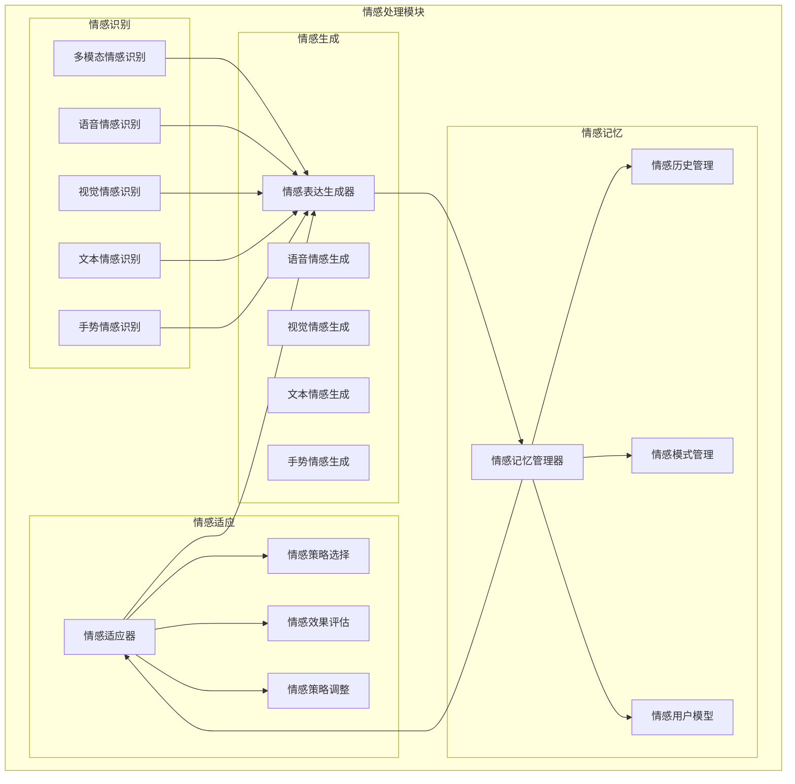

#### 3.2.3 核心组件设计

##### 3.2.3.1 多模态情感识别组件
- **功能**：从多模态数据中识别用户情感状态
- **接口**：
  - `recognize_emotion(modalities, context)`: 识别多模态情感
  - `extract_emotional_features(modalities)`: 提取情感特征
  - `fuse_emotional_features(features)`: 融合情感特征
  - `classify_emotion(features)`: 分类情感状态
- **技术实现**：基于多模态情感识别的深度学习模型，融合语音、视觉、文本等多模态信息

##### 3.2.3.2 情感表达生成器组件
- **功能**：根据系统情感状态生成多模态情感表达
- **接口**：
  - `generate_emotional_expression(emotion, context)`: 生成情感表达
  - `select_expression_modality(emotion, context)`: 选择表达模态
  - `generate_vocal_emotion(emotion, text)`: 生成语音情感
  - `generate_visual_emotion(emotion)`: 生成视觉情感
- **技术实现**：基于情感生成的深度学习模型，如情感语音合成、情感面部生成等

##### 3.2.3.3 情感记忆管理器组件
- **功能**：管理情感历史和模式，构建情感用户模型
- **接口**：
  - `store_emotional_state(user_id, emotion, context)`: 存储情感状态
  - `retrieve_emotional_history(user_id, time_range)`: 检索情感历史
  - `identify_emotional_patterns(user_id)`: 识别情感模式
  - `update_emotional_user_model(user_id, new_data)`: 更新情感用户模型
- **技术实现**：基于时间序列分析和模式识别技术，构建情感用户模型

##### 3.2.3.4 情感适应器组件
- **功能**：根据用户情感状态调整交互策略
- **接口**：
  - `adapt_interaction_strategy(user_emotion, context)`: 适应交互策略
  - `select_emotional_strategy(user_emotion, context)`: 选择情感策略
  - `evaluate_strategy_effect(strategy, user_feedback)`: 评估策略效果
  - `adjust_strategy(strategy, evaluation)`: 调整策略
- **技术实现**：基于强化学习和情感计算的方法，动态调整交互策略

### 3.3 个性化模块

#### 3.3.1 模块概述
个性化模块负责处理用户画像构建、交互风格适配、内容个性化和节奏控制等功能，使系统能够根据用户特点和偏好提供个性化的交互体验，增强用户满意度和系统使用效果。

#### 3.3.2 模块架构

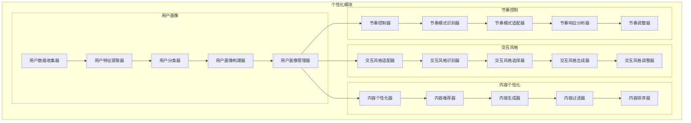

#### 3.3.3 核心组件设计

##### 3.3.3.1 用户画像构建器组件
- **功能**：基于用户数据构建和更新用户画像
- **接口**：
  - `build_user_profile(user_id)`: 构建用户画像
  - `update_user_profile(user_id, new_data)`: 更新用户画像
  - `extract_user_features(user_data)`: 提取用户特征
  - `classify_user_type(features)`: 分类用户类型
- **技术实现**：基于机器学习和数据挖掘技术，从用户行为数据中提取特征并构建画像

##### 3.3.3.2 交互风格适配器组件
- **功能**：根据用户画像适配交互风格
- **接口**：
  - `adapt_interaction_style(user_profile, context)`: 适配交互风格
  - `recognize_interaction_style(user_data)`: 识别交互风格
  - `select_interaction_style(user_profile, context)`: 选择交互风格
  - `generate_style_guidelines(style)`: 生成风格指南
- **技术实现**：基于风格迁移和个性化推荐技术，动态调整交互风格

##### 3.3.3.3 内容个性化器组件
- **功能**：根据用户画像和上下文提供个性化内容
- **接口**：
  - `personalize_content(user_profile, context)`: 个性化内容
  - `recommend_content(user_profile, context)`: 推荐内容
  - `generate_content(user_profile, requirements)`: 生成内容
  - `filter_content(content, user_preferences)`: 过滤内容
- **技术实现**：基于推荐系统和内容生成技术，提供个性化内容

##### 3.3.3.4 节奏控制器组件
- **功能**：根据用户特点和上下文控制交互节奏
- **接口**：
  - `control_interaction_pace(user_profile, context)`: 控制交互节奏
  - `recognize_pace_pattern(user_data)`: 识别节奏模式
  - `adapt_pace_pattern(user_profile, context)`: 适配节奏模式
  - `adjust_pace(feedback, current_pace)`: 调整节奏
- **技术实现**：基于时间序列分析和用户行为建模，动态调整交互节奏

### 3.4 上下文管理模块

#### 3.4.1 模块概述
上下文管理模块负责处理短期、中期、长期上下文管理和跨模态上下文融合等功能，使系统能够维护交互上下文，确保交互的连贯性和一致性，支持跨模态上下文信息的融合和利用。

#### 3.4.2 模块架构

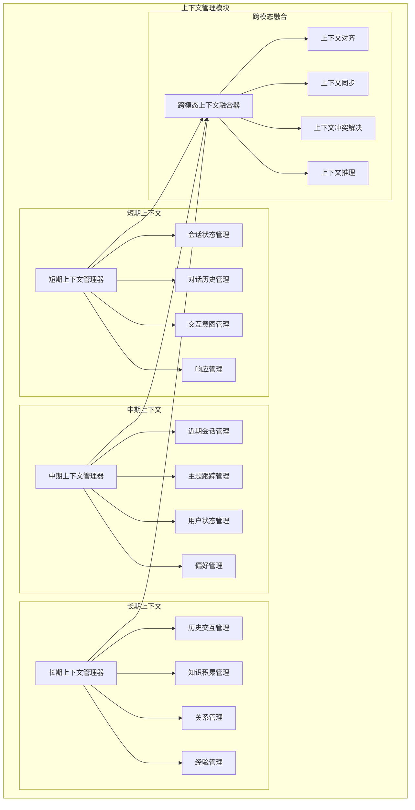

#### 3.4.3 核心组件设计

##### 3.4.3.1 短期上下文管理器组件
- **功能**：管理当前会话的上下文信息
- **接口**：
  - `manage_session_context(session_id)`: 管理会话上下文
  - `update_dialogue_history(session_id, utterance)`: 更新对话历史
  - `track_interaction_intent(session_id, intent)`: 跟踪交互意图
  - `manage_response_context(session_id, response)`: 管理响应上下文
- **技术实现**：基于对话状态跟踪和上下文窗口管理技术

##### 3.4.3.2 中期上下文管理器组件
- **功能**：管理近期交互的上下文信息
- **接口**：
  - `manage_medium_term_context(user_id)`: 管理中期上下文
  - `track_recent_sessions(user_id, sessions)`: 跟踪近期会话
  - `manage_topic_progression(user_id, topics)`: 管理主题进展
  - `update_user_state(user_id, state)`: 更新用户状态
- **技术实现**：基于时间序列分析和主题建模技术

##### 3.4.3.3 长期上下文管理器组件
- **功能**：管理长期交互历史和知识积累
- **接口**：
  - `manage_long_term_context(user_id)`: 管理长期上下文
  - `maintain_interaction_history(user_id, history)`: 维护交互历史
  - `accumulate_knowledge(user_id, knowledge)`: 积累知识
  - `manage_relationship_model(user_id, model)`: 管理关系模型
- **技术实现**：基于知识图谱和长期记忆建模技术

##### 3.4.3.4 跨模态上下文融合器组件
- **功能**：融合不同模态的上下文信息
- **接口**：
  - `fuse_cross_modal_context(contexts)`: 融合跨模态上下文
  - `align_contexts(contexts)`: 对齐上下文
  - `synchronize_contexts(contexts)`: 同步上下文
  - `resolve_context_conflicts(contexts)`: 解决上下文冲突
- **技术实现**：基于多模态融合和上下文推理技术

## 4. 模块间交互设计

### 4.1 交互架构

#### 4.1.1 交互流程图

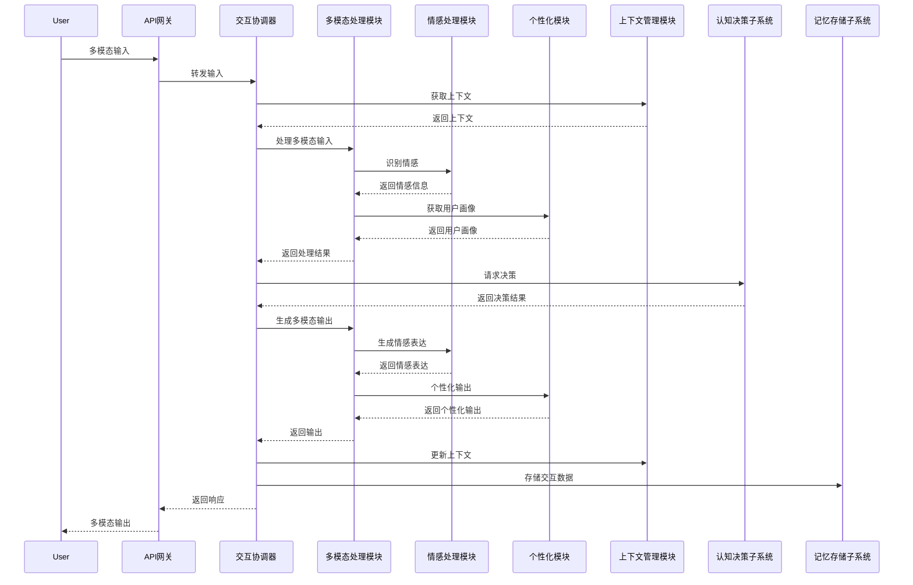

#### 4.1.2 交互说明

1. **输入处理流程**：
   - 用户通过多模态方式输入信息
   - API网关接收并转发输入到交互协调器
   - 交互协调器从上下文管理模块获取相关上下文
   - 多模态处理模块处理输入，识别情感，获取用户画像
   - 处理结果返回给交互协调器

2. **决策流程**：
   - 交互协调器将处理结果发送给认知决策子系统
   - 认知决策子系统返回决策结果
   - 交互协调器根据决策结果生成响应

3. **输出处理流程**：
   - 多模态处理模块生成多模态输出
   - 情感处理模块生成情感表达
   - 个性化模块进行个性化调整
   - 最终输出返回给用户

4. **上下文更新流程**：
   - 交互协调器更新上下文管理模块
   - 交互数据存储到记忆存储子系统

### 4.2 数据流设计

#### 4.2.1 输入数据流

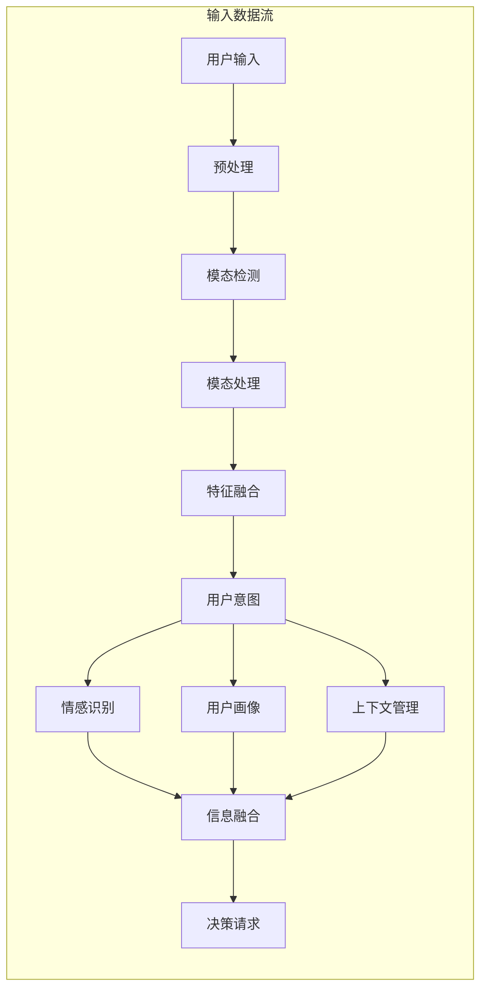

#### 4.2.2 输出数据流

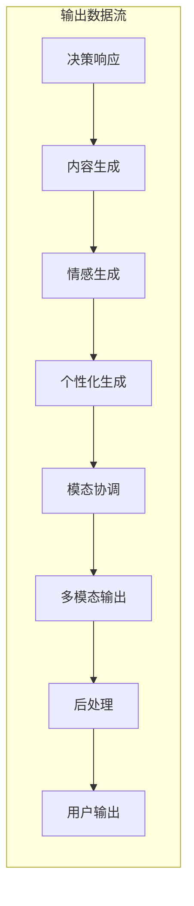

### 4.3 事件驱动设计

#### 4.3.1 事件类型

1. **输入事件**：
   - `AudioInputReceived`: 音频输入接收事件
   - `VideoInputReceived`: 视频输入接收事件
   - `TextInputReceived`: 文本输入接收事件
   - `ImageInputReceived`: 图像输入接收事件
   - `GestureInputReceived`: 手势输入接收事件

2. **处理事件**：
   - `ModalityProcessed`: 模态处理完成事件
   - `EmotionRecognized`: 情感识别完成事件
   - `UserIntentIdentified`: 用户意图识别完成事件
   - `ContextRetrieved`: 上下文检索完成事件

3. **决策事件**：
   - `DecisionRequested`: 决策请求事件
   - `DecisionReceived`: 决策接收事件
   - `ActionDetermined`: 行动确定事件

4. **输出事件**：
   - `ContentGenerated`: 内容生成完成事件
   - `EmotionGenerated`: 情感生成完成事件
   - `PersonalizationApplied`: 个性化应用完成事件
   - `ModalityCoordinated`: 模态协调完成事件
   - `OutputReady`: 输出准备完成事件

#### 4.3.2 事件处理流程

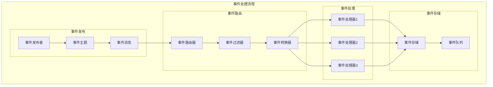

## 5. 接口设计

### 5.1 内部接口设计

#### 5.1.1 模块间接口

##### 5.1.1.1 多模态处理模块接口
```python
class MultimodalProcessorInterface:
    """多模态处理模块接口"""
    
    def process_input(self, input_data: Dict[str, Any]) -> ProcessedInput:
        """处理多模态输入"""
        pass
    
    def generate_output(self, response_data: Dict[str, Any]) -> MultimodalOutput:
        """生成多模态输出"""
        pass
    
    def get_supported_modalities(self) -> List[str]:
        """获取支持的模态列表"""
        pass
    
    def register_modality_processor(self, modality: str, processor: ModalityProcessor) -> bool:
        """注册模态处理器"""
        pass
```

##### 5.1.1.2 情感处理模块接口
```python
class EmotionProcessorInterface:
    """情感处理模块接口"""
    
    def recognize_emotion(self, multimodal_data: Dict[str, Any]) -> EmotionResult:
        """识别情感"""
        pass
    
    def generate_emotion(self, emotion_type: str, intensity: float, context: Dict[str, Any]) -> EmotionExpression:
        """生成情感表达"""
        pass
    
    def update_emotion_memory(self, user_id: str, emotion_data: EmotionData) -> bool:
        """更新情感记忆"""
        pass
    
    def adapt_interaction_strategy(self, user_emotion: EmotionResult, context: Dict[str, Any]) -> InteractionStrategy:
        """适应交互策略"""
        pass
```

##### 5.1.1.3 个性化模块接口
```python
class PersonalizationInterface:
    """个性化模块接口"""
    
    def get_user_profile(self, user_id: str) -> UserProfile:
        """获取用户画像"""
        pass
    
    def update_user_profile(self, user_id: str, new_data: Dict[str, Any]) -> bool:
        """更新用户画像"""
        pass
    
    def adapt_interaction_style(self, user_id: str, context: Dict[str, Any]) -> InteractionStyle:
        """适配交互风格"""
        pass
    
    def personalize_content(self, user_id: str, content: Content, context: Dict[str, Any]) -> PersonalizedContent:
        """个性化内容"""
        pass
    
    def control_interaction_pace(self, user_id: str, context: Dict[str, Any]) -> PaceSettings:
        """控制交互节奏"""
        pass
```

##### 5.1.1.4 上下文管理模块接口
```python
class ContextManagerInterface:
    """上下文管理模块接口"""
    
    def get_short_term_context(self, session_id: str) -> ShortTermContext:
        """获取短期上下文"""
        pass
    
    def get_medium_term_context(self, user_id: str) -> MediumTermContext:
        """获取中期上下文"""
        pass
    
    def get_long_term_context(self, user_id: str) -> LongTermContext:
        """获取长期上下文"""
        pass
    
    def update_context(self, context_type: str, context_id: str, new_data: Dict[str, Any]) -> bool:
        """更新上下文"""
        pass
    
    def fuse_cross_modal_context(self, contexts: List[Dict[str, Any]]) -> FusedContext:
        """融合跨模态上下文"""
        pass
```

#### 5.1.2 数据访问接口

##### 5.1.2.1 用户数据访问接口
```python
class UserDataAccessInterface:
    """用户数据访问接口"""
    
    def get_user_data(self, user_id: str, data_type: str) -> Dict[str, Any]:
        """获取用户数据"""
        pass
    
    def store_user_data(self, user_id: str, data_type: str, data: Dict[str, Any]) -> bool:
        """存储用户数据"""
        pass
    
    def update_user_data(self, user_id: str, data_type: str, updates: Dict[str, Any]) -> bool:
        """更新用户数据"""
        pass
    
    def delete_user_data(self, user_id: str, data_type: str) -> bool:
        """删除用户数据"""
        pass
```

##### 5.1.2.2 内容数据访问接口
```python
class ContentDataAccessInterface:
    """内容数据访问接口"""
    
    def get_content(self, content_id: str) -> Content:
        """获取内容"""
        pass
    
    def store_content(self, content: Content) -> str:
        """存储内容"""
        pass
    
    def search_content(self, query: Dict[str, Any], limit: int) -> List[Content]:
        """搜索内容"""
        pass
    
    def update_content(self, content_id: str, updates: Dict[str, Any]) -> bool:
        """更新内容"""
        pass
```

### 5.2 外部接口设计

#### 5.2.1 子系统间接口

##### 5.2.1.1 与感知处理子系统接口
```python
class PerceptionSubsystemInterface:
    """感知处理子系统接口"""
    
    def get_perception_data(self, request: PerceptionRequest) -> PerceptionData:
        """获取感知数据"""
        pass
    
    def subscribe_perception_events(self, event_types: List[str], callback: Callable) -> str:
        """订阅感知事件"""
        pass
    
    def unsubscribe_perception_events(self, subscription_id: str) -> bool:
        """取消订阅感知事件"""
        pass
```

##### 5.2.1.2 与认知决策子系统接口
```python
class CognitiveDecisionInterface:
    """认知决策子系统接口"""
    
    def request_decision(self, context: Dict[str, Any]) -> DecisionResult:
        """请求决策"""
        pass
    
    def provide_feedback(self, decision_id: str, feedback: FeedbackData) -> bool:
        """提供反馈"""
        pass
    
    def get_decision_explanation(self, decision_id: str) -> Explanation:
        """获取决策解释"""
        pass
```

##### 5.2.1.3 与记忆存储子系统接口
```python
class MemoryStorageInterface:
    """记忆存储子系统接口"""
    
    def store_memory(self, memory_data: MemoryData) -> str:
        """存储记忆"""
        pass
    
    def retrieve_memory(self, memory_id: str) -> MemoryData:
        """检索记忆"""
        pass
    
    def search_memories(self, query: MemoryQuery) -> List[MemoryData]:
        """搜索记忆"""
        pass
    
    def update_memory(self, memory_id: str, updates: Dict[str, Any]) -> bool:
        """更新记忆"""
        pass
```

##### 5.2.1.4 与自我意识子系统接口
```python
class SelfAwarenessInterface:
    """自我意识子系统接口"""
    
    def get_system_state(self) -> SystemState:
        """获取系统状态"""
        pass
    
    def report_interaction_result(self, result: InteractionResult) -> bool:
        """报告交互结果"""
        pass
    
    def get_self_assessment(self) -> SelfAssessment:
        """获取自我评估"""
        pass
```

#### 5.2.2 用户接口

##### 5.2.2.1 RESTful API接口
```yaml
# 交互处理API
POST /api/v1/interaction/process
Content-Type: application/json
{
  "user_id": "string",
  "session_id": "string",
  "input": {
    "modalities": {
      "audio": "base64_encoded_audio_data",
      "video": "base64_encoded_video_data",
      "text": "user_text_input",
      "image": "base64_encoded_image_data",
      "gesture": "gesture_data"
    },
    "metadata": {
      "timestamp": "ISO8601_timestamp",
      "device_info": "device_information"
    }
  }
}

Response:
{
  "interaction_id": "string",
  "output": {
    "modalities": {
      "audio": "base64_encoded_audio_data",
      "video": "base64_encoded_video_data",
      "text": "response_text",
      "image": "base64_encoded_image_data",
      "gesture": "gesture_data"
    },
    "metadata": {
      "timestamp": "ISO8601_timestamp",
      "processing_time_ms": "number"
    }
  },
  "context": {
    "session_id": "string",
    "user_emotion": {
      "type": "string",
      "intensity": "number"
    },
    "personalization_applied": "boolean"
  }
}
```

##### 5.2.2.2 WebSocket接口
```yaml
# WebSocket连接
ws://api.example.com/v1/interaction/ws

# 消息格式
{
  "type": "message_type",
  "data": {
    "user_id": "string",
    "session_id": "string",
    "payload": "message_payload"
  }
}

# 消息类型
- "input": 用户输入消息
- "output": 系统输出消息
- "context_update": 上下文更新消息
- "error": 错误消息
- "heartbeat": 心跳消息
```

## 6. 数据架构设计

### 6.1 数据模型设计

#### 6.1.1 用户数据模型

```yaml
User:
  type: object
  properties:
    user_id:
      type: string
      description: "用户唯一标识"
    profile:
      $ref: "#/components/schemas/UserProfile"
    preferences:
      $ref: "#/components/schemas/UserPreferences"
    interaction_history:
      type: array
      items:
        $ref: "#/components/schemas/InteractionRecord"
    created_at:
      type: string
      format: date-time
    updated_at:
      type: string
      format: date-time

UserProfile:
  type: object
  properties:
    demographics:
      $ref: "#/components/schemas/Demographics"
    interests:
      type: array
      items:
        type: string
    personality_traits:
      type: array
      items:
        $ref: "#/components/schemas/PersonalityTrait"
    communication_style:
      $ref: "#/components/schemas/CommunicationStyle"
    cognitive_profile:
      $ref: "#/components/schemas/CognitiveProfile"

UserPreferences:
  type: object
  properties:
    interaction_modalities:
      type: array
      items:
        type: string
    language:
      type: string
    response_speed:
      type: string
      enum: [fast, normal, slow]
    content_types:
      type: array
      items:
        type: string
    privacy_settings:
      $ref: "#/components/schemas/PrivacySettings"

InteractionRecord:
  type: object
  properties:
    interaction_id:
      type: string
    session_id:
      type: string
    timestamp:
      type: string
      format: date-time
    input:
      $ref: "#/components/schemas/MultimodalInput"
    output:
      $ref: "#/components/schemas/MultimodalOutput"
    context:
      $ref: "#/components/schemas/InteractionContext"
    metrics:
      $ref: "#/components/schemas/InteractionMetrics"
```

#### 6.1.2 交互数据模型

```yaml
InteractionSession:
  type: object
  properties:
    session_id:
      type: string
    user_id:
      type: string
    start_time:
      type: string
      format: date-time
    end_time:
      type: string
      format: date-time
    interactions:
      type: array
      items:
        $ref: "#/components/schemas/InteractionRecord"
    context:
      $ref: "#/components/schemas/SessionContext"
    summary:
      $ref: "#/components/schemas/SessionSummary"

MultimodalInput:
  type: object
  properties:
    modalities:
      type: object
      properties:
        audio:
          $ref: "#/components/schemas/AudioInput"
        video:
          $ref: "#/components/schemas/VideoInput"
        text:
          $ref: "#/components/schemas/TextInput"
        image:
          $ref: "#/components/schemas/ImageInput"
        gesture:
          $ref: "#/components/schemas/GestureInput"
    metadata:
      $ref: "#/components/schemas/InputMetadata"

MultimodalOutput:
  type: object
  properties:
    modalities:
      type: object
      properties:
        audio:
          $ref: "#/components/schemas/AudioOutput"
        video:
          $ref: "#/components/schemas/VideoOutput"
        text:
          $ref: "#/components/schemas/TextOutput"
        image:
          $ref: "#/components/schemas/ImageOutput"
        gesture:
          $ref: "#/components/schemas/GestureOutput"
    metadata:
      $ref: "#/components/schemas/OutputMetadata"

InteractionContext:
  type: object
  properties:
    user_emotion:
      $ref: "#/components/schemas/Emotion"
    system_emotion:
      $ref: "#/components/schemas/Emotion"
    environment:
      $ref: "#/components/schemas/Environment"
    recent_topics:
      type: array
      items:
        type: string
    interaction_goals:
      type: array
      items:
        type: string
```

#### 6.1.3 情感数据模型

```yaml
Emotion:
  type: object
  properties:
    primary_emotion:
      type: string
      enum: [joy, sadness, anger, fear, surprise, disgust, neutral]
    secondary_emotions:
      type: array
      items:
        type: string
    valence:
      type: number
      minimum: -1
      maximum: 1
    arousal:
      type: number
      minimum: 0
      maximum: 1
    intensity:
      type: number
      minimum: 0
      maximum: 1
    confidence:
      type: number
      minimum: 0
      maximum: 1
    source_modalities:
      type: array
      items:
        type: string

EmotionExpression:
  type: object
  properties:
    expression_type:
      type: string
    modality:
      type: string
    parameters:
      type: object
      additionalProperties: true
    intensity:
      type: number
      minimum: 0
      maximum: 1
    duration:
      type: number
    timing:
      $ref: "#/components/schemas/Timing"

EmotionHistory:
  type: object
  properties:
    user_id:
      type: string
    emotion_records:
      type: array
      items:
        $ref: "#/components/schemas/EmotionRecord"
    patterns:
      type: array
      items:
        $ref: "#/components/schemas/EmotionPattern"
    triggers:
      type: array
      items:
        $ref: "#/components/schemas/EmotionTrigger"
```

### 6.2 数据存储设计

#### 6.2.1 数据库选型

##### 6.2.1.1 关系型数据库
- **用途**：存储结构化数据，如用户基本信息、会话信息等
- **选型**：PostgreSQL，支持JSON字段，适合混合数据存储
- **优势**：ACID事务保证，复杂查询支持，成熟稳定

##### 6.2.1.2 文档数据库
- **用途**：存储半结构化数据，如用户画像、交互记录等
- **选型**：MongoDB，灵活的文档结构，适合快速迭代
- **优势**：灵活的数据模型，水平扩展能力强，开发效率高

##### 6.2.1.3 图数据库
- **用途**：存储关系数据，如用户关系、知识图谱等
- **选型**：Neo4j，原生图数据库，适合复杂关系查询
- **优势**：直观的关系表示，高效的图查询，丰富的图算法

##### 6.2.1.4 时序数据库
- **用途**：存储时序数据，如用户行为序列、系统指标等
- **选型**：InfluxDB，专为时序数据设计，高性能写入查询
- **优势**：高效时序数据压缩，灵活的时间窗口聚合，内置数据保留策略

#### 6.2.2 数据分片策略

##### 6.2.2.1 用户数据分片
- **分片键**：用户ID
- **分片方法**：哈希分片
- **优势**：均匀分布，减少跨分片查询
- **考虑**：用户数据访问模式，热点用户处理

##### 6.2.2.2 交互数据分片
- **分片键**：会话ID + 时间戳
- **分片方法**：范围分片 + 哈希分片
- **优势**：时间局部性，查询效率高
- **考虑**：数据生命周期管理，历史数据归档

##### 6.2.2.3 内容数据分片
- **分片键**：内容类型 + 创建时间
- **分片方法**：范围分片
- **优势**：内容访问模式匹配，缓存友好
- **考虑**：内容热度分布，冷热数据分离

#### 6.2.3 数据缓存策略

##### 6.2.3.1 多级缓存架构
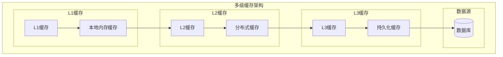

##### 6.2.3.2 缓存策略
- **用户画像缓存**：长期缓存，TTL设置为1小时，更新时主动失效
- **会话上下文缓存**：短期缓存，TTL设置为30分钟，会话结束时清除
- **热门内容缓存**：中期缓存，TTL设置为2小时，基于访问频率动态调整
- **情感模型缓存**：长期缓存，TTL设置为24小时，模型更新时主动失效

##### 6.2.3.3 缓存更新策略
- **写透缓存**：用户画像数据，确保数据一致性
- **写回缓存**：交互记录数据，提高写入性能
- **旁路缓存**：内容数据，平衡一致性和性能
- **刷新-ahead**：热点数据，提前预加载减少延迟

## 7. 安全架构设计

### 7.1 安全威胁分析

#### 7.1.1 常见安全威胁

1. **数据泄露威胁**：
   - 用户隐私数据泄露
   - 交互内容泄露
   - 系统内部数据泄露

2. **身份认证威胁**：
   - 用户身份冒充
   - 会话劫持
   - 权限提升

3. **注入攻击威胁**：
   - SQL注入
   - NoSQL注入
   - 命令注入

4. **拒绝服务威胁**：
   - 资源耗尽攻击
   - 分布式拒绝服务攻击
   - 应用层DDoS攻击

5. **模型安全威胁**：
   - 对抗样本攻击
   - 模型窃取
   - 数据投毒

#### 7.1.2 威胁缓解策略

1. **数据保护**：
   - 数据加密存储和传输
   - 数据脱敏和匿名化
   - 数据访问控制和审计

2. **身份认证**：
   - 多因素认证
   - 强密码策略
   - 会话管理和超时

3. **输入验证**：
   - 输入数据验证和过滤
   - 参数化查询
   - 最小权限原则

4. **可用性保障**：
   - 流量控制和限流
   - 负载均衡和弹性扩展
   - 攻击检测和缓解

5. **模型安全**：
   - 对抗样本检测
   - 模型加密和访问控制
   - 数据来源验证

### 7.2 安全架构设计

#### 7.2.1 安全层次架构

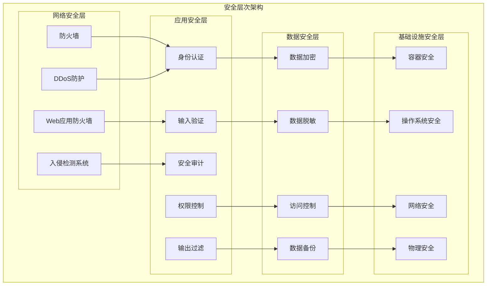

#### 7.2.2 身份认证与授权

##### 7.2.2.1 身份认证机制
- **多因素认证**：支持密码、短信验证码、生物特征等多种认证因素
- **单点登录**：集成企业SSO系统，提供统一认证体验
- **OAuth2.0授权**：支持第三方应用安全授权访问
- **JWT令牌**：使用JWT令牌进行无状态身份验证

##### 7.2.2.2 权限控制机制
- **RBAC模型**：基于角色的访问控制，简化权限管理
- **ABAC模型**：基于属性的访问控制，提供细粒度权限控制
- **资源级权限**：控制对具体资源的访问权限
- **API级权限**：控制对具体API的访问权限

#### 7.2.3 数据安全保护

##### 7.2.3.1 数据加密
- **传输加密**：使用TLS 1.3协议加密数据传输
- **存储加密**：使用AES-256算法加密敏感数据存储
- **字段级加密**：对敏感字段进行单独加密
- **密钥管理**：使用专业密钥管理系统管理加密密钥

##### 7.2.3.2 数据脱敏
- **静态脱敏**：对开发测试环境数据进行脱敏
- **动态脱敏**：根据用户权限动态脱敏敏感数据
- **脱敏算法**：提供多种脱敏算法，如掩码、替换、哈希等
- **脱敏策略**：根据数据类型和敏感度制定脱敏策略

##### 7.2.3.3 数据访问控制
- **最小权限原则**：用户只获得完成任务所需的最小权限
- **数据分类**：根据敏感度对数据进行分类分级
- **访问审计**：记录所有数据访问行为，支持审计追踪
- **数据水印**：在敏感数据中嵌入水印，追踪泄露源头

### 7.3 隐私保护设计

#### 7.3.1 隐私保护原则

1. **数据最小化**：
   - 只收集和处理必要的用户数据
   - 定期清理不再需要的数据
   - 匿名化处理不必要识别信息

2. **透明性**：
   - 明确告知用户数据收集和使用目的
   - 提供易于理解的隐私政策
   - 提供数据使用情况的查询接口

3. **用户控制**：
   - 提供用户数据查询和更正接口
   - 提供数据删除和导出功能
   - 提供隐私设置自定义选项

4. **安全保护**：
   - 实施多层次安全防护措施
   - 定期进行安全评估和审计
   - 及时响应安全事件和漏洞

#### 7.3.2 隐私保护技术

##### 7.3.2.1 匿名化技术
- **K-匿名**：确保数据集中每个个体至少与K-1个其他个体不可区分
- **L-多样性**：确保每个等价类中至少有L个不同敏感值
- **T-接近性**：确保每个等价类中敏感值分布与整体分布接近
- **差分隐私**：添加可控噪声保护个体隐私

##### 7.3.2.2 联邦学习
- **本地训练**：模型在本地设备上训练，不上传原始数据
- **模型聚合**：只上传模型参数更新，在服务器端聚合
- **隐私保护**：结合差分隐私和同态加密增强隐私保护
- **效果平衡**：在隐私保护和模型效果之间取得平衡

##### 7.3.2.3 同态加密
- **加密计算**：在加密数据上直接进行计算，无需解密
- **隐私保护**：原始数据始终处于加密状态，保护用户隐私
- **应用场景**：适用于隐私要求高的场景，如医疗、金融等
- **性能考虑**：同态加密计算开销大，需要权衡性能和隐私

## 8. 性能优化设计

### 8.1 性能瓶颈分析

#### 8.1.1 计算密集型瓶颈

1. **深度学习模型推理**：
   - 多模态融合模型计算复杂度高
   - 情感识别和生成模型计算量大
   - 个性化推荐模型实时性要求高

2. **多模态数据处理**：
   - 音视频数据编解码计算密集
   - 图像处理和特征提取计算量大
   - 实时流处理对计算资源要求高

3. **复杂查询处理**：
   - 多维度数据查询计算复杂
   - 图数据库查询计算密集
   - 实时分析查询计算开销大

#### 8.1.2 I/O密集型瓶颈

1. **大规模数据读取**：
   - 用户画像数据读取频繁
   - 交互历史数据查询量大
   - 内容数据访问模式多样

2. **实时数据写入**：
   - 交互记录实时写入压力大
   - 用户行为数据写入频繁
   - 系统日志数据写入量大

3. **跨网络通信**：
   - 微服务间通信开销大
   - 外部API调用延迟高
   - 数据同步网络带宽限制

#### 8.1.3 内存密集型瓶颈

1. **大模型加载**：
   - 深度学习模型占用内存大
   - 多模型同时加载内存压力大
   - 模型参数更新内存消耗高

2. **缓存数据管理**：
   - 多级缓存占用内存多
   - 热点数据缓存内存需求大
   - 缓存淘汰策略影响内存使用

3. **中间数据存储**：
   - 流处理中间数据内存占用
   - 批处理中间结果内存消耗
   - 临时数据结构内存开销

### 8.2 性能优化策略

#### 8.2.1 计算优化

##### 8.2.1.1 模型优化
- **模型压缩**：使用知识蒸馏、剪枝、量化等技术压缩模型
- **模型选择**：根据精度和速度需求选择合适大小的模型
- **模型缓存**：缓存常用模型，避免重复加载
- **模型并行**：将大模型拆分到多个设备并行计算

##### 8.2.1.2 算法优化
- **近似算法**：使用近似算法降低计算复杂度
- **并行计算**：利用多核CPU和GPU并行计算
- **增量计算**：利用增量计算减少重复计算
- **预计算**：预计算常用结果，提高响应速度

##### 8.2.1.3 硬件加速
- **GPU加速**：使用GPU加速深度学习模型推理
- **专用硬件**：使用TPU、FPGA等专用硬件加速
- **边缘计算**：将计算任务下沉到边缘节点
- **异构计算**：结合CPU、GPU、专用芯片异构计算

#### 8.2.2 I/O优化

##### 8.2.2.1 存储优化
- **数据分片**：将数据分片存储，提高并行访问能力
- **索引优化**：优化数据库索引，提高查询速度
- **列式存储**：对分析型查询使用列式存储
- **数据压缩**：压缩存储数据，减少I/O开销

##### 8.2.2.2 缓存优化
- **多级缓存**：设计多级缓存架构，提高命中率
- **缓存预热**：系统启动时预加载热点数据
- **智能缓存**：基于访问模式智能缓存数据
- **缓存一致性**：保证缓存与数据源的一致性

##### 8.2.2.3 网络优化
- **连接池**：使用连接池减少连接建立开销
- **数据压缩**：压缩网络传输数据，减少带宽占用
- **负载均衡**：合理分配网络负载，避免热点
- **CDN加速**：使用CDN加速静态资源访问

#### 8.2.3 内存优化

##### 8.2.3.1 内存管理
- **内存池**：使用内存池减少内存分配开销
- **对象复用**：复用对象减少内存分配和回收
- **内存监控**：实时监控内存使用，及时发现问题
- **垃圾回收**：优化垃圾回收策略，减少GC停顿

##### 8.2.3.2 数据结构优化
- **紧凑数据结构**：使用紧凑数据结构减少内存占用
- **流式处理**：使用流式处理减少内存占用
- **分批处理**：分批处理大数据集，控制内存使用
- **内存映射**：使用内存映射文件减少内存拷贝

### 8.3 性能监控与调优

#### 8.3.1 性能指标体系

##### 8.3.1.1 系统级指标
- **CPU使用率**：监控CPU使用情况，识别计算瓶颈
- **内存使用率**：监控内存使用情况，识别内存瓶颈
- **磁盘I/O**：监控磁盘读写情况，识别I/O瓶颈
- **网络I/O**：监控网络吞吐和延迟，识别网络瓶颈

##### 8.3.1.2 应用级指标
- **响应时间**：监控请求响应时间，识别性能问题
- **吞吐量**：监控系统吞吐能力，评估系统容量
- **错误率**：监控错误率，识别系统稳定性问题
- **资源利用率**：监控各类资源利用率，优化资源分配

##### 8.3.1.3 业务级指标
- **交互成功率**：监控交互成功率，评估交互质量
- **用户满意度**：监控用户满意度，评估用户体验
- **功能使用率**：监控功能使用率，优化功能设计
- **转化率**：监控转化率，评估系统效果

#### 8.3.2 性能监控工具

##### 8.3.2.1 系统监控工具
- **Prometheus**：开源监控系统，收集和存储时序数据
- **Grafana**：可视化平台，展示监控数据和告警
- **ELK Stack**：日志收集、存储和分析平台
- **Jaeger**：分布式追踪系统，分析微服务调用链

##### 8.3.2.2 应用性能管理工具
- **New Relic**：全栈性能监控，提供端到端可见性
- **AppDynamics**：应用性能管理，实时监控和诊断
- **Dynatrace**：AI驱动的全栈监控，自动发现和诊断
- **SkyWalking**：开源APM系统，专注于微服务架构

##### 8.3.2.3 专用性能分析工具
- **PyTorch Profiler**：PyTorch模型性能分析工具
- **TensorFlow Profiler**：TensorFlow模型性能分析工具
- **Intel VTune**：Intel平台性能分析工具
- **perf**：Linux系统性能分析工具

#### 8.3.3 性能调优流程

##### 8.3.3.1 性能基线建立
- **基准测试**：建立系统性能基准，作为优化参考
- **负载测试**：模拟真实负载，测试系统性能极限
- **压力测试**：增加系统负载，测试系统稳定性
- **容量规划**：基于性能数据规划系统容量

##### 8.3.3.2 性能瓶颈定位
- **监控数据分析**：分析监控数据，识别性能瓶颈
- **调用链分析**：分析微服务调用链，定位慢服务
- **资源分析**：分析资源使用情况，定位资源瓶颈
- **代码分析**：分析热点代码，定位性能问题

##### 8.3.3.3 性能优化实施
- **优化方案设计**：基于瓶颈分析设计优化方案
- **优化实施**：按计划实施优化措施
- **效果评估**：评估优化效果，验证优化成果
- **持续优化**：建立持续优化机制，不断提升性能

## 9. 容错与恢复设计

### 9.1 故障类型分析

#### 9.1.1 硬件故障

1. **服务器故障**：
   - 服务器宕机
   - CPU故障
   - 内存故障
   - 磁盘故障

2. **网络设备故障**：
   - 交换机故障
   - 路由器故障
   - 网线故障
   - 网络分区

3. **存储设备故障**：
   - 磁盘阵列故障
   - 存储网络故障
   - 存储控制器故障
   - 数据损坏

#### 9.1.2 软件故障

1. **操作系统故障**：
   - 系统崩溃
   - 内态恐慌
   - 资源耗尽
   - 死锁

2. **中间件故障**：
   - 数据库故障
   - 消息队列故障
   - 缓存服务故障
   - 注册中心故障

3. **应用软件故障**：
   - 应用崩溃
   - 内存泄漏
   - 死循环
   - 逻辑错误

#### 9.1.3 业务故障

1. **数据不一致**：
   - 数据同步失败
   - 事务回滚失败
   - 数据冲突
   - 数据丢失

2. **服务不可用**：
   - 服务过载
   - 依赖服务故障
   - 配置错误
   - 资源不足

3. **用户体验下降**：
   - 响应时间过长
   - 功能异常
   - 界面错误
   - 交互中断

### 9.2 容错设计策略

#### 9.2.1 冗余设计

##### 9.2.1.1 硬件冗余
- **服务器冗余**：部署多台服务器，避免单点故障
- **网络冗余**：使用多路径网络，提高网络可靠性
- **存储冗余**：使用RAID技术，提高数据可靠性
- **电源冗余**：使用双电源，避免电源故障

##### 9.2.1.2 软件冗余
- **服务冗余**：部署多实例服务，避免单点故障
- **数据冗余**：多副本存储数据，提高数据可靠性
- **组件冗余**：关键组件多副本部署，提高系统可靠性
- **功能冗余**：实现功能冗余，提供备选方案

##### 9.2.1.3 数据冗余
- **主从复制**：使用主从复制，提高数据可用性
- **多活架构**：使用多活架构，提高系统可用性
- **异地多活**：跨地域部署，提高灾难恢复能力
- **备份策略**：定期备份数据，防止数据丢失

#### 9.2.2 隔离设计

##### 9.2.2.1 服务隔离
- **进程隔离**：不同服务运行在不同进程
- **容器隔离**：使用容器技术隔离服务运行环境
- **虚拟机隔离**：使用虚拟机隔离服务运行环境
- **命名空间隔离**：使用命名空间隔离系统资源

##### 9.2.2.2 资源隔离
- **CPU隔离**：限制服务CPU使用，避免相互影响
- **内存隔离**：限制服务内存使用，避免内存争抢
- **网络隔离**：使用网络隔离技术，避免网络干扰
- **存储隔离**：隔离存储访问，避免存储冲突

##### 9.2.2.3 故障隔离
- **熔断机制**：使用熔断机制，防止故障扩散
- **限流机制**：使用限流机制，防止系统过载
- **降级机制**：使用降级机制，保证核心功能可用
- **异步处理**：使用异步处理，避免阻塞和级联故障

#### 9.2.3 自愈设计

##### 9.2.3.1 自动检测
- **健康检查**：定期检查服务健康状态
- **心跳检测**：通过心跳机制检测服务存活
- **异常检测**：通过异常检测发现潜在问题
- **性能监控**：通过性能监控发现性能问题

##### 9.2.3.2 自动恢复
- **服务重启**：自动重启失败服务
- **服务迁移**：将服务迁移到健康节点
- **流量切换**：自动切换流量到健康实例
- **资源扩容**：自动扩容应对资源不足

##### 9.2.3.3 自动修复
- **配置修复**：自动修复错误配置
- **数据修复**：自动修复损坏数据
- **状态修复**：自动修复不一致状态
- **依赖修复**：自动修复依赖问题

### 9.3 恢复设计策略

#### 9.3.1 数据恢复

##### 9.3.1.1 备份恢复
- **全量备份**：定期进行全量备份，确保数据完整性
- **增量备份**：进行增量备份，减少备份时间和存储空间
- **差异备份**：进行差异备份，平衡备份时间和恢复时间
- **异地备份**：异地存储备份，防止地域性灾难

##### 9.3.1.2 副本恢复
- **主从切换**：主节点故障时切换到从节点
- **多副本选举**：多副本环境下选举新主节点
- **数据同步**：故障恢复后同步数据
- **一致性保证**：确保数据一致性

##### 9.3.1.3 事务恢复
- **事务回滚**：回滚未完成事务
- **事务重做**：重做已提交事务
- **检查点恢复**：从检查点恢复
- **日志恢复**：通过日志恢复数据

#### 9.3.2 服务恢复

##### 9.3.2.1 服务重启
- **自动重启**：监控服务状态，自动重启失败服务
- **优雅重启**：优雅关闭服务后再启动
- **健康检查**：重启后进行健康检查
- **依赖检查**：检查服务依赖是否正常

##### 9.3.2.2 服务迁移
- **自动迁移**：自动将服务迁移到健康节点
- **负载均衡**：根据负载情况迁移服务
- **状态同步**：迁移前后同步服务状态
- **流量切换**：平滑切换服务流量

##### 9.3.2.3 服务降级
- **功能降级**：关闭非核心功能，保证核心服务可用
- **性能降级**：降低服务质量，保证服务可用性
- **体验降级**：简化用户界面，保证基本功能可用
- **资源降级**：减少资源使用，保证系统稳定

#### 9.3.3 系统恢复

##### 9.3.3.1 集群恢复
- **节点恢复**：故障节点恢复后重新加入集群
- **数据重平衡**：重新平衡集群数据分布
- **服务重分布**：重新分布集群服务
- **负载重分配**：重新分配集群负载

##### 9.3.3.2 网络恢复
- **连接恢复**：恢复网络连接
- **路由恢复**：恢复网络路由
- **服务发现**：重新发现服务
- **流量恢复**：恢复网络流量

##### 9.3.3.3 灾难恢复
- **站点切换**：切换到备用站点
- **数据恢复**：从备份恢复数据
- **服务恢复**：恢复关键服务
- **业务恢复**：恢复业务功能

## 10. 部署架构设计

### 10.1 部署环境规划

#### 10.1.1 开发环境

##### 10.1.1.1 环境配置
- **硬件配置**：中等配置服务器，满足开发和测试需求
- **软件配置**：与生产环境一致的软件版本和配置
- **网络配置**：模拟生产网络环境，测试网络相关功能
- **数据配置**：使用脱敏的生产数据，模拟真实场景

##### 10.1.1.2 部署策略
- **容器化部署**：使用Docker容器化部署，简化环境管理
- **自动化部署**：使用CI/CD流水线自动化部署
- **蓝绿部署**：使用蓝绿部署策略，减少部署风险
- **滚动更新**：使用滚动更新策略，保证服务可用性

##### 10.1.1.3 监控策略
- **全链路监控**：监控从用户请求到数据库访问的全链路
- **实时告警**：设置实时告警，及时发现问题
- **性能分析**：分析性能瓶颈，优化系统性能
- **日志分析**：分析日志数据，发现潜在问题

#### 10.1.2 测试环境

##### 10.1.2.1 环境配置
- **硬件配置**：与生产环境相似的硬件配置
- **软件配置**：与生产环境一致的软件版本和配置
- **网络配置**：模拟生产网络环境，测试网络相关功能
- **数据配置**：使用与生产环境规模相当的测试数据

##### 10.1.2.2 部署策略
- **容器化部署**：使用Docker容器化部署，简化环境管理
- **自动化部署**：使用CI/CD流水线自动化部署
- **蓝绿部署**：使用蓝绿部署策略，减少部署风险
- **滚动更新**：使用滚动更新策略，保证服务可用性

##### 10.1.2.3 测试策略
- **功能测试**：全面测试系统功能，确保功能正确性
- **性能测试**：测试系统性能，确保满足性能要求
- **安全测试**：测试系统安全性，发现安全漏洞
- **兼容性测试**：测试系统兼容性，确保兼容各种环境

#### 10.1.3 生产环境

##### 10.1.3.1 环境配置
- **硬件配置**：高性能服务器，满足高并发和大数据处理需求
- **软件配置**：稳定可靠的软件版本和配置
- **网络配置**：高可用网络配置，确保网络稳定性
- **数据配置**：生产数据，确保数据安全和隐私

##### 10.1.3.2 部署策略
- **容器化部署**：使用Kubernetes容器编排，简化部署和管理
- **自动化部署**：使用CI/CD流水线自动化部署
- **蓝绿部署**：使用蓝绿部署策略，减少部署风险
- **滚动更新**：使用滚动更新策略，保证服务可用性

##### 10.1.3.3 运维策略
- **高可用部署**：多副本部署，确保服务高可用
- **弹性伸缩**：根据负载自动扩缩容，优化资源使用
- **故障恢复**：自动故障检测和恢复，提高系统可靠性
- **监控告警**：全方位监控和告警，及时发现问题

### 10.2 容器化部署

#### 10.2.1 容器镜像设计

##### 10.2.1.1 基础镜像选择
- **官方镜像**：选择官方维护的基础镜像，确保安全性
- **最小化镜像**：选择最小化基础镜像，减少安全风险
- **特定版本**：固定基础镜像版本，避免不可预期变化
- **安全扫描**：定期扫描镜像漏洞，及时修复安全问题

##### 10.2.1.2 镜像构建策略
- **多阶段构建**：使用多阶段构建，减少镜像大小
- **依赖缓存**：合理利用依赖缓存，提高构建速度
- **安全配置**：配置安全用户和权限，提高安全性
- **健康检查**：配置健康检查，确保容器健康

##### 10.2.1.3 镜像管理
- **镜像仓库**：使用私有镜像仓库，管理镜像版本
- **版本管理**：规范镜像版本管理，便于追踪和回滚
- **安全扫描**：定期扫描镜像漏洞，及时修复安全问题
- **生命周期管理**：管理镜像生命周期，清理无用镜像

#### 10.2.2 Kubernetes部署

##### 10.2.2.1 资源配置
- **资源请求**：合理设置资源请求，保证服务稳定运行
- **资源限制**：合理设置资源限制，避免资源争抢
- **服务质量**：配置服务质量类别，保证关键服务优先级
- **节点选择**：合理选择节点，优化资源使用

##### 10.2.2.2 高可用配置
- **副本数**：设置合适副本数，确保服务高可用
- **反亲和性**：配置反亲和性规则，避免单点故障
- **Pod中断预算**：配置Pod中断预算，保证服务可用性
- **健康检查**：配置健康检查，及时发现问题

##### 10.2.2.3 网络配置
- **服务发现**：配置服务发现，便于服务间通信
- **负载均衡**：配置负载均衡，优化流量分配
- **网络策略**：配置网络策略，提高网络安全性
- **Ingress配置**：配置Ingress，暴露服务到外部

#### 10.2.3 服务网格

##### 10.2.3.1 服务网格选择
- **Istio**：功能丰富的服务网格，适合复杂微服务架构
- **Linkerd**：轻量级服务网格，性能开销小
- **Consul Connect**：简单易用的服务网格，集成度高
- **自研方案**：根据特定需求定制服务网格

##### 10.2.3.2 流量管理
- **流量路由**：灵活配置流量路由规则
- **流量分割**：支持流量分割，便于灰度发布
- **故障注入**：支持故障注入，测试系统容错能力
- **超时重试**：配置超时重试策略，提高服务可靠性

##### 10.2.3.3 安全策略
- **双向TLS**：启用双向TLS，加密服务间通信
- **访问控制**：配置访问控制策略，限制服务访问
- **身份认证**：配置身份认证，验证服务身份
- **审计日志**：记录审计日志，便于安全审计

### 10.3 CI/CD流水线

#### 10.3.1 持续集成

##### 10.3.1.1 代码检查
- **静态代码分析**：使用静态代码分析工具，检查代码质量
- **单元测试**：运行单元测试，确保代码功能正确
- **集成测试**：运行集成测试，确保模块间协作正常
- **安全扫描**：扫描代码安全漏洞，及时修复安全问题

##### 10.3.1.2 构建流程
- **依赖管理**：管理项目依赖，确保依赖安全可靠
- **编译构建**：编译源代码，生成可执行文件
- **镜像构建**：构建容器镜像，准备部署
- **制品管理**：管理构建产物，便于追踪和回滚

##### 10.3.1.3 测试流程
- **自动化测试**：运行自动化测试，确保代码质量
- **性能测试**：运行性能测试，确保满足性能要求
- **安全测试**：运行安全测试，发现安全漏洞
- **兼容性测试**：运行兼容性测试，确保兼容性

#### 10.3.2 持续交付

##### 10.3.2.1 部署策略
- **蓝绿部署**：使用蓝绿部署策略，减少部署风险
- **滚动更新**：使用滚动更新策略，保证服务可用性
- **金丝雀发布**：使用金丝雀发布策略，逐步验证新版本
- **A/B测试**：使用A/B测试，验证新版本效果

##### 10.3.2.2 环境管理
- **环境隔离**：隔离不同环境，避免相互影响
- **配置管理**：统一管理环境配置，确保一致性
- **数据管理**：管理环境数据，确保数据安全
- **权限管理**：管理环境权限，确保安全访问

##### 10.3.2.3 监控反馈
- **部署监控**：监控部署过程，及时发现问题
- **性能监控**：监控应用性能，发现性能问题
- **错误监控**：监控应用错误，及时修复问题
- **用户反馈**：收集用户反馈，持续改进产品

#### 10.3.3 持续部署

##### 10.3.3.1 自动化部署
- **触发条件**：设置自动部署触发条件
- **部署流程**：自动化部署流程，减少人工干预
- **回滚机制**：自动回滚机制，快速恢复服务
- **部署验证**：自动验证部署结果，确保部署成功

##### 10.3.3.2 风险控制
- **部署策略**：选择合适部署策略，降低部署风险
- **监控告警**：设置监控告警，及时发现问题
- **回滚策略**：制定回滚策略，快速恢复服务
- **应急预案**：制定应急预案，应对突发情况

##### 10.3.3.3 效果评估
- **性能指标**：评估性能指标变化
- **业务指标**：评估业务指标变化
- **用户反馈**：收集用户反馈，评估用户体验
- **持续改进**：基于评估结果持续改进

## 11. 总结与展望

### 11.1 架构设计总结

本文档详细设计了交互表达子系统的架构，包括总体架构、核心模块、模块间交互、接口设计、数据架构、安全架构、性能优化、容错恢复和部署架构等方面。通过模块化设计、微服务架构、事件驱动等技术，构建了一个高效、可扩展、安全的交互表达子系统，能够满足多模态交互处理、情感表达与理解、个性化交互适配和上下文感知交互等核心需求。

### 11.2 技术创新点

1. **多模态融合技术**：创新性地设计了跨模态特征对齐和融合机制，实现了多模态数据的高效融合和利用。

2. **情感计算技术**：结合深度学习和心理学理论，设计了情感识别、生成、记忆和适应的完整情感处理流程。

3. **个性化技术**：基于用户画像和行为分析，设计了交互风格适配、内容个性化和节奏控制的个性化机制。

4. **上下文管理技术**：设计了短期、中期、长期上下文管理和跨模态上下文融合的完整上下文管理体系。

5. **自适应优化技术**：结合强化学习和在线学习，设计了系统自适应优化机制，持续提升交互体验。

### 11.3 未来发展方向

1. **更自然的多模态交互**：随着技术发展，实现更接近人类交流方式的多模态交互，提高交互自然度和效率。

2. **更精准的情感理解**：结合情感计算和心理学研究，提高情感理解的精准度和深度，实现更情感化的交互。

3. **更智能的个性化**：结合用户行为分析和深度学习，实现更精准的个性化交互，提高用户满意度。

4. **更全面的上下文感知**：结合知识图谱和情境计算，实现更全面的上下文感知，提高交互连贯性。

5. **更安全的隐私保护**：结合联邦学习和差分隐私，实现更安全的隐私保护，提高用户信任度。

### 11.4 持续改进计划

1. **技术迭代**：持续跟踪最新技术发展，及时引入新技术，提升系统能力。

2. **性能优化**：持续监控系统性能，发现性能瓶颈，优化系统性能。

3. **用户体验**：持续收集用户反馈，改进交互设计，提升用户体验。

4. **安全加固**：持续关注安全动态，发现安全风险，加固系统安全。

5. **生态建设**：持续建设开发者生态，丰富应用场景，扩大系统影响。

通过以上架构设计，交互表达子系统将为真实婴儿AI管家系统提供强大的交互能力，实现自然、情感化、个性化的交互体验，为用户提供更加智能、贴心、高效的服务。
