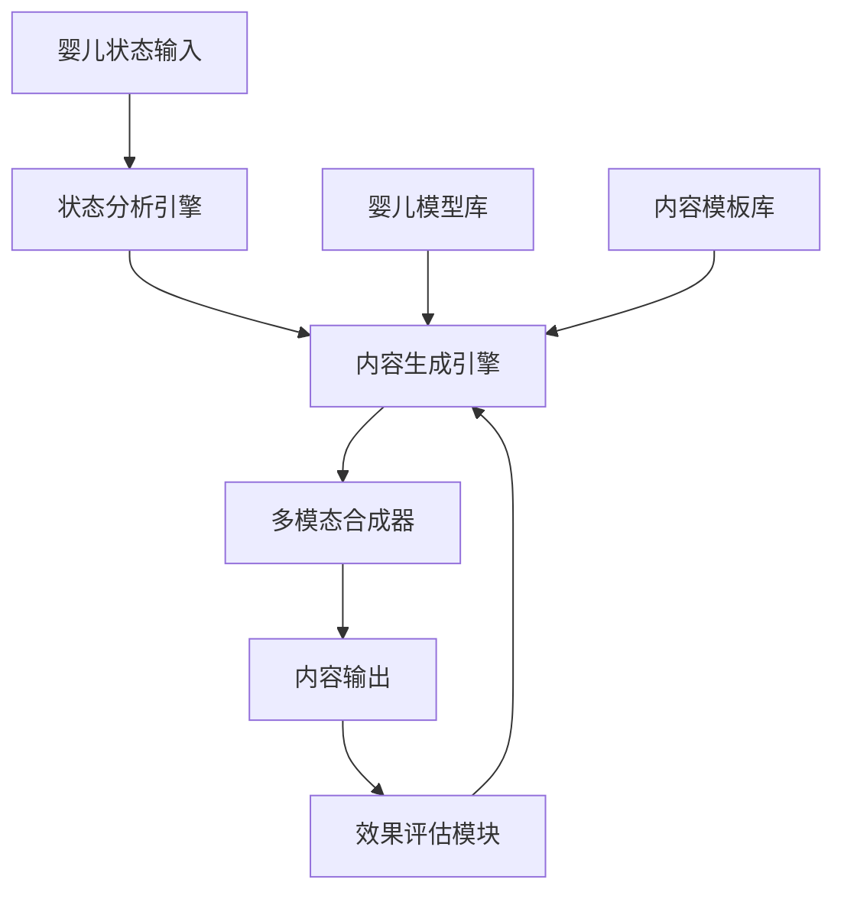

# 交互内容生成模块实现工作流

## 1. 模块概述

### 1.1 基本信息
- **模块名称**: 交互内容生成模块
- **所属子系统**: 交互表达子系统
- **功能描述**: 基于婴儿状态和需求，生成适合婴儿认知水平的交互内容，包括视觉、听觉和触觉等多模态内容
- **主要职责**: 
  - 分析婴儿当前状态和需求
  - 生成适合婴儿认知水平的多模态交互内容
  - 调整内容生成策略以适应婴儿发展变化
  - 评估交互内容效果并优化生成算法

### 1.2 技术特点
- **多模态内容生成**: 整合视觉、听觉和触觉等多种模态的内容生成
- **认知适应性**: 根据婴儿认知发展水平调整内容复杂度
- **实时响应**: 低延迟内容生成，确保交互的即时性
- **个性化定制**: 基于婴儿个人偏好和历史交互数据定制内容

## 2. 技术架构

### 2.1 系统架构


### 2.2 核心组件
1. **状态分析引擎**: 分析婴儿当前状态和需求
2. **内容生成引擎**: 基于状态和需求生成核心内容
3. **多模态合成器**: 将核心内容合成为多模态交互内容
4. **效果评估模块**: 评估交互内容效果并反馈优化

### 2.3 技术选型
- **深度学习框架**: PyTorch
- **多模态模型**: 基于Transformer的多模态架构
- **内容生成模型**: 扩散模型(Diffusion Models)和GANs结合
- **评估框架**: 自定义评估指标结合专家评估

## 3. 核心算法实现

### 3.1 婴儿状态分析算法

#### 3.1.1 情绪状态识别
基于多模态输入的情绪识别算法，采用注意力机制的多模态融合方法：

```python
class MultimodalEmotionRecognizer(nn.Module):
    """多模态情绪识别模型"""
    
    def __init__(self, visual_dim, audio_dim, text_dim, hidden_dim, num_classes):
        super(MultimodalEmotionRecognizer, self).__init__()
        
        # 视觉特征提取器
        self.visual_encoder = VisualEncoder(visual_dim, hidden_dim)
        
        # 音频特征提取器
        self.audio_encoder = AudioEncoder(audio_dim, hidden_dim)
        
        # 文本特征提取器
        self.text_encoder = TextEncoder(text_dim, hidden_dim)
        
        # 跨模态注意力机制
        self.cross_modal_attention = CrossModalAttention(hidden_dim)
        
        # 分类器
        self.classifier = nn.Sequential(
            nn.Linear(hidden_dim * 3, hidden_dim),
            nn.ReLU(),
            nn.Dropout(0.2),
            nn.Linear(hidden_dim, num_classes)
        )
    
    def forward(self, visual_input, audio_input, text_input):
        # 提取各模态特征
        visual_feat = self.visual_encoder(visual_input)
        audio_feat = self.audio_encoder(audio_input)
        text_feat = self.text_encoder(text_input)
        
        # 跨模态注意力融合
        fused_feat = self.cross_modal_attention(visual_feat, audio_feat, text_feat)
        
        # 分类预测
        output = self.classifier(fused_feat)
        
        return output
```

#### 3.1.2 认知状态评估
基于行为模式的认知状态评估算法：

```python
class CognitiveStateAssessor:
    """认知状态评估器"""
    
    def __init__(self, model_path):
        self.model = self._load_model(model_path)
        self.cognitive_stages = {
            0: "感知运动阶段(0-2岁)",
            1: "前运算阶段(2-7岁)",
            2: "具体运算阶段(7-11岁)",
            3: "形式运算阶段(11岁以上)"
        }
    
    def assess_cognitive_state(self, behavioral_data):
        """
        评估婴儿认知状态
        
        参数:
            behavioral_data: 行为数据，包括注意力持续时间、问题解决能力等
            
        返回:
            cognitive_stage: 认知阶段
            cognitive_score: 认知评分
            developmental_indicators: 发展指标
        """
        # 数据预处理
        processed_data = self._preprocess_data(behavioral_data)
        
        # 模型预测
        prediction = self.model.predict(processed_data)
        
        # 解析结果
        cognitive_stage_idx = np.argmax(prediction[:4])
        cognitive_stage = self.cognitive_stages[cognitive_stage_idx]
        cognitive_score = prediction[4]
        
        # 提取发展指标
        developmental_indicators = self._extract_developmental_indicators(prediction[5:])
        
        return {
            "cognitive_stage": cognitive_stage,
            "cognitive_score": float(cognitive_score),
            "developmental_indicators": developmental_indicators
        }
    
    def _preprocess_data(self, data):
        """数据预处理"""
        # 实现数据预处理逻辑
        pass
    
    def _extract_developmental_indicators(self, indicators_vector):
        """提取发展指标"""
        # 实现发展指标提取逻辑
        pass
```

### 3.2 多模态内容生成算法

#### 3.2.1 基于扩散模型的视觉内容生成
采用改进的扩散模型生成适合婴儿认知的视觉内容：

```python
class InfantFriendlyVisualGenerator:
    """婴儿友好型视觉内容生成器"""
    
    def __init__(self, model_path, device="cuda"):
        self.device = device
        self.model = self._load_diffusion_model(model_path)
        self.infant_preferences = self._load_infant_preferences()
        
    def generate_visual_content(self, prompt, cognitive_level, emotional_state):
        """
        生成适合婴儿的视觉内容
        
        参数:
            prompt: 文本提示
            cognitive_level: 认知水平
            emotional_state: 情绪状态
            
        返回:
            generated_image: 生成的图像
            metadata: 生成元数据
        """
        # 根据认知水平调整提示
        adjusted_prompt = self._adjust_prompt_for_cognitive_level(prompt, cognitive_level)
        
        # 根据情绪状态调整生成参数
        generation_params = self._adjust_params_for_emotional_state(emotional_state)
        
        # 生成图像
        with torch.no_grad():
            generated_image = self.model.generate(
                prompt=adjusted_prompt,
                **generation_params
            )
        
        # 婴儿友好性后处理
        processed_image = self._apply_infant_friendly_postprocessing(generated_image)
        
        # 创建元数据
        metadata = {
            "prompt": adjusted_prompt,
            "cognitive_level": cognitive_level,
            "emotional_state": emotional_state,
            "generation_params": generation_params
        }
        
        return processed_image, metadata
    
    def _adjust_prompt_for_cognitive_level(self, prompt, cognitive_level):
        """根据认知水平调整提示"""
        # 实现提示调整逻辑
        pass
    
    def _adjust_params_for_emotional_state(self, emotional_state):
        """根据情绪状态调整生成参数"""
        # 实现参数调整逻辑
        pass
    
    def _apply_infant_friendly_postprocessing(self, image):
        """应用婴儿友好性后处理"""
        # 实现后处理逻辑
        pass
```

#### 3.2.2 基于Transformer的音频内容生成
采用Transformer架构生成适合婴儿的音频内容：

```python
class InfantFriendlyAudioGenerator:
    """婴儿友好型音频内容生成器"""
    
    def __init__(self, model_path, sample_rate=16000):
        self.sample_rate = sample_rate
        self.model = self._load_audio_model(model_path)
        self.infant_audio_preferences = self._load_infant_audio_preferences()
        
    def generate_audio_content(self, text, cognitive_level, emotional_state):
        """
        生成适合婴儿的音频内容
        
        参数:
            text: 文本内容
            cognitive_level: 认知水平
            emotional_state: 情绪状态
            
        返回:
            generated_audio: 生成的音频
            metadata: 生成元数据
        """
        # 根据认知水平调整文本
        adjusted_text = self._adjust_text_for_cognitive_level(text, cognitive_level)
        
        # 根据情绪状态调整语音参数
        voice_params = self._adjust_voice_params_for_emotional_state(emotional_state)
        
        # 生成音频
        with torch.no_grad():
            generated_audio = self.model.synthesize(
                text=adjusted_text,
                **voice_params
            )
        
        # 婴儿友好性后处理
        processed_audio = self._apply_infant_friendly_postprocessing(generated_audio)
        
        # 创建元数据
        metadata = {
            "original_text": text,
            "adjusted_text": adjusted_text,
            "cognitive_level": cognitive_level,
            "emotional_state": emotional_state,
            "voice_params": voice_params
        }
        
        return processed_audio, metadata
    
    def _adjust_text_for_cognitive_level(self, text, cognitive_level):
        """根据认知水平调整文本"""
        # 实现文本调整逻辑
        pass
    
    def _adjust_voice_params_for_emotional_state(self, emotional_state):
        """根据情绪状态调整语音参数"""
        # 实现语音参数调整逻辑
        pass
    
    def _apply_infant_friendly_postprocessing(self, audio):
        """应用婴儿友好性后处理"""
        # 实现后处理逻辑
        pass
```

### 3.3 多模态内容融合算法

```python
class MultimodalContentFusion:
    """多模态内容融合器"""
    
    def __init__(self, fusion_model_path):
        self.fusion_model = self._load_fusion_model(fusion_model_path)
        self.temporal_alignment_model = self._load_temporal_alignment_model()
        
    def fuse_content(self, visual_content, audio_content, tactile_content, synchronization_params):
        """
        融合多模态内容
        
        参数:
            visual_content: 视觉内容
            audio_content: 音频内容
            tactile_content: 触觉内容
            synchronization_params: 同步参数
            
        返回:
            fused_content: 融合后的多模态内容
            sync_metadata: 同步元数据
        """
        # 时间对齐
        aligned_visual, aligned_audio, aligned_tactile = self._align_content_temporally(
            visual_content, audio_content, tactile_content, synchronization_params
        )
        
        # 多模态融合
        fused_content = self.fusion_model.fuse(
            visual=aligned_visual,
            audio=aligned_audio,
            tactile=aligned_tactile
        )
        
        # 创建同步元数据
        sync_metadata = {
            "visual_timestamps": aligned_visual.timestamps,
            "audio_timestamps": aligned_audio.timestamps,
            "tactile_timestamps": aligned_tactile.timestamps,
            "synchronization_quality": self._evaluate_synchronization_quality(
                aligned_visual, aligned_audio, aligned_tactile
            )
        }
        
        return fused_content, sync_metadata
    
    def _align_content_temporally(self, visual, audio, tactile, sync_params):
        """时间对齐多模态内容"""
        # 实现时间对齐逻辑
        pass
    
    def _evaluate_synchronization_quality(self, visual, audio, tactile):
        """评估同步质量"""
        # 实现同步质量评估逻辑
        pass
```

## 4. 实现细节

### 4.1 数据处理流程

#### 4.1.1 婴儿状态数据预处理
```python
class InfantStateDataPreprocessor:
    """婴儿状态数据预处理器"""
    
    def __init__(self):
        self.normalization_params = self._load_normalization_params()
        self.feature_extractors = {
            "visual": VisualFeatureExtractor(),
            "audio": AudioFeatureExtractor(),
            "physiological": PhysiologicalFeatureExtractor()
        }
    
    def preprocess(self, raw_data):
        """
        预处理原始婴儿状态数据
        
        参数:
            raw_data: 原始数据，包含视觉、音频和生理数据
            
        返回:
            processed_data: 预处理后的数据
        """
        # 提取各模态特征
        visual_features = self.feature_extractors["visual"].extract(raw_data["visual"])
        audio_features = self.feature_extractors["audio"].extract(raw_data["audio"])
        physiological_features = self.feature_extractors["physiological"].extract(raw_data["physiological"])
        
        # 数据标准化
        normalized_visual = self._normalize_features(visual_features, "visual")
        normalized_audio = self._normalize_features(audio_features, "audio")
        normalized_physiological = self._normalize_features(physiological_features, "physiological")
        
        # 特征融合
        fused_features = self._fuse_features(
            normalized_visual, normalized_audio, normalized_physiological
        )
        
        return {
            "visual": normalized_visual,
            "audio": normalized_audio,
            "physiological": normalized_physiological,
            "fused": fused_features
        }
    
    def _normalize_features(self, features, modality):
        """标准化特征"""
        # 实现特征标准化逻辑
        pass
    
    def _fuse_features(self, visual, audio, physiological):
        """融合多模态特征"""
        # 实现特征融合逻辑
        pass
```

### 4.2 模型训练流程

#### 4.2.1 内容生成模型训练
```python
class ContentGenerationModelTrainer:
    """内容生成模型训练器"""
    
    def __init__(self, model_config, training_config):
        self.model = self._build_model(model_config)
        self.training_config = training_config
        self.optimizer = self._setup_optimizer()
        self.scheduler = self._setup_scheduler()
        self.loss_functions = self._setup_loss_functions()
        
    def train(self, train_dataset, val_dataset):
        """
        训练内容生成模型
        
        参数:
            train_dataset: 训练数据集
            val_dataset: 验证数据集
            
        返回:
            training_history: 训练历史
            best_model_path: 最佳模型路径
        """
        best_val_loss = float('inf')
        training_history = {"train_loss": [], "val_loss": [], "metrics": []}
        
        for epoch in range(self.training_config["num_epochs"]):
            # 训练阶段
            train_loss = self._train_epoch(train_dataset)
            training_history["train_loss"].append(train_loss)
            
            # 验证阶段
            val_loss, metrics = self._validate_epoch(val_dataset)
            training_history["val_loss"].append(val_loss)
            training_history["metrics"].append(metrics)
            
            # 学习率调度
            self.scheduler.step(val_loss)
            
            # 保存最佳模型
            if val_loss < best_val_loss:
                best_val_loss = val_loss
                best_model_path = self._save_checkpoint(epoch, val_loss, is_best=True)
            
            # 打印训练进度
            self._print_training_progress(epoch, train_loss, val_loss, metrics)
        
        return training_history, best_model_path
    
    def _train_epoch(self, dataset):
        """训练一个epoch"""
        self.model.train()
        total_loss = 0.0
        
        for batch_idx, batch in enumerate(dataset):
            self.optimizer.zero_grad()
            
            # 前向传播
            outputs = self.model(batch["inputs"])
            
            # 计算损失
            loss = self._compute_loss(outputs, batch["targets"])
            
            # 反向传播
            loss.backward()
            
            # 梯度裁剪
            torch.nn.utils.clip_grad_norm_(
                self.model.parameters(), 
                self.training_config["grad_clip_norm"]
            )
            
            # 参数更新
            self.optimizer.step()
            
            total_loss += loss.item()
        
        return total_loss / len(dataset)
    
    def _validate_epoch(self, dataset):
        """验证一个epoch"""
        self.model.eval()
        total_loss = 0.0
        all_metrics = []
        
        with torch.no_grad():
            for batch in dataset:
                # 前向传播
                outputs = self.model(batch["inputs"])
                
                # 计算损失
                loss = self._compute_loss(outputs, batch["targets"])
                total_loss += loss.item()
                
                # 计算指标
                metrics = self._compute_metrics(outputs, batch["targets"])
                all_metrics.append(metrics)
        
        # 平均指标
        avg_metrics = {}
        for key in all_metrics[0].keys():
            avg_metrics[key] = np.mean([m[key] for m in all_metrics])
        
        return total_loss / len(dataset), avg_metrics
    
    def _compute_loss(self, outputs, targets):
        """计算损失"""
        # 实现损失计算逻辑
        pass
    
    def _compute_metrics(self, outputs, targets):
        """计算评估指标"""
        # 实现指标计算逻辑
        pass
```

### 4.3 实时内容生成流程

```python
class RealTimeContentGenerator:
    """实时内容生成器"""
    
    def __init__(self, model_paths, device="cuda"):
        self.device = device
        self.models = self._load_models(model_paths)
        self.content_cache = ContentCache(max_size=100)
        self.performance_monitor = PerformanceMonitor()
        
    def generate_content(self, infant_state, content_request):
        """
        实时生成交互内容
        
        参数:
            infant_state: 婴儿当前状态
            content_request: 内容请求
            
        返回:
            generated_content: 生成的内容
            generation_metadata: 生成元数据
        """
        # 记录开始时间
        start_time = time.time()
        
        # 检查缓存
        cache_key = self._generate_cache_key(infant_state, content_request)
        cached_content = self.content_cache.get(cache_key)
        if cached_content is not None:
            return cached_content, {"cached": True, "generation_time": time.time() - start_time}
        
        # 分析婴儿状态
        analyzed_state = self.models["state_analyzer"].analyze(infant_state)
        
        # 生成内容计划
        content_plan = self._create_content_plan(analyzed_state, content_request)
        
        # 生成各模态内容
        visual_content = self.models["visual_generator"].generate(
            content_plan["visual"], analyzed_state
        )
        audio_content = self.models["audio_generator"].generate(
            content_plan["audio"], analyzed_state
        )
        tactile_content = self.models["tactile_generator"].generate(
            content_plan["tactile"], analyzed_state
        )
        
        # 融合多模态内容
        fused_content = self.models["content_fusion"].fuse(
            visual_content, audio_content, tactile_content
        )
        
        # 缓存生成的内容
        self.content_cache.put(cache_key, fused_content)
        
        # 记录生成时间
        generation_time = time.time() - start_time
        self.performance_monitor.record_generation_time(generation_time)
        
        # 创建元数据
        generation_metadata = {
            "cached": False,
            "generation_time": generation_time,
            "infant_state": analyzed_state,
            "content_plan": content_plan
        }
        
        return fused_content, generation_metadata
    
    def _generate_cache_key(self, infant_state, content_request):
        """生成缓存键"""
        # 实现缓存键生成逻辑
        pass
    
    def _create_content_plan(self, analyzed_state, content_request):
        """创建内容计划"""
        # 实现内容计划创建逻辑
        pass
```

## 5. 性能优化

### 5.1 模型优化策略

#### 5.1.1 模型量化
```python
def quantize_model(model, calibration_data_loader):
    """
    量化模型以提高推理速度
    
    参数:
        model: 要量化的模型
        calibration_data_loader: 校准数据加载器
        
    返回:
        quantized_model: 量化后的模型
    """
    # 设置模型为评估模式
    model.eval()
    
    # 准备量化
    model.qconfig = torch.quantization.get_default_qconfig('fbgemm')
    torch.quantization.prepare(model, inplace=True)
    
    # 使用校准数据进行校准
    with torch.no_grad():
        for data, _ in calibration_data_loader:
            model(data)
    
    # 转换为量化模型
    quantized_model = torch.quantization.convert(model, inplace=False)
    
    return quantized_model
```

#### 5.1.2 模型剪枝
```python
def prune_model(model, pruning_ratio):
    """
    剪枝模型以减少参数数量
    
    参数:
        model: 要剪枝的模型
        pruning_ratio: 剪枝比例
        
    返回:
        pruned_model: 剪枝后的模型
    """
    import torch.nn.utils.prune as prune
    
    # 获取要剪枝的参数
    parameters_to_prune = []
    for name, module in model.named_modules():
        if isinstance(module, (torch.nn.Linear, torch.nn.Conv2d)):
            parameters_to_prune.append((module, 'weight'))
    
    # 全局结构化剪枝
    prune.global_unstructured(
        parameters_to_prune,
        pruning_method=prune.L1Unstructured,
        amount=pruning_ratio,
    )
    
    # 移除剪枝重参数化以使剪枝永久化
    for module, param_name in parameters_to_prune:
        prune.remove(module, param_name)
    
    return model
```

### 5.2 系统优化策略

#### 5.2.1 缓存策略
```python
class IntelligentContentCache:
    """智能内容缓存系统"""
    
    def __init__(self, max_size=1000, similarity_threshold=0.9):
        self.max_size = max_size
        self.similarity_threshold = similarity_threshold
        self.cache = {}
        self.usage_stats = {}
        self.similarity_index = SimilarityIndex()
        
    def get(self, key):
        """从缓存获取内容"""
        if key in self.cache:
            self.usage_stats[key] = self.usage_stats.get(key, 0) + 1
            return self.cache[key]
        
        # 检查相似内容
        similar_key = self._find_similar_content(key)
        if similar_key is not None:
            self.usage_stats[similar_key] = self.usage_stats.get(similar_key, 0) + 1
            return self.cache[similar_key]
        
        return None
    
    def put(self, key, content):
        """将内容放入缓存"""
        # 如果缓存已满，移除最少使用的内容
        if len(self.cache) >= self.max_size:
            self._evict_least_used()
        
        self.cache[key] = content
        self.usage_stats[key] = 1
        
        # 更新相似性索引
        self.similarity_index.add(key, content)
    
    def _find_similar_content(self, key):
        """查找相似内容"""
        # 实现相似内容查找逻辑
        pass
    
    def _evict_least_used(self):
        """移除最少使用的内容"""
        # 实现最少使用内容移除逻辑
        pass
```

#### 5.2.2 并行处理
```python
class ParallelContentGenerator:
    """并行内容生成器"""
    
    def __init__(self, model_paths, num_workers=4):
        self.model_paths = model_paths
        self.num_workers = num_workers
        self.models = None
        self.model_locks = None
        self._initialize_models()
        
    def _initialize_models(self):
        """初始化模型和锁"""
        self.models = {}
        self.model_locks = {}
        
        for model_name, model_path in self.model_paths.items():
            self.models[model_name] = self._load_model(model_path)
            self.model_locks[model_name] = threading.Lock()
    
    def generate_content_parallel(self, infant_state, content_request):
        """
        并行生成内容
        
        参数:
            infant_state: 婴儿状态
            content_request: 内容请求
            
        返回:
            generated_content: 生成的内容
        """
        # 创建线程池
        with ThreadPoolExecutor(max_workers=self.num_workers) as executor:
            # 并行生成各模态内容
            visual_future = executor.submit(
                self._generate_visual_content, infant_state, content_request
            )
            audio_future = executor.submit(
                self._generate_audio_content, infant_state, content_request
            )
            tactile_future = executor.submit(
                self._generate_tactile_content, infant_state, content_request
            )
            
            # 等待所有任务完成
            visual_content = visual_future.result()
            audio_content = audio_future.result()
            tactile_content = tactile_future.result()
        
        # 融合多模态内容
        fused_content = self._fuse_content(visual_content, audio_content, tactile_content)
        
        return fused_content
    
    def _generate_visual_content(self, infant_state, content_request):
        """生成视觉内容"""
        with self.model_locks["visual_generator"]:
            # 实现视觉内容生成逻辑
            pass
    
    def _generate_audio_content(self, infant_state, content_request):
        """生成音频内容"""
        with self.model_locks["audio_generator"]:
            # 实现音频内容生成逻辑
            pass
    
    def _generate_tactile_content(self, infant_state, content_request):
        """生成触觉内容"""
        with self.model_locks["tactile_generator"]:
            # 实现触觉内容生成逻辑
            pass
```

## 6. 评估与测试

### 6.1 评估指标

#### 6.1.1 内容质量评估
```python
class ContentQualityEvaluator:
    """内容质量评估器"""
    
    def __init__(self):
        self.metrics = {
            "age_appropriateness": AgeAppropriatenessMetric(),
            "engagement_potential": EngagementPotentialMetric(),
            "educational_value": EducationalValueMetric(),
            "diversity": DiversityMetric(),
            "safety": SafetyMetric()
        }
    
    def evaluate_content(self, generated_content, target_age, context):
        """
        评估生成内容的质量
        
        参数:
            generated_content: 生成的内容
            target_age: 目标年龄
            context: 上下文信息
            
        返回:
            evaluation_results: 评估结果
        """
        results = {}
        
        for metric_name, metric in self.metrics.items():
            score = metric.evaluate(generated_content, target_age, context)
            results[metric_name] = score
        
        # 计算综合评分
        overall_score = self._compute_overall_score(results)
        results["overall_score"] = overall_score
        
        return results
    
    def _compute_overall_score(self, metric_scores):
        """计算综合评分"""
        # 实现综合评分计算逻辑
        pass
```

#### 6.1.2 实时性能评估
```python
class RealTimePerformanceEvaluator:
    """实时性能评估器"""
    
    def __init__(self):
        self.metrics = {
            "generation_time": GenerationTimeMetric(),
            "memory_usage": MemoryUsageMetric(),
            "cpu_utilization": CPUUtilizationMetric(),
            "gpu_utilization": GPUUtilizationMetric()
        }
        self.performance_history = []
        
    def evaluate_performance(self, generation_start_time, generation_end_time, system_resources):
        """
        评估实时性能
        
        参数:
            generation_start_time: 生成开始时间
            generation_end_time: 生成结束时间
            system_resources: 系统资源使用情况
            
        返回:
            performance_metrics: 性能指标
        """
        generation_time = generation_end_time - generation_start_time
        
        results = {
            "generation_time": generation_time,
            "memory_usage": system_resources["memory_usage"],
            "cpu_utilization": system_resources["cpu_utilization"],
            "gpu_utilization": system_resources["gpu_utilization"]
        }
        
        # 记录性能历史
        self.performance_history.append(results)
        
        # 计算性能趋势
        performance_trends = self._compute_performance_trends()
        results["trends"] = performance_trends
        
        return results
    
    def _compute_performance_trends(self):
        """计算性能趋势"""
        # 实现性能趋势计算逻辑
        pass
```

### 6.2 测试框架

#### 6.2.1 单元测试
```python
class TestContentGeneration(unittest.TestCase):
    """内容生成单元测试"""
    
    def setUp(self):
        """测试设置"""
        self.model_path = "path/to/model"
        self.generator = InfantFriendlyContentGenerator(self.model_path)
        
    def test_visual_content_generation(self):
        """测试视觉内容生成"""
        prompt = "colorful animals"
        cognitive_level = 1
        emotional_state = "happy"
        
        image, metadata = self.generator.generate_visual_content(
            prompt, cognitive_level, emotional_state
        )
        
        # 验证输出
        self.assertIsNotNone(image)
        self.assertIn("prompt", metadata)
        self.assertEqual(metadata["prompt"], prompt)
        self.assertEqual(metadata["cognitive_level"], cognitive_level)
        self.assertEqual(metadata["emotional_state"], emotional_state)
    
    def test_audio_content_generation(self):
        """测试音频内容生成"""
        text = "Hello, baby!"
        cognitive_level = 1
        emotional_state = "calm"
        
        audio, metadata = self.generator.generate_audio_content(
            text, cognitive_level, emotional_state
        )
        
        # 验证输出
        self.assertIsNotNone(audio)
        self.assertIn("original_text", metadata)
        self.assertEqual(metadata["original_text"], text)
        self.assertEqual(metadata["cognitive_level"], cognitive_level)
        self.assertEqual(metadata["emotional_state"], emotional_state)
```

#### 6.2.2 集成测试
```python
class TestIntegratedContentGeneration(unittest.TestCase):
    """集成内容生成测试"""
    
    def setUp(self):
        """测试设置"""
        self.model_paths = {
            "state_analyzer": "path/to/state_analyzer",
            "visual_generator": "path/to/visual_generator",
            "audio_generator": "path/to/audio_generator",
            "tactile_generator": "path/to/tactile_generator",
            "content_fusion": "path/to/content_fusion"
        }
        self.generator = RealTimeContentGenerator(self.model_paths)
        
    def test_end_to_end_content_generation(self):
        """测试端到端内容生成"""
        infant_state = {
            "age": 12,  # 12个月
            "emotional_state": "curious",
            "cognitive_level": 1,
            "attention_span": 30  # 30秒
        }
        
        content_request = {
            "type": "educational",
            "topic": "animals",
            "duration": 20  # 20秒
        }
        
        generated_content, metadata = self.generator.generate_content(
            infant_state, content_request
        )
        
        # 验证输出
        self.assertIsNotNone(generated_content)
        self.assertIn("visual", generated_content)
        self.assertIn("audio", generated_content)
        self.assertIn("tactile", generated_content)
        self.assertIn("generation_time", metadata)
        self.assertLess(metadata["generation_time"], 1.0)  # 生成时间应小于1秒
```

## 7. 部署与运维

### 7.1 部署架构

#### 7.1.1 容器化部署
```dockerfile
# Dockerfile for Interactive Content Generation Module
FROM python:3.9-slim

# 设置工作目录
WORKDIR /app

# 安装系统依赖
RUN apt-get update && apt-get install -y \
    build-essential \
    cmake \
    git \
    wget \
    unzip \
    pkg-config \
    libopencv-dev \
    libavcodec-dev \
    libavformat-dev \
    libswscale-dev \
    libgtk2.0-dev \
    libcanberra-gtk-module \
    libcanberra-gtk3-module \
    && rm -rf /var/lib/apt/lists/*

# 复制依赖文件
COPY requirements.txt .

# 安装Python依赖
RUN pip install --no-cache-dir -r requirements.txt

# 复制应用代码
COPY . .

# 创建非root用户
RUN useradd -m -u 1000 appuser && chown -R appuser:appuser /app
USER appuser

# 暴露端口
EXPOSE 8080

# 启动命令
CMD ["python", "app.py"]
```

#### 7.1.2 Kubernetes部署配置
```yaml
apiVersion: apps/v1
kind: Deployment
metadata:
  name: interactive-content-generation
  labels:
    app: interactive-content-generation
spec:
  replicas: 3
  selector:
    matchLabels:
      app: interactive-content-generation
  template:
    metadata:
      labels:
        app: interactive-content-generation
    spec:
      containers:
      - name: interactive-content-generation
        image: registry.example.com/interactive-content-generation:latest
        ports:
        - containerPort: 8080
        resources:
          requests:
            memory: "4Gi"
            cpu: "2"
            nvidia.com/gpu: 1
          limits:
            memory: "8Gi"
            cpu: "4"
            nvidia.com/gpu: 1
        env:
        - name: MODEL_PATH
          value: "/models"
        - name: LOG_LEVEL
          value: "INFO"
        volumeMounts:
        - name: model-volume
          mountPath: /models
          readOnly: true
      volumes:
      - name: model-volume
        persistentVolumeClaim:
          claimName: model-pvc
---
apiVersion: v1
kind: Service
metadata:
  name: interactive-content-generation-service
spec:
  selector:
    app: interactive-content-generation
  ports:
    - protocol: TCP
      port: 80
      targetPort: 8080
  type: LoadBalancer
```

### 7.2 监控与日志

#### 7.2.1 性能监控
```python
class PerformanceMonitor:
    """性能监控器"""
    
    def __init__(self, metrics_endpoint):
        self.metrics_endpoint = metrics_endpoint
        self.metrics_collector = MetricsCollector()
        
    def start_monitoring(self):
        """开始监控"""
        # 设置系统指标收集
        self.metrics_collector.register_metric(
            "cpu_usage", self._get_cpu_usage, interval=5
        )
        self.metrics_collector.register_metric(
            "memory_usage", self._get_memory_usage, interval=5
        )
        self.metrics_collector.register_metric(
            "gpu_usage", self._get_gpu_usage, interval=5
        )
        
        # 设置应用指标收集
        self.metrics_collector.register_metric(
            "request_count", self._get_request_count, interval=10
        )
        self.metrics_collector.register_metric(
            "average_response_time", self._get_average_response_time, interval=10
        )
        self.metrics_collector.register_metric(
            "error_rate", self._get_error_rate, interval=10
        )
        
        # 启动指标收集
        self.metrics_collector.start()
        
    def _get_cpu_usage(self):
        """获取CPU使用率"""
        # 实现CPU使用率获取逻辑
        pass
    
    def _get_memory_usage(self):
        """获取内存使用率"""
        # 实现内存使用率获取逻辑
        pass
    
    def _get_gpu_usage(self):
        """获取GPU使用率"""
        # 实现GPU使用率获取逻辑
        pass
    
    def _get_request_count(self):
        """获取请求计数"""
        # 实现请求计数获取逻辑
        pass
    
    def _get_average_response_time(self):
        """获取平均响应时间"""
        # 实现平均响应时间获取逻辑
        pass
    
    def _get_error_rate(self):
        """获取错误率"""
        # 实现错误率获取逻辑
        pass
```

#### 7.2.2 日志系统
```python
class StructuredLogger:
    """结构化日志记录器"""
    
    def __init__(self, log_level="INFO"):
        self.logger = logging.getLogger("interactive_content_generation")
        self.logger.setLevel(getattr(logging, log_level))
        
        # 创建格式化器
        formatter = logging.Formatter(
            '%(asctime)s - %(name)s - %(levelname)s - %(message)s'
        )
        
        # 创建控制台处理器
        console_handler = logging.StreamHandler()
        console_handler.setFormatter(formatter)
        self.logger.addHandler(console_handler)
        
        # 创建文件处理器
        file_handler = logging.FileHandler("/var/log/interactive_content_generation.log")
        file_handler.setFormatter(formatter)
        self.logger.addHandler(file_handler)
        
        # 创建JSON处理器用于结构化日志
        json_handler = logging.FileHandler("/var/log/interactive_content_generation.json")
        json_formatter = JsonFormatter()
        json_handler.setFormatter(json_formatter)
        self.logger.addHandler(json_handler)
    
    def log_request(self, request_id, infant_state, content_request):
        """记录请求日志"""
        self.logger.info(
            "Request received",
            extra={
                "event_type": "request_received",
                "request_id": request_id,
                "infant_state": infant_state,
                "content_request": content_request
            }
        )
    
    def log_response(self, request_id, generated_content, generation_time):
        """记录响应日志"""
        self.logger.info(
            "Response sent",
            extra={
                "event_type": "response_sent",
                "request_id": request_id,
                "content_summary": self._summarize_content(generated_content),
                "generation_time": generation_time
            }
        )
    
    def log_error(self, request_id, error_type, error_message, stack_trace):
        """记录错误日志"""
        self.logger.error(
            "Error occurred",
            extra={
                "event_type": "error",
                "request_id": request_id,
                "error_type": error_type,
                "error_message": error_message,
                "stack_trace": stack_trace
            }
        )
    
    def _summarize_content(self, content):
        """总结内容"""
        # 实现内容总结逻辑
        pass
```

## 8. 未来发展方向

### 8.1 技术演进

1. **更先进的多模态融合技术**: 探索基于Transformer的跨模态注意力机制，实现更自然的多模态内容融合
2. **个性化内容生成**: 基于婴儿个人偏好和发展轨迹，实现高度个性化的内容生成
3. **实时适应性调整**: 开发能够实时调整内容生成策略的算法，以适应婴儿不断变化的需求
4. **情感计算增强**: 集成更先进的情感计算技术，使生成内容更符合婴儿情感状态

### 8.2 应用扩展

1. **早期教育应用**: 扩展到更广泛的早期教育场景，包括语言学习、数学概念等
2. **特殊需求支持**: 开发针对有特殊需求婴儿的内容生成算法，如自闭症谱系障碍儿童
3. **家长参与工具**: 开发家长参与的内容生成工具，增强亲子互动体验
4. **跨文化适应**: 研究跨文化内容生成策略，适应不同文化背景的婴儿

### 8.3 伦理与安全

1. **内容安全过滤**: 开发更先进的内容安全过滤机制，确保生成内容的适宜性
2. **隐私保护增强**: 强化婴儿数据隐私保护措施，符合相关法规要求
3. **偏见检测与消除**: 开发检测和消除算法偏见的机制，确保内容生成的公平性
4. **长期影响研究**: 开展长期研究，评估交互内容生成对婴儿发展的影响

## 9. 结论

交互内容生成模块是真实婴儿AI管家系统的核心组件之一，负责生成适合婴儿认知水平的多模态交互内容。本实现工作流详细介绍了模块的技术架构、核心算法实现、性能优化策略以及部署运维方案。

基于当前最先进的多模态AI技术，我们设计了一套完整的内容生成流程，包括婴儿状态分析、多模态内容生成和内容融合等关键环节。通过采用深度学习、扩散模型和Transformer等前沿技术，实现了高质量、个性化的交互内容生成。

未来，随着技术的不断发展和对婴儿认知理解的深入，交互内容生成模块将不断演进，为婴儿提供更加丰富、适宜的交互体验，促进其认知和情感发展。