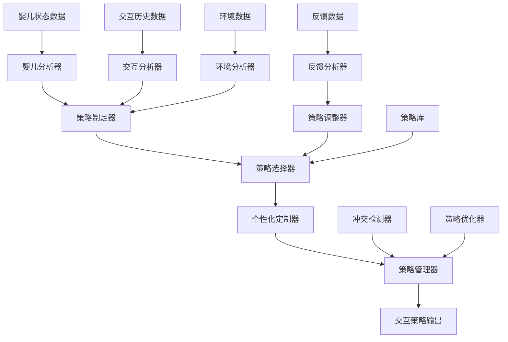

# 交互策略模块实现工作流

## 1. 模块概述

### 1.1 基本信息
- **模块名称**: 交互策略模块
- **所属子系统**: 交互表达子系统
- **功能描述**: 根据婴儿的状态、偏好和反馈，动态调整交互方式、内容和节奏，制定最适合的交互策略
- **主要职责**: 
  - 分析婴儿状态、偏好和习惯
  - 制定和管理交互策略库
  - 根据情境选择最合适的策略
  - 根据反馈调整交互策略
  - 优化策略效果和适应性
  - 定制个性化交互策略

### 1.2 技术特点
- **多维度分析**: 从婴儿状态、交互历史和反馈多维度分析
- **动态调整**: 实时调整交互策略以适应婴儿变化
- **个性化定制**: 基于婴儿个人特征定制交互策略
- **策略学习**: 从交互效果中学习并优化策略

## 2. 技术架构

### 2.1 系统架构


### 2.2 核心组件
1. **婴儿分析器**: 分析婴儿状态、偏好和习惯
2. **交互分析器**: 分析交互历史和效果
3. **反馈分析器**: 分析反馈信息和趋势
4. **环境分析器**: 分析环境状态和变化
5. **策略制定器**: 根据分析结果制定策略
6. **策略选择器**: 根据情境选择最适合的策略
7. **策略调整器**: 根据反馈调整现有策略
8. **策略优化器**: 优化策略效果和适应性
9. **个性化定制器**: 定制个性化策略
10. **策略管理器**: 管理和维护策略库
11. **冲突检测器**: 检测和解决策略冲突

### 2.3 技术选型
- **机器学习框架**: scikit-learn, XGBoost
- **深度学习框架**: PyTorch
- **数据处理库**: pandas, numpy
- **实时处理**: Redis, Apache Kafka
- **API框架**: FastAPI
- **部署方案**: Kubernetes

## 3. 核心算法实现

### 3.1 婴儿状态分析算法

#### 3.1.1 多维度状态评估
基于多模态数据的婴儿状态评估算法：

```python
class MultiDimensionalStateAnalyzer:
    """多维度婴儿状态分析器"""
    
    def __init__(self, model_paths):
        self.emotion_model = self._load_model(model_paths["emotion"])
        self.attention_model = self._load_model(model_paths["attention"])
        self.cognitive_model = self._load_model(model_paths["cognitive"])
        self.fusion_model = self._load_model(model_paths["fusion"])
        
    def analyze_state(self, multimodal_data):
        """
        分析婴儿多维度状态
        
        参数:
            multimodal_data: 多模态数据，包含视觉、音频和生理数据
            
        返回:
            state_assessment: 状态评估结果
        """
        # 提取各模态特征
        visual_features = self._extract_visual_features(multimodal_data["visual"])
        audio_features = self._extract_audio_features(multimodal_data["audio"])
        physiological_features = self._extract_physiological_features(multimodal_data["physiological"])
        
        # 各维度状态评估
        emotion_state = self.emotion_model.predict(visual_features, audio_features)
        attention_state = self.attention_model.predict(visual_features, physiological_features)
        cognitive_state = self.cognitive_model.predict(visual_features, audio_features, physiological_features)
        
        # 融合多维度状态
        fused_state = self.fusion_model.fuse(
            emotion=emotion_state,
            attention=attention_state,
            cognitive=cognitive_state
        )
        
        # 生成状态评估报告
        state_assessment = {
            "emotion": emotion_state,
            "attention": attention_state,
            "cognitive": cognitive_state,
            "overall": fused_state,
            "confidence": self._calculate_confidence(emotion_state, attention_state, cognitive_state),
            "timestamp": datetime.now().isoformat()
        }
        
        return state_assessment
    
    def _extract_visual_features(self, visual_data):
        """提取视觉特征"""
        # 实现视觉特征提取逻辑
        pass
    
    def _extract_audio_features(self, audio_data):
        """提取音频特征"""
        # 实现音频特征提取逻辑
        pass
    
    def _extract_physiological_features(self, physiological_data):
        """提取生理特征"""
        # 实现生理特征提取逻辑
        pass
    
    def _calculate_confidence(self, emotion_state, attention_state, cognitive_state):
        """计算状态评估置信度"""
        # 实现置信度计算逻辑
        pass
```

#### 3.1.2 偏好学习算法
基于交互历史的婴儿偏好学习算法：

```python
class PreferenceLearningEngine:
    """婴儿偏好学习引擎"""
    
    def __init__(self, model_config):
        self.preference_model = self._build_preference_model(model_config)
        self.interaction_history = InteractionHistory()
        self.preference_update_interval = model_config.get("update_interval", 24)  # 小时
        
    def learn_preferences(self, infant_id, interaction_history):
        """
        学习婴儿偏好
        
        参数:
            infant_id: 婴儿ID
            interaction_history: 交互历史数据
            
        返回:
            preferences: 学习到的偏好模型
        """
        # 数据预处理
        processed_data = self._preprocess_interaction_data(interaction_history)
        
        # 特征工程
        features = self._extract_preference_features(processed_data)
        
        # 偏好建模
        preferences = self.preference_model.fit(features)
        
        # 验证偏好模型
        validation_score = self._validate_preference_model(preferences, processed_data)
        
        # 更新偏好模型
        if validation_score > self.preference_update_threshold:
            self._update_preference_model(infant_id, preferences)
        
        return preferences
    
    def predict_preference(self, infant_id, interaction_options):
        """
        预测婴儿对交互选项的偏好
        
        参数:
            infant_id: 婴儿ID
            interaction_options: 交互选项列表
            
        返回:
            preference_scores: 偏好评分
        """
        # 获取婴儿偏好模型
        preference_model = self._get_preference_model(infant_id)
        
        # 计算各选项偏好评分
        preference_scores = {}
        for option in interaction_options:
            features = self._extract_option_features(option)
            score = preference_model.predict(features)
            preference_scores[option["id"]] = score
        
        return preference_scores
    
    def _preprocess_interaction_data(self, interaction_history):
        """预处理交互数据"""
        # 实现数据预处理逻辑
        pass
    
    def _extract_preference_features(self, processed_data):
        """提取偏好特征"""
        # 实现特征提取逻辑
        pass
    
    def _validate_preference_model(self, preferences, validation_data):
        """验证偏好模型"""
        # 实现模型验证逻辑
        pass
    
    def _update_preference_model(self, infant_id, preferences):
        """更新偏好模型"""
        # 实现模型更新逻辑
        pass
    
    def _get_preference_model(self, infant_id):
        """获取婴儿偏好模型"""
        # 实现模型获取逻辑
        pass
    
    def _extract_option_features(self, option):
        """提取选项特征"""
        # 实现选项特征提取逻辑
        pass
```

### 3.2 策略制定算法

#### 3.2.1 基于规则的策略制定
基于专家知识和规则的策略制定算法：

```python
class RuleBasedStrategyCreator:
    """基于规则的策略制定器"""
    
    def __init__(self, rule_base_path):
        self.rule_base = self._load_rule_base(rule_base_path)
        self.rule_engine = RuleEngine()
        
    def create_strategy(self, infant_state, context, objectives):
        """
        基于规则制定策略
        
        参数:
            infant_state: 婴儿状态
            context: 上下文信息
            objectives: 交互目标
            
        返回:
            strategy: 制定的策略
        """
        # 初始化策略
        strategy = {
            "id": self._generate_strategy_id(),
            "infant_id": infant_state["infant_id"],
            "creation_time": datetime.now().isoformat(),
            "rules_applied": [],
            "parameters": {},
            "expected_outcomes": []
        }
        
        # 应用规则
        for rule in self.rule_base["rules"]:
            if self._rule_matches(rule, infant_state, context, objectives):
                # 应用规则
                rule_result = self.rule_engine.apply_rule(rule, infant_state, context, objectives)
                
                # 更新策略
                strategy["rules_applied"].append(rule["id"])
                strategy["parameters"].update(rule_result["parameters"])
                strategy["expected_outcomes"].extend(rule_result["expected_outcomes"])
        
        # 解决规则冲突
        strategy = self._resolve_rule_conflicts(strategy)
        
        # 验证策略完整性
        strategy = self._validate_strategy_completeness(strategy)
        
        return strategy
    
    def _rule_matches(self, rule, infant_state, context, objectives):
        """检查规则是否匹配"""
        # 实现规则匹配逻辑
        pass
    
    def _resolve_rule_conflicts(self, strategy):
        """解决规则冲突"""
        # 实现冲突解决逻辑
        pass
    
    def _validate_strategy_completeness(self, strategy):
        """验证策略完整性"""
        # 实现完整性验证逻辑
        pass
    
    def _generate_strategy_id(self):
        """生成策略ID"""
        # 实现ID生成逻辑
        pass
```

#### 3.2.2 基于强化学习的策略制定
基于强化学习的自适应策略制定算法：

```python
class ReinforcementLearningStrategyCreator:
    """基于强化学习的策略制定器"""
    
    def __init__(self, model_config):
        self.state_dim = model_config["state_dim"]
        self.action_dim = model_config["action_dim"]
        self.agent = self._build_rl_agent(model_config)
        self.experience_buffer = ExperienceBuffer(max_size=model_config["buffer_size"])
        self.training_config = model_config["training"]
        
    def create_strategy(self, infant_state, context, objectives):
        """
        基于强化学习制定策略
        
        参数:
            infant_state: 婴儿状态
            context: 上下文信息
            objectives: 交互目标
            
        返回:
            strategy: 制定的策略
        """
        # 构建状态表示
        state = self._build_state_representation(infant_state, context, objectives)
        
        # 使用智能体选择动作
        action_values = self.agent.predict(state)
        action = self._select_action(action_values)
        
        # 解码动作为策略参数
        strategy_parameters = self._decode_action_to_parameters(action)
        
        # 构建策略
        strategy = {
            "id": self._generate_strategy_id(),
            "infant_id": infant_state["infant_id"],
            "creation_time": datetime.now().isoformat(),
            "method": "reinforcement_learning",
            "state": state,
            "action": action,
            "parameters": strategy_parameters,
            "confidence": self._calculate_confidence(action_values, action)
        }
        
        return strategy
    
    def update_model(self, experience_batch):
        """
        使用经验更新模型
        
        参数:
            experience_batch: 经验批次
        """
        # 将经验添加到缓冲区
        for experience in experience_batch:
            self.experience_buffer.add(experience)
        
        # 从缓冲区采样
        if len(self.experience_buffer) >= self.training_config["batch_size"]:
            batch = self.experience_buffer.sample(self.training_config["batch_size"])
            
            # 训练智能体
            loss = self.agent.train(batch)
            
            return loss
        
        return None
    
    def _build_state_representation(self, infant_state, context, objectives):
        """构建状态表示"""
        # 实现状态表示构建逻辑
        pass
    
    def _select_action(self, action_values):
        """选择动作"""
        # 实现动作选择逻辑
        pass
    
    def _decode_action_to_parameters(self, action):
        """解码动作为策略参数"""
        # 实现动作解码逻辑
        pass
    
    def _calculate_confidence(self, action_values, selected_action):
        """计算置信度"""
        # 实现置信度计算逻辑
        pass
    
    def _generate_strategy_id(self):
        """生成策略ID"""
        # 实现ID生成逻辑
        pass
```

### 3.3 策略选择算法

#### 3.3.1 多准则决策分析
基于多准则决策分析(MCDA)的策略选择算法：

```python
class MultiCriteriaStrategySelector:
    """多准则策略选择器"""
    
    def __init__(self, criteria_config):
        self.criteria = criteria_config["criteria"]
        self.weights = criteria_config["weights"]
        self.normalization_method = criteria_config.get("normalization", "min-max")
        
    def select_strategy(self, candidate_strategies, context, objectives):
        """
        选择最适合的策略
        
        参数:
            candidate_strategies: 候选策略列表
            context: 上下文信息
            objectives: 交互目标
            
        返回:
            selected_strategy: 选择的策略
            selection_details: 选择详情
        """
        # 评估各策略在各准则下的表现
        evaluation_matrix = self._evaluate_strategies(candidate_strategies, context, objectives)
        
        # 标准化评估矩阵
        normalized_matrix = self._normalize_evaluation_matrix(evaluation_matrix)
        
        # 计算加权得分
        weighted_scores = self._calculate_weighted_scores(normalized_matrix)
        
        # 选择最佳策略
        best_strategy_idx = np.argmax(weighted_scores)
        selected_strategy = candidate_strategies[best_strategy_idx]
        
        # 生成选择详情
        selection_details = {
            "evaluation_matrix": evaluation_matrix,
            "normalized_matrix": normalized_matrix,
            "weighted_scores": weighted_scores.tolist(),
            "selected_index": best_strategy_idx,
            "selection_confidence": self._calculate_selection_confidence(weighted_scores)
        }
        
        return selected_strategy, selection_details
    
    def _evaluate_strategies(self, strategies, context, objectives):
        """评估策略在各准则下的表现"""
        # 实现策略评估逻辑
        pass
    
    def _normalize_evaluation_matrix(self, evaluation_matrix):
        """标准化评估矩阵"""
        # 实现矩阵标准化逻辑
        pass
    
    def _calculate_weighted_scores(self, normalized_matrix):
        """计算加权得分"""
        # 实现加权得分计算逻辑
        pass
    
    def _calculate_selection_confidence(self, weighted_scores):
        """计算选择置信度"""
        # 实现置信度计算逻辑
        pass
```

#### 3.3.2 基于相似度的策略选择
基于历史成功案例相似度的策略选择算法：

```python
class SimilarityBasedStrategySelector:
    """基于相似度的策略选择器"""
    
    def __init__(self, case_base_config):
        self.case_base = CaseBase(case_base_config["path"])
        self.similarity_threshold = case_base_config.get("similarity_threshold", 0.7)
        self.feature_weights = case_base_config.get("feature_weights", {})
        
    def select_strategy(self, current_situation, candidate_strategies):
        """
        基于相似度选择策略
        
        参数:
            current_situation: 当前情境
            candidate_strategies: 候选策略列表
            
        返回:
            selected_strategy: 选择的策略
            selection_details: 选择详情
        """
        # 从案例库中检索相似案例
        similar_cases = self.case_base.retrieve_similar_cases(
            current_situation, 
            top_k=10,
            similarity_threshold=self.similarity_threshold
        )
        
        # 如果没有相似案例，使用默认选择方法
        if not similar_cases:
            return self._default_selection(candidate_strategies)
        
        # 分析相似案例中的成功策略
        successful_strategies = self._analyze_successful_strategies(similar_cases)
        
        # 计算候选策略与成功策略的匹配度
        strategy_scores = self._calculate_strategy_match_scores(
            candidate_strategies, 
            successful_strategies
        )
        
        # 选择得分最高的策略
        best_strategy_idx = np.argmax(strategy_scores)
        selected_strategy = candidate_strategies[best_strategy_idx]
        
        # 生成选择详情
        selection_details = {
            "similar_cases": similar_cases,
            "successful_strategies": successful_strategies,
            "strategy_scores": strategy_scores.tolist(),
            "selected_index": best_strategy_idx,
            "selection_confidence": strategy_scores[best_strategy_idx]
        }
        
        return selected_strategy, selection_details
    
    def _analyze_successful_strategies(self, similar_cases):
        """分析相似案例中的成功策略"""
        # 实现成功策略分析逻辑
        pass
    
    def _calculate_strategy_match_scores(self, candidate_strategies, successful_strategies):
        """计算策略匹配得分"""
        # 实现匹配得分计算逻辑
        pass
    
    def _default_selection(self, candidate_strategies):
        """默认选择方法"""
        # 实现默认选择逻辑
        pass
```

### 3.4 策略调整算法

#### 3.4.1 基于反馈的策略调整
基于实时反馈的策略调整算法：

```python
class FeedbackBasedStrategyAdjuster:
    """基于反馈的策略调整器"""
    
    def __init__(self, adjustment_config):
        self.adjustment_rules = adjustment_config["rules"]
        self.adjustment_limits = adjustment_config["limits"]
        self.feedback_analyzer = FeedbackAnalyzer()
        
    def adjust_strategy(self, current_strategy, feedback_data, infant_state):
        """
        基于反馈调整策略
        
        参数:
            current_strategy: 当前策略
            feedback_data: 反馈数据
            infant_state: 婴儿状态
            
        返回:
            adjusted_strategy: 调整后的策略
            adjustment_details: 调整详情
        """
        # 分析反馈
        feedback_analysis = self.feedback_analyzer.analyze(feedback_data)
        
        # 初始化调整详情
        adjustment_details = {
            "original_strategy": current_strategy["id"],
            "feedback_analysis": feedback_analysis,
            "adjustments_applied": [],
            "adjustment_reasons": []
        }
        
        # 创建调整后的策略副本
        adjusted_strategy = copy.deepcopy(current_strategy)
        adjusted_strategy["id"] = self._generate_adjusted_strategy_id(current_strategy["id"])
        adjusted_strategy["adjustment_time"] = datetime.now().isoformat()
        adjusted_strategy["parent_strategy"] = current_strategy["id"]
        
        # 应用调整规则
        for rule in self.adjustment_rules:
            if self._rule_matches(rule, feedback_analysis, infant_state):
                # 应用调整
                adjustment_result = self._apply_adjustment_rule(
                    rule, 
                    adjusted_strategy, 
                    feedback_analysis, 
                    infant_state
                )
                
                # 更新策略
                adjusted_strategy["parameters"].update(adjustment_result["parameter_adjustments"])
                
                # 记录调整详情
                adjustment_details["adjustments_applied"].append(rule["id"])
                adjustment_details["adjustment_reasons"].append(adjustment_result["reason"])
        
        # 验证调整后的策略
        validation_result = self._validate_adjusted_strategy(adjusted_strategy)
        if not validation_result["valid"]:
            # 如果调整后的策略无效，返回原策略
            adjustment_details["validation_failed"] = True
            adjustment_details["validation_errors"] = validation_result["errors"]
            return current_strategy, adjustment_details
        
        return adjusted_strategy, adjustment_details
    
    def _rule_matches(self, rule, feedback_analysis, infant_state):
        """检查调整规则是否匹配"""
        # 实现规则匹配逻辑
        pass
    
    def _apply_adjustment_rule(self, rule, strategy, feedback_analysis, infant_state):
        """应用调整规则"""
        # 实现调整规则应用逻辑
        pass
    
    def _validate_adjusted_strategy(self, strategy):
        """验证调整后的策略"""
        # 实现策略验证逻辑
        pass
    
    def _generate_adjusted_strategy_id(self, original_id):
        """生成调整后的策略ID"""
        # 实现ID生成逻辑
        pass
```

#### 3.4.2 基于在线学习的策略调整
基于在线学习的自适应策略调整算法：

```python
class OnlineLearningStrategyAdjuster:
    """基于在线学习的策略调整器"""
    
    def __init__(self, model_config):
        self.model = self._build_online_model(model_config)
        self.learning_rate = model_config["learning_rate"]
        self.update_frequency = model_config["update_frequency"]
        self.performance_window = model_config["performance_window"]
        self.strategy_performance = {}
        
    def adjust_strategy(self, current_strategy, performance_metrics, infant_state):
        """
        基于在线学习调整策略
        
        参数:
            current_strategy: 当前策略
            performance_metrics: 性能指标
            infant_state: 婴儿状态
            
        返回:
            adjusted_strategy: 调整后的策略
            adjustment_details: 调整详情
        """
        # 记录策略性能
        strategy_id = current_strategy["id"]
        self._record_strategy_performance(strategy_id, performance_metrics)
        
        # 检查是否需要调整
        if not self._should_adjust_strategy(strategy_id):
            return current_strategy, {"adjusted": False, "reason": "Performance is satisfactory"}
        
        # 准备训练数据
        training_data = self._prepare_training_data(strategy_id)
        
        # 更新模型
        self.model.partial_fit(training_data["X"], training_data["y"])
        
        # 预测调整方向
        adjustment_direction = self._predict_adjustment_direction(
            current_strategy, 
            infant_state, 
            performance_metrics
        )
        
        # 应用调整
        adjusted_strategy = self._apply_adjustment(
            current_strategy, 
            adjustment_direction
        )
        
        # 生成调整详情
        adjustment_details = {
            "adjusted": True,
            "adjustment_direction": adjustment_direction,
            "performance_trend": self._calculate_performance_trend(strategy_id),
            "model_update": True
        }
        
        return adjusted_strategy, adjustment_details
    
    def _record_strategy_performance(self, strategy_id, performance_metrics):
        """记录策略性能"""
        # 实现性能记录逻辑
        pass
    
    def _should_adjust_strategy(self, strategy_id):
        """判断是否需要调整策略"""
        # 实现调整判断逻辑
        pass
    
    def _prepare_training_data(self, strategy_id):
        """准备训练数据"""
        # 实现训练数据准备逻辑
        pass
    
    def _predict_adjustment_direction(self, strategy, infant_state, performance_metrics):
        """预测调整方向"""
        # 实现调整方向预测逻辑
        pass
    
    def _apply_adjustment(self, strategy, adjustment_direction):
        """应用调整"""
        # 实现调整应用逻辑
        pass
    
    def _calculate_performance_trend(self, strategy_id):
        """计算性能趋势"""
        # 实现性能趋势计算逻辑
        pass
```

## 4. 实现细节

### 4.1 数据处理流程

#### 4.1.1 实时数据处理
```python
class RealTimeDataProcessor:
    """实时数据处理器"""
    
    def __init__(self, config):
        self.input_stream = KafkaConsumer(config["input_topic"])
        self.output_stream = KafkaProducer(config["output_topic"])
        self.processing_pipeline = self._build_processing_pipeline(config["pipeline"])
        self.data_buffer = DataBuffer(max_size=config["buffer_size"])
        
    def start_processing(self):
        """开始实时数据处理"""
        for message in self.input_stream:
            try:
                # 解析消息
                data = json.loads(message.value.decode('utf-8'))
                
                # 数据预处理
                preprocessed_data = self._preprocess_data(data)
                
                # 处理数据
                processed_data = self.processing_pipeline.process(preprocessed_data)
                
                # 发送处理结果
                self.output_stream.send(
                    value=json.dumps(processed_data).encode('utf-8'),
                    key=data.get("infant_id", "unknown").encode('utf-8')
                )
                
            except Exception as e:
                logger.error(f"Error processing message: {e}")
                
    def _preprocess_data(self, data):
        """预处理数据"""
        # 实现数据预处理逻辑
        pass
    
    def _build_processing_pipeline(self, pipeline_config):
        """构建处理管道"""
        # 实现处理管道构建逻辑
        pass
```

#### 4.1.2 历史数据分析
```python
class HistoricalDataAnalyzer:
    """历史数据分析器"""
    
    def __init__(self, db_config):
        self.db_connection = self._connect_to_database(db_config)
        self.analysis_cache = AnalysisCache(max_size=100)
        
    def analyze_interaction_history(self, infant_id, time_range=None):
        """
        分析交互历史
        
        参数:
            infant_id: 婴儿ID
            time_range: 时间范围，默认为最近30天
            
        返回:
            analysis_results: 分析结果
        """
        # 检查缓存
        cache_key = f"{infant_id}_{time_range}"
        cached_result = self.analysis_cache.get(cache_key)
        if cached_result is not None:
            return cached_result
        
        # 设置默认时间范围
        if time_range is None:
            end_date = datetime.now()
            start_date = end_date - timedelta(days=30)
            time_range = (start_date, end_date)
        
        # 查询交互历史
        interaction_history = self._query_interaction_history(infant_id, time_range)
        
        # 分析交互模式
        interaction_patterns = self._analyze_interaction_patterns(interaction_history)
        
        # 分析偏好变化
        preference_evolution = self._analyze_preference_evolution(interaction_history)
        
        # 分析效果趋势
        effectiveness_trends = self._analyze_effectiveness_trends(interaction_history)
        
        # 生成分析报告
        analysis_results = {
            "infant_id": infant_id,
            "time_range": time_range,
            "interaction_patterns": interaction_patterns,
            "preference_evolution": preference_evolution,
            "effectiveness_trends": effectiveness_trends,
            "analysis_time": datetime.now().isoformat()
        }
        
        # 缓存结果
        self.analysis_cache.put(cache_key, analysis_results)
        
        return analysis_results
    
    def _query_interaction_history(self, infant_id, time_range):
        """查询交互历史"""
        # 实现历史数据查询逻辑
        pass
    
    def _analyze_interaction_patterns(self, interaction_history):
        """分析交互模式"""
        # 实现交互模式分析逻辑
        pass
    
    def _analyze_preference_evolution(self, interaction_history):
        """分析偏好变化"""
        # 实现偏好变化分析逻辑
        pass
    
    def _analyze_effectiveness_trends(self, interaction_history):
        """分析效果趋势"""
        # 实现效果趋势分析逻辑
        pass
```

### 4.2 策略库管理

#### 4.2.1 策略存储与检索
```python
class StrategyRepository:
    """策略库"""
    
    def __init__(self, db_config):
        self.db_connection = self._connect_to_database(db_config)
        self.index_manager = IndexManager()
        
    def save_strategy(self, strategy):
        """
        保存策略
        
        参数:
            strategy: 策略对象
            
        返回:
            strategy_id: 策略ID
        """
        # 生成策略ID（如果没有）
        if "id" not in strategy:
            strategy["id"] = self._generate_strategy_id()
        
        # 添加时间戳
        strategy["created_at"] = datetime.now().isoformat()
        strategy["updated_at"] = datetime.now().isoformat()
        
        # 保存到数据库
        collection = self.db_connection["strategies"]
        result = collection.insert_one(strategy)
        
        # 更新索引
        self.index_manager.index_strategy(strategy)
        
        return strategy["id"]
    
    def get_strategy(self, strategy_id):
        """
        获取策略
        
        参数:
            strategy_id: 策略ID
            
        返回:
            strategy: 策略对象
        """
        collection = self.db_connection["strategies"]
        strategy = collection.find_one({"id": strategy_id})
        
        return strategy
    
    def search_strategies(self, search_criteria, limit=10):
        """
        搜索策略
        
        参数:
            search_criteria: 搜索条件
            limit: 返回结果数量限制
            
        返回:
            strategies: 匹配的策略列表
        """
        # 使用索引搜索
        strategy_ids = self.index_manager.search(search_criteria, limit)
        
        # 从数据库获取策略详情
        collection = self.db_connection["strategies"]
        strategies = list(collection.find({"id": {"$in": strategy_ids}}))
        
        return strategies
    
    def update_strategy(self, strategy_id, updates):
        """
        更新策略
        
        参数:
            strategy_id: 策略ID
            updates: 更新内容
            
        返回:
            success: 是否成功
        """
        # 添加更新时间戳
        updates["updated_at"] = datetime.now().isoformat()
        
        # 更新数据库
        collection = self.db_connection["strategies"]
        result = collection.update_one({"id": strategy_id}, {"$set": updates})
        
        if result.modified_count > 0:
            # 获取更新后的策略
            updated_strategy = collection.find_one({"id": strategy_id})
            
            # 更新索引
            self.index_manager.update_index(updated_strategy)
            
            return True
        
        return False
    
    def _generate_strategy_id(self):
        """生成策略ID"""
        # 实现ID生成逻辑
        pass
```

#### 4.2.2 策略版本管理
```python
class StrategyVersionManager:
    """策略版本管理器"""
    
    def __init__(self, db_config):
        self.db_connection = self._connect_to_database(db_config)
        self.max_versions = db_config.get("max_versions", 10)
        
    def create_version(self, strategy_id, strategy_data, change_description=""):
        """
        创建策略版本
        
        参数:
            strategy_id: 策略ID
            strategy_data: 策略数据
            change_description: 变更描述
            
        返回:
            version_id: 版本ID
        """
        # 获取当前最新版本号
        latest_version = self._get_latest_version(strategy_id)
        new_version_number = latest_version + 1
        
        # 创建版本记录
        version = {
            "version_id": self._generate_version_id(strategy_id, new_version_number),
            "strategy_id": strategy_id,
            "version_number": new_version_number,
            "strategy_data": copy.deepcopy(strategy_data),
            "created_at": datetime.now().isoformat(),
            "change_description": change_description
        }
        
        # 保存版本
        collection = self.db_connection["strategy_versions"]
        collection.insert_one(version)
        
        # 清理旧版本
        self._cleanup_old_versions(strategy_id)
        
        return version["version_id"]
    
    def get_version(self, version_id):
        """
        获取版本
        
        参数:
            version_id: 版本ID
            
        返回:
            version: 版本对象
        """
        collection = self.db_connection["strategy_versions"]
        version = collection.find_one({"version_id": version_id})
        
        return version
    
    def get_latest_version(self, strategy_id):
        """
        获取最新版本
        
        参数:
            strategy_id: 策略ID
            
        返回:
            version: 最新版本对象
        """
        collection = self.db_connection["strategy_versions"]
        version = collection.find_one(
            {"strategy_id": strategy_id}, 
            sort=[("version_number", -1)]
        )
        
        return version
    
    def list_versions(self, strategy_id):
        """
        列出所有版本
        
        参数:
            strategy_id: 策略ID
            
        返回:
            versions: 版本列表
        """
        collection = self.db_connection["strategy_versions"]
        versions = list(collection.find(
            {"strategy_id": strategy_id},
            sort=[("version_number", -1)]
        ))
        
        return versions
    
    def rollback_to_version(self, strategy_id, version_number):
        """
        回滚到指定版本
        
        参数:
            strategy_id: 策略ID
            version_number: 版本号
            
        返回:
            success: 是否成功
        """
        # 获取指定版本
        collection = self.db_connection["strategy_versions"]
        version = collection.find_one({
            "strategy_id": strategy_id,
            "version_number": version_number
        })
        
        if version is None:
            return False
        
        # 创建新版本（基于旧版本）
        new_version_id = self.create_version(
            strategy_id, 
            version["strategy_data"],
            f"Rollback to version {version_number}"
        )
        
        return new_version_id is not None
    
    def _get_latest_version(self, strategy_id):
        """获取最新版本号"""
        collection = self.db_connection["strategy_versions"]
        latest_version = collection.find_one(
            {"strategy_id": strategy_id}, 
            sort=[("version_number", -1)]
        )
        
        return latest_version["version_number"] if latest_version else 0
    
    def _cleanup_old_versions(self, strategy_id):
        """清理旧版本"""
        collection = self.db_connection["strategy_versions"]
        
        # 获取所有版本，按版本号降序排序
        versions = list(collection.find(
            {"strategy_id": strategy_id},
            sort=[("version_number", -1)]
        ))
        
        # 如果版本数量超过限制，删除旧版本
        if len(versions) > self.max_versions:
            versions_to_delete = versions[self.max_versions:]
            version_ids_to_delete = [v["version_id"] for v in versions_to_delete]
            
            collection.delete_many({"version_id": {"$in": version_ids_to_delete}})
    
    def _generate_version_id(self, strategy_id, version_number):
        """生成版本ID"""
        # 实现版本ID生成逻辑
        pass
```

## 5. 性能优化

### 5.1 模型优化

#### 5.1.1 模型压缩
```python
def compress_strategy_model(model, compression_ratio=0.5):
    """
    压缩策略模型
    
    参数:
        model: 要压缩的模型
        compression_ratio: 压缩比例
        
    返回:
        compressed_model: 压缩后的模型
    """
    # 知识蒸馏
    teacher_model = model
    student_model = create_student_model(model, compression_ratio)
    
    # 准备蒸馏数据
    distillation_data = prepare_distillation_data()
    
    # 训练学生模型
    distillation_loss = distill_knowledge(
        teacher_model, 
        student_model, 
        distillation_data
    )
    
    # 量化学生模型
    quantized_model = quantize_model(student_model)
    
    return quantized_model
```

#### 5.1.2 模型缓存
```python
class ModelCache:
    """模型缓存系统"""
    
    def __init__(self, cache_config):
        self.cache_size = cache_config["max_size"]
        self.cache = {}
        self.usage_stats = {}
        self.loading_lock = threading.Lock()
        
    def get_model(self, model_id, model_path):
        """
        获取模型（优先从缓存）
        
        参数:
            model_id: 模型ID
            model_path: 模型路径
            
        返回:
            model: 模型对象
        """
        # 检查缓存
        if model_id in self.cache:
            self.usage_stats[model_id] = self.usage_stats.get(model_id, 0) + 1
            return self.cache[model_id]
        
        # 加载模型
        with self.loading_lock:
            # 双重检查，防止多线程重复加载
            if model_id in self.cache:
                self.usage_stats[model_id] = self.usage_stats.get(model_id, 0) + 1
                return self.cache[model_id]
            
            # 检查缓存空间
            if len(self.cache) >= self.cache_size:
                self._evict_least_used_model()
            
            # 加载模型
            model = self._load_model_from_disk(model_path)
            
            # 添加到缓存
            self.cache[model_id] = model
            self.usage_stats[model_id] = 1
            
            return model
    
    def _evict_least_used_model(self):
        """移除最少使用的模型"""
        # 找到最少使用的模型
        least_used_model_id = min(
            self.usage_stats.keys(), 
            key=lambda k: self.usage_stats[k]
        )
        
        # 从缓存中移除
        del self.cache[least_used_model_id]
        del self.usage_stats[least_used_model_id]
    
    def _load_model_from_disk(self, model_path):
        """从磁盘加载模型"""
        # 实现模型加载逻辑
        pass
```

### 5.2 系统优化

#### 5.2.1 并行策略处理
```python
class ParallelStrategyProcessor:
    """并行策略处理器"""
    
    def __init__(self, config):
        self.num_workers = config["num_workers"]
        self.task_queue = multiprocessing.Queue()
        self.result_queue = multiprocessing.Queue()
        self.workers = []
        self._start_workers()
        
    def process_strategies_parallel(self, strategies, processing_func):
        """
        并行处理策略
        
        参数:
            strategies: 策略列表
            processing_func: 处理函数
            
        返回:
            results: 处理结果列表
        """
        # 添加任务到队列
        for strategy in strategies:
            self.task_queue.put((strategy, processing_func))
        
        # 收集结果
        results = []
        for _ in range(len(strategies)):
            result = self.result_queue.get()
            results.append(result)
        
        return results
    
    def _start_workers(self):
        """启动工作进程"""
        for _ in range(self.num_workers):
            worker = multiprocessing.Process(
                target=self._worker_process
            )
            worker.start()
            self.workers.append(worker)
    
    def _worker_process(self):
        """工作进程"""
        while True:
            try:
                # 获取任务
                strategy, processing_func = self.task_queue.get(timeout=1)
                
                # 处理任务
                result = processing_func(strategy)
                
                # 返回结果
                self.result_queue.put(result)
                
            except queue.Empty:
                continue
            except Exception as e:
                logger.error(f"Error in worker process: {e}")
```

#### 5.2.2 策略预计算
```python
class StrategyPrecomputer:
    """策略预计算器"""
    
    def __init__(self, config):
        self.precompute_config = config
        self.common_scenarios = config["common_scenarios"]
        self.precomputed_strategies = {}
        self.update_interval = config.get("update_interval", 24)  # 小时
        
    def start_precomputation(self):
        """开始预计算"""
        # 定期预计算
        schedule.every(self.update_interval).hours.do(self._precompute_all_strategies)
        
        # 初始预计算
        self._precompute_all_strategies()
        
        # 保持运行
        while True:
            schedule.run_pending()
            time.sleep(60)  # 每分钟检查一次
    
    def get_precomputed_strategy(self, scenario_id):
        """
        获取预计算策略
        
        参数:
            scenario_id: 场景ID
            
        返回:
            strategy: 预计算策略
        """
        return self.precomputed_strategies.get(scenario_id)
    
    def _precompute_all_strategies(self):
        """预计算所有策略"""
        for scenario in self.common_scenarios:
            scenario_id = scenario["id"]
            
            try:
                # 预计算策略
                strategy = self._precompute_strategy(scenario)
                
                # 存储预计算结果
                self.precomputed_strategies[scenario_id] = strategy
                
                logger.info(f"Precomputed strategy for scenario {scenario_id}")
                
            except Exception as e:
                logger.error(f"Error precomputing strategy for scenario {scenario_id}: {e}")
    
    def _precompute_strategy(self, scenario):
        """预计算单个策略"""
        # 实现策略预计算逻辑
        pass
```

## 6. 评估与测试

### 6.1 策略效果评估

#### 6.1.1 交互效果评估指标
```python
class InteractionEffectivenessEvaluator:
    """交互效果评估器"""
    
    def __init__(self, metrics_config):
        self.metrics = {
            "engagement": EngagementMetric(metrics_config["engagement"]),
            "learning": LearningMetric(metrics_config["learning"]),
            "emotional_response": EmotionalResponseMetric(metrics_config["emotional_response"]),
            "attention": AttentionMetric(metrics_config["attention"]),
            "satisfaction": SatisfactionMetric(metrics_config["satisfaction"])
        }
        self.weights = metrics_config.get("weights", {})
        
    def evaluate_effectiveness(self, interaction_data, strategy):
        """
        评估交互效果
        
        参数:
            interaction_data: 交互数据
            strategy: 使用的策略
            
        返回:
            evaluation_results: 评估结果
        """
        results = {}
        
        # 计算各指标得分
        for metric_name, metric in self.metrics.items():
            score = metric.calculate(interaction_data, strategy)
            results[metric_name] = {
                "score": score,
                "weight": self.weights.get(metric_name, 1.0),
                "weighted_score": score * self.weights.get(metric_name, 1.0)
            }
        
        # 计算综合得分
        total_weight = sum(self.weights.get(name, 1.0) for name in self.metrics.keys())
        overall_score = sum(
            result["weighted_score"] for result in results.values()
        ) / total_weight
        
        results["overall"] = {
            "score": overall_score,
            "total_weight": total_weight
        }
        
        return results
```

#### 6.1.2 A/B测试框架
```python
class StrategyABTestFramework:
    """策略A/B测试框架"""
    
    def __init__(self, config):
        self.test_config = config
        self.test_groups = {}
        self.test_results = {}
        
    def create_test(self, test_id, strategy_a, strategy_b, traffic_split=0.5):
        """
        创建A/B测试
        
        参数:
            test_id: 测试ID
            strategy_a: 策略A
            strategy_b: 策略B
            traffic_split: 流量分配比例（A策略的比例）
            
        返回:
            success: 是否成功创建测试
        """
        self.test_groups[test_id] = {
            "strategy_a": strategy_a,
            "strategy_b": strategy_b,
            "traffic_split": traffic_split,
            "participants_a": [],
            "participants_b": [],
            "results_a": [],
            "results_b": [],
            "start_time": datetime.now().isoformat(),
            "status": "running"
        }
        
        return True
    
    def assign_to_group(self, test_id, infant_id):
        """
        分配婴儿到测试组
        
        参数:
            test_id: 测试ID
            infant_id: 婴儿ID
            
        返回:
            group: 分配的组（"a"或"b"）
            strategy: 分配的策略
        """
        if test_id not in self.test_groups:
            return None, None
        
        test = self.test_groups[test_id]
        
        # 检查婴儿是否已分配
        if infant_id in test["participants_a"]:
            return "a", test["strategy_a"]
        elif infant_id in test["participants_b"]:
            return "b", test["strategy_b"]
        
        # 随机分配
        if random.random() < test["traffic_split"]:
            test["participants_a"].append(infant_id)
            return "a", test["strategy_a"]
        else:
            test["participants_b"].append(infant_id)
            return "b", test["strategy_b"]
    
    def record_result(self, test_id, infant_id, interaction_result):
        """
        记录交互结果
        
        参数:
            test_id: 测试ID
            infant_id: 婴儿ID
            interaction_result: 交互结果
            
        返回:
            success: 是否成功记录
        """
        if test_id not in self.test_groups:
            return False
        
        test = self.test_groups[test_id]
        
        # 确定婴儿所属组
        if infant_id in test["participants_a"]:
            test["results_a"].append({
                "infant_id": infant_id,
                "result": interaction_result,
                "timestamp": datetime.now().isoformat()
            })
        elif infant_id in test["participants_b"]:
            test["results_b"].append({
                "infant_id": infant_id,
                "result": interaction_result,
                "timestamp": datetime.now().isoformat()
            })
        else:
            return False
        
        return True
    
    def analyze_results(self, test_id):
        """
        分析测试结果
        
        参数:
            test_id: 测试ID
            
        返回:
            analysis_results: 分析结果
        """
        if test_id not in self.test_groups:
            return None
        
        test = self.test_groups[test_id]
        
        # 计算各组的平均效果
        avg_effect_a = self._calculate_average_effect(test["results_a"])
        avg_effect_b = self._calculate_average_effect(test["results_b"])
        
        # 进行统计显著性检验
        significance_test = self._significance_test(
            test["results_a"], 
            test["results_b"]
        )
        
        # 确定胜出策略
        winner = "a" if avg_effect_a > avg_effect_b else "b"
        confidence = significance_test["p_value"]
        
        analysis_results = {
            "test_id": test_id,
            "strategy_a_performance": avg_effect_a,
            "strategy_b_performance": avg_effect_b,
            "winner": winner,
            "confidence": confidence,
            "significant": significance_test["significant"],
            "participants_a": len(test["participants_a"]),
            "participants_b": len(test["participants_b"]),
            "analysis_time": datetime.now().isoformat()
        }
        
        return analysis_results
    
    def _calculate_average_effect(self, results):
        """计算平均效果"""
        # 实现平均效果计算逻辑
        pass
    
    def _significance_test(self, results_a, results_b):
        """进行统计显著性检验"""
        # 实现显著性检验逻辑
        pass
```

### 6.2 测试框架

#### 6.2.1 单元测试
```python
class TestStrategyCreation(unittest.TestCase):
    """策略创建单元测试"""
    
    def setUp(self):
        """测试设置"""
        self.rule_based_creator = RuleBasedStrategyCreator("test_rules.json")
        self.rl_creator = ReinforcementLearningStrategyCreator("test_rl_config.json")
        
    def test_rule_based_strategy_creation(self):
        """测试基于规则的策略创建"""
        infant_state = {
            "infant_id": "test_infant",
            "age": 12,
            "emotional_state": "happy",
            "attention_level": 0.8
        }
        
        context = {
            "time_of_day": "morning",
            "environment": "home"
        }
        
        objectives = [
            {"type": "educational", "priority": 0.7},
            {"type": "entertainment", "priority": 0.3}
        ]
        
        strategy = self.rule_based_creator.create_strategy(
            infant_state, context, objectives
        )
        
        # 验证策略结构
        self.assertIn("id", strategy)
        self.assertIn("infant_id", strategy)
        self.assertIn("creation_time", strategy)
        self.assertIn("rules_applied", strategy)
        self.assertIn("parameters", strategy)
        self.assertIn("expected_outcomes", strategy)
        
        # 验证策略内容
        self.assertEqual(strategy["infant_id"], "test_infant")
        self.assertIsInstance(strategy["rules_applied"], list)
        self.assertIsInstance(strategy["parameters"], dict)
        self.assertIsInstance(strategy["expected_outcomes"], list)
    
    def test_rl_strategy_creation(self):
        """测试基于强化学习的策略创建"""
        infant_state = {
            "infant_id": "test_infant",
            "age": 12,
            "emotional_state": "happy",
            "attention_level": 0.8
        }
        
        context = {
            "time_of_day": "morning",
            "environment": "home"
        }
        
        objectives = [
            {"type": "educational", "priority": 0.7},
            {"type": "entertainment", "priority": 0.3}
        ]
        
        strategy = self.rl_creator.create_strategy(
            infant_state, context, objectives
        )
        
        # 验证策略结构
        self.assertIn("id", strategy)
        self.assertIn("infant_id", strategy)
        self.assertIn("creation_time", strategy)
        self.assertIn("method", strategy)
        self.assertIn("state", strategy)
        self.assertIn("action", strategy)
        self.assertIn("parameters", strategy)
        self.assertIn("confidence", strategy)
        
        # 验证策略内容
        self.assertEqual(strategy["infant_id"], "test_infant")
        self.assertEqual(strategy["method"], "reinforcement_learning")
        self.assertIsInstance(strategy["state"], np.ndarray)
        self.assertIsInstance(strategy["action"], (int, np.integer))
        self.assertIsInstance(strategy["parameters"], dict)
        self.assertIsInstance(strategy["confidence"], (float, np.floating))
```

#### 6.2.2 集成测试
```python
class TestStrategySystemIntegration(unittest.TestCase):
    """策略系统集成测试"""
    
    def setUp(self):
        """测试设置"""
        self.config = self._load_test_config()
        self.strategy_system = self._setup_strategy_system()
        
    def test_end_to_end_strategy_workflow(self):
        """测试端到端策略工作流"""
        # 1. 模拟婴儿状态数据
        infant_state = self._generate_test_infant_state()
        
        # 2. 模拟交互历史数据
        interaction_history = self._generate_test_interaction_history()
        
        # 3. 模拟反馈数据
        feedback_data = self._generate_test_feedback_data()
        
        # 4. 执行策略工作流
        # 4.1 分析婴儿状态
        state_analysis = self.strategy_system.analyze_infant_state(infant_state)
        
        # 4.2 分析交互历史
        history_analysis = self.strategy_system.analyze_interaction_history(
            infant_state["infant_id"], 
            interaction_history
        )
        
        # 4.3 分析反馈
        feedback_analysis = self.strategy_system.analyze_feedback(feedback_data)
        
        # 4.4 创建候选策略
        candidate_strategies = self.strategy_system.create_candidate_strategies(
            state_analysis, 
            history_analysis, 
            feedback_analysis
        )
        
        # 4.5 选择最佳策略
        selected_strategy, selection_details = self.strategy_system.select_strategy(
            candidate_strategies, 
            state_analysis
        )
        
        # 4.6 应用策略
        applied_strategy = self.strategy_system.apply_strategy(
            selected_strategy, 
            infant_state
        )
        
        # 5. 验证结果
        self.assertIsNotNone(state_analysis)
        self.assertIsNotNone(history_analysis)
        self.assertIsNotNone(feedback_analysis)
        self.assertGreater(len(candidate_strategies), 0)
        self.assertIsNotNone(selected_strategy)
        self.assertIsNotNone(selection_details)
        self.assertIsNotNone(applied_strategy)
        
        # 6. 验证策略效果
        interaction_result = self._simulate_interaction(applied_strategy)
        strategy_effectiveness = self.strategy_system.evaluate_strategy_effectiveness(
            applied_strategy, 
            interaction_result
        )
        
        self.assertIsNotNone(strategy_effectiveness)
        self.assertGreater(strategy_effectiveness["overall"]["score"], 0.5)
```

## 7. 部署与运维

### 7.1 部署架构

#### 7.1.1 微服务部署
```yaml
apiVersion: apps/v1
kind: Deployment
metadata:
  name: interaction-strategy-service
  labels:
    app: interaction-strategy
spec:
  replicas: 3
  selector:
    matchLabels:
      app: interaction-strategy
  template:
    metadata:
      labels:
        app: interaction-strategy
    spec:
      containers:
      - name: interaction-strategy
        image: registry.example.com/interaction-strategy:latest
        ports:
        - containerPort: 8080
        env:
        - name: DATABASE_URL
          valueFrom:
            secretKeyRef:
              name: db-secret
              key: url
        - name: REDIS_URL
          valueFrom:
            secretKeyRef:
              name: redis-secret
              key: url
        - name: KAFKA_BROKERS
          value: "kafka-service:9092"
        resources:
          requests:
            memory: "2Gi"
            cpu: "1"
          limits:
            memory: "4Gi"
            cpu: "2"
        livenessProbe:
          httpGet:
            path: /health
            port: 8080
          initialDelaySeconds: 30
          periodSeconds: 10
        readinessProbe:
          httpGet:
            path: /ready
            port: 8080
          initialDelaySeconds: 5
          periodSeconds: 5
---
apiVersion: v1
kind: Service
metadata:
  name: interaction-strategy-service
spec:
  selector:
    app: interaction-strategy
  ports:
    - protocol: TCP
      port: 80
      targetPort: 8080
  type: ClusterIP
```

#### 7.1.2 批处理服务部署
```yaml
apiVersion: batch/v1
kind: CronJob
metadata:
  name: strategy-precomputation
spec:
  schedule: "0 2 * * *"  # 每天凌晨2点运行
  jobTemplate:
    spec:
      template:
        spec:
          containers:
          - name: strategy-precomputation
            image: registry.example.com/strategy-precomputation:latest
            env:
            - name: DATABASE_URL
              valueFrom:
                secretKeyRef:
                  name: db-secret
                  key: url
            - name: PRECOMPUTATION_CONFIG
              valueFrom:
                configMapKeyRef:
                  name: strategy-config
                  key: precomputation.json
            resources:
              requests:
                memory: "4Gi"
                cpu: "2"
              limits:
                memory: "8Gi"
                cpu: "4"
          restartPolicy: OnFailure
```

### 7.2 监控与日志

#### 7.2.1 性能监控
```python
class StrategyPerformanceMonitor:
    """策略性能监控器"""
    
    def __init__(self, config):
        self.metrics_collector = MetricsCollector(config["metrics_endpoint"])
        self.alert_manager = AlertManager(config["alert_endpoint"])
        self.monitoring_rules = config["monitoring_rules"]
        
    def start_monitoring(self):
        """开始监控"""
        # 注册监控指标
        self.metrics_collector.register_metric(
            "strategy_creation_time", 
            self._measure_strategy_creation_time,
            interval=10
        )
        
        self.metrics_collector.register_metric(
            "strategy_selection_time", 
            self._measure_strategy_selection_time,
            interval=10
        )
        
        self.metrics_collector.register_metric(
            "strategy_effectiveness", 
            self._measure_strategy_effectiveness,
            interval=60
        )
        
        self.metrics_collector.register_metric(
            "system_resource_usage", 
            self._measure_system_resource_usage,
            interval=30
        )
        
        # 启动指标收集
        self.metrics_collector.start()
        
        # 启动告警检查
        self._start_alert_checking()
    
    def _measure_strategy_creation_time(self):
        """测量策略创建时间"""
        # 实现策略创建时间测量逻辑
        pass
    
    def _measure_strategy_selection_time(self):
        """测量策略选择时间"""
        # 实现策略选择时间测量逻辑
        pass
    
    def _measure_strategy_effectiveness(self):
        """测量策略效果"""
        # 实现策略效果测量逻辑
        pass
    
    def _measure_system_resource_usage(self):
        """测量系统资源使用情况"""
        # 实现系统资源使用测量逻辑
        pass
    
    def _start_alert_checking(self):
        """启动告警检查"""
        # 实现告警检查逻辑
        pass
```

#### 7.2.2 日志系统
```python
class StructuredLogger:
    """结构化日志记录器"""
    
    def __init__(self, config):
        self.logger = logging.getLogger("interaction_strategy")
        self.logger.setLevel(getattr(logging, config["log_level"]))
        
        # 创建格式化器
        formatter = logging.Formatter(
            '%(asctime)s - %(name)s - %(levelname)s - %(message)s'
        )
        
        # 创建控制台处理器
        console_handler = logging.StreamHandler()
        console_handler.setFormatter(formatter)
        self.logger.addHandler(console_handler)
        
        # 创建文件处理器
        file_handler = logging.FileHandler(config["log_file_path"])
        file_handler.setFormatter(formatter)
        self.logger.addHandler(file_handler)
        
        # 创建JSON处理器用于结构化日志
        json_handler = logging.FileHandler(config["json_log_file_path"])
        json_formatter = JsonFormatter()
        json_handler.setFormatter(json_formatter)
        self.logger.addHandler(json_handler)
    
    def log_strategy_creation(self, strategy_id, infant_state, context, objectives):
        """记录策略创建日志"""
        self.logger.info(
            "Strategy created",
            extra={
                "event_type": "strategy_created",
                "strategy_id": strategy_id,
                "infant_id": infant_state.get("infant_id"),
                "infant_age": infant_state.get("age"),
                "context": context,
                "objectives": objectives
            }
        )
    
    def log_strategy_selection(self, strategy_id, candidate_count, selection_details):
        """记录策略选择日志"""
        self.logger.info(
            "Strategy selected",
            extra={
                "event_type": "strategy_selected",
                "strategy_id": strategy_id,
                "candidate_count": candidate_count,
                "selection_confidence": selection_details.get("selection_confidence"),
                "selection_method": selection_details.get("selection_method")
            }
        )
    
    def log_strategy_adjustment(self, original_strategy_id, adjusted_strategy_id, adjustment_reason):
        """记录策略调整日志"""
        self.logger.info(
            "Strategy adjusted",
            extra={
                "event_type": "strategy_adjusted",
                "original_strategy_id": original_strategy_id,
                "adjusted_strategy_id": adjusted_strategy_id,
                "adjustment_reason": adjustment_reason
            }
        )
    
    def log_strategy_evaluation(self, strategy_id, effectiveness_metrics):
        """记录策略评估日志"""
        self.logger.info(
            "Strategy evaluated",
            extra={
                "event_type": "strategy_evaluated",
                "strategy_id": strategy_id,
                "overall_score": effectiveness_metrics.get("overall", {}).get("score"),
                "engagement_score": effectiveness_metrics.get("engagement", {}).get("score"),
                "learning_score": effectiveness_metrics.get("learning", {}).get("score")
            }
        )
```

## 8. 未来发展方向

### 8.1 技术演进

1. **更先进的强化学习算法**: 探索基于深度强化学习的策略制定方法，提高策略的自适应性和效果
2. **联邦学习应用**: 应用联邦学习技术，在保护隐私的前提下利用多源数据优化策略
3. **因果推理集成**: 集成因果推理技术，更好地理解策略与效果之间的因果关系
4. **元学习框架**: 开发元学习框架，使系统能够快速适应新婴儿和新环境

### 8.2 应用扩展

1. **多婴儿群体策略**: 开发针对多婴儿群体的群体交互策略，促进社交发展
2. **家长参与策略**: 设计家长参与的交互策略，增强亲子互动体验
3. **特殊需求策略**: 开发针对有特殊需求婴儿的专门策略，如早产儿、发育迟缓等
4. **跨文化策略**: 研究跨文化交互策略，适应不同文化背景的婴儿和家庭

### 8.3 伦理与安全

1. **策略公平性**: 确保策略对所有婴儿群体公平，避免偏见和歧视
2. **隐私保护增强**: 进一步加强婴儿数据隐私保护，符合国际隐私法规
3. **长期影响研究**: 开展长期研究，评估交互策略对婴儿长期发展的影响
4. **透明度提升**: 提高策略制定过程的透明度，使家长能够理解和信任系统决策

## 9. 结论

交互策略模块是真实婴儿AI管家系统的核心决策组件，负责根据婴儿状态、历史交互和反馈信息，制定最适合的交互策略。本实现工作流详细介绍了模块的技术架构、核心算法实现、性能优化策略以及部署运维方案。

通过结合基于规则的专家系统、强化学习和多准则决策分析等多种技术，我们设计了一套全面、灵活的交互策略制定框架。该框架能够根据婴儿的个体差异和动态变化，实时调整交互策略，确保交互的有效性和个性化。

未来，随着人工智能技术的不断发展和对婴儿认知发展的深入理解，交互策略模块将不断演进，为婴儿提供更加精准、有效的交互体验，促进其全面发展。