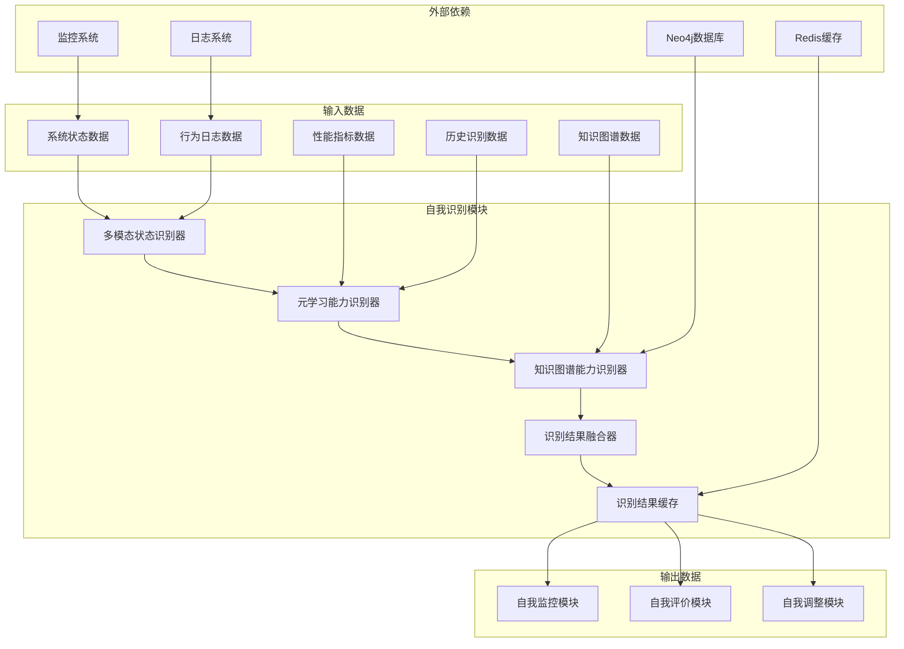

# 自我识别模块实现工作流

## 1. 模块概述

自我识别模块是自我意识子系统的核心组件，负责对AI系统自身的身份、状态和能力进行全面识别和评估。该模块通过多模态感知和元学习能力，实现对系统内部状态的实时监控和动态评估，为自我监控、自我评价和自我调整模块提供基础数据支持。

### 1.1 功能职责

- **身份识别**：识别系统的基本身份信息，包括系统类型、版本号、配置参数等
- **状态识别**：实时监控系统运行状态，包括CPU、内存、网络等资源使用情况
- **能力识别**：评估系统的各项能力水平，包括感知、认知、决策和执行能力
- **动态更新**：根据系统运行情况动态更新识别结果，保持识别结果的时效性

### 1.2 系统位置

自我识别模块位于自我意识子系统的最前端，是整个自我意识系统的数据来源。它接收来自感知处理子系统的原始数据，处理后传递给自我监控、自我评价和自我调整模块。

### 1.3 关键技术选型

- **多模态感知技术**：基于PyTorch和MediaPipe的多模态数据融合
- **元学习算法**：基于scikit-learn的元学习能力评估
- **知识图谱技术**：基于Neo4j的知识图谱构建和查询
- **实时数据处理**：基于Redis的实时数据缓存和交换
- **API接口技术**：基于FastAPI的RESTful API接口

## 2. 技术架构

### 2.1 整体架构图



### 2.2 技术栈集成

| 技术组件 | 版本要求 | 用途说明 | 集成方式 |
|---------|---------|---------|---------|
| Python | 3.9+ | 主要开发语言 | 基础环境 |
| PyTorch | 1.12+ | 深度学习框架 | 多模态数据处理 |
| scikit-learn | 1.1+ | 机器学习库 | 元学习算法实现 |
| Neo4j | 4.4+ | 图数据库 | 知识图谱存储 |
| Redis | 6.2+ | 内存数据库 | 实时数据缓存 |
| FastAPI | 0.85+ | API框架 | RESTful接口 |
| MediaPipe | 0.8+ | 多模态处理 | 音视频数据处理 |
| Docker | 20.10+ | 容器化部署 | 环境隔离 |

## 3. 核心组件实现

### 3.1 多模态状态识别器

多模态状态识别器负责从多个数据源收集和处理系统状态信息，包括系统资源使用情况、行为日志和性能指标等。

```python
import numpy as np
import pandas as pd
from typing import Dict, List, Any, Optional
from datetime import datetime
import logging

class MultiModalStateIdentifier:
    """多模态状态识别器"""
    
    def __init__(self, config: Dict[str, Any]):
        """
        初始化多模态状态识别器
        
        Args:
            config: 配置参数，包含数据源配置、模型参数等
        """
        self.config = config
        self.logger = logging.getLogger(__name__)
        
        # 初始化数据源连接
        self._init_data_sources()
        
        # 初始化状态识别模型
        self._init_state_models()
        
        # 状态历史记录
        self.state_history = []
        
    def _init_data_sources(self):
        """初始化数据源连接"""
        # 系统监控数据源
        self.monitoring_client = self._connect_monitoring_system()
        
        # 日志系统数据源
        self.log_client = self._connect_log_system()
        
        # 性能指标数据源
        self.metrics_client = self._connect_metrics_system()
        
    def _init_state_models(self):
        """初始化状态识别模型"""
        # 加载预训练的状态识别模型
        self.state_models = {}
        
        # 系统资源状态识别模型
        self.state_models['resource'] = self._load_resource_state_model()
        
        # 行为状态识别模型
        self.state_models['behavior'] = self._load_behavior_state_model()
        
        # 性能状态识别模型
        self.state_models['performance'] = self._load_performance_state_model()
        
    def identify_current_state(self) -> Dict[str, Any]:
        """
        识别当前系统状态
        
        Returns:
            包含多维度状态信息的字典
        """
        # 收集多模态数据
        resource_data = self._collect_resource_data()
        behavior_data = self._collect_behavior_data()
        performance_data = self._collect_performance_data()
        
        # 多模态数据融合
        fused_data = self._fuse_multimodal_data(
            resource_data, behavior_data, performance_data
        )
        
        # 状态识别
        state_info = self._identify_state(fused_data)
        
        # 更新状态历史
        self._update_state_history(state_info)
        
        return state_info
    
    def _collect_resource_data(self) -> Dict[str, Any]:
        """收集系统资源数据"""
        try:
            # 从监控系统获取资源使用情况
            resource_usage = self.monitoring_client.get_resource_usage()
            
            # 数据预处理
            processed_data = self._preprocess_resource_data(resource_usage)
            
            return {
                'timestamp': datetime.now().isoformat(),
                'data': processed_data,
                'source': 'monitoring_system'
            }
        except Exception as e:
            self.logger.error(f"收集资源数据失败: {str(e)}")
            return self._get_default_resource_data()
    
    def _collect_behavior_data(self) -> Dict[str, Any]:
        """收集行为数据"""
        try:
            # 从日志系统获取行为记录
            behavior_logs = self.log_client.get_recent_behavior_logs(
                time_window=self.config.get('behavior_time_window', 3600)  # 默认1小时
            )
            
            # 行为特征提取
            behavior_features = self._extract_behavior_features(behavior_logs)
            
            return {
                'timestamp': datetime.now().isoformat(),
                'data': behavior_features,
                'source': 'log_system'
            }
        except Exception as e:
            self.logger.error(f"收集行为数据失败: {str(e)}")
            return self._get_default_behavior_data()
    
    def _collect_performance_data(self) -> Dict[str, Any]:
        """收集性能数据"""
        try:
            # 从性能指标系统获取性能数据
            performance_metrics = self.metrics_client.get_performance_metrics(
                time_window=self.config.get('performance_time_window', 1800)  # 默认30分钟
            )
            
            # 性能特征提取
            performance_features = self._extract_performance_features(performance_metrics)
            
            return {
                'timestamp': datetime.now().isoformat(),
                'data': performance_features,
                'source': 'metrics_system'
            }
        except Exception as e:
            self.logger.error(f"收集性能数据失败: {str(e)}")
            return self._get_default_performance_data()
    
    def _fuse_multimodal_data(self, resource_data: Dict[str, Any], 
                             behavior_data: Dict[str, Any], 
                             performance_data: Dict[str, Any]) -> Dict[str, Any]:
        """
        融合多模态数据
        
        Args:
            resource_data: 资源数据
            behavior_data: 行为数据
            performance_data: 性能数据
            
        Returns:
            融合后的数据
        """
        # 数据对齐
        aligned_data = self._align_multimodal_data(
            resource_data, behavior_data, performance_data
        )
        
        # 特征级融合
        fused_features = self._feature_level_fusion(aligned_data)
        
        # 决策级融合
        fused_data = self._decision_level_fusion(fused_features)
        
        return fused_data
    
    def _identify_state(self, fused_data: Dict[str, Any]) -> Dict[str, Any]:
        """
        基于融合数据识别系统状态
        
        Args:
            fused_data: 融合后的多模态数据
            
        Returns:
            状态识别结果
        """
        state_info = {
            'timestamp': datetime.now().isoformat(),
            'identity': self._identify_identity(fused_data),
            'resource_state': self._identify_resource_state(fused_data),
            'behavior_state': self._identify_behavior_state(fused_data),
            'performance_state': self._identify_performance_state(fused_data),
            'overall_state': self._identify_overall_state(fused_data)
        }
        
        return state_info
    
    def _update_state_history(self, state_info: Dict[str, Any]):
        """
        更新状态历史记录
        
        Args:
            state_info: 状态识别结果
        """
        # 添加到历史记录
        self.state_history.append(state_info)
        
        # 保持历史记录在合理范围内
        max_history_size = self.config.get('max_history_size', 1000)
        if len(self.state_history) > max_history_size:
            self.state_history = self.state_history[-max_history_size:]
    
    # 以下是辅助方法的具体实现
    def _connect_monitoring_system(self):
        """连接监控系统"""
        # 实现监控系统连接逻辑
        pass
    
    def _connect_log_system(self):
        """连接日志系统"""
        # 实现日志系统连接逻辑
        pass
    
    def _connect_metrics_system(self):
        """连接性能指标系统"""
        # 实现性能指标系统连接逻辑
        pass
    
    def _load_resource_state_model(self):
        """加载资源状态识别模型"""
        # 实现模型加载逻辑
        pass
    
    def _load_behavior_state_model(self):
        """加载行为状态识别模型"""
        # 实现模型加载逻辑
        pass
    
    def _load_performance_state_model(self):
        """加载性能状态识别模型"""
        # 实现模型加载逻辑
        pass
    
    def _preprocess_resource_data(self, raw_data):
        """预处理资源数据"""
        # 实现数据预处理逻辑
        pass
    
    def _extract_behavior_features(self, behavior_logs):
        """提取行为特征"""
        # 实现特征提取逻辑
        pass
    
    def _extract_performance_features(self, performance_metrics):
        """提取性能特征"""
        # 实现特征提取逻辑
        pass
    
    def _get_default_resource_data(self):
        """获取默认资源数据"""
        # 返回默认资源数据
        pass
    
    def _get_default_behavior_data(self):
        """获取默认行为数据"""
        # 返回默认行为数据
        pass
    
    def _get_default_performance_data(self):
        """获取默认性能数据"""
        # 返回默认性能数据
        pass
    
    def _align_multimodal_data(self, resource_data, behavior_data, performance_data):
        """对齐多模态数据"""
        # 实现数据对齐逻辑
        pass
    
    def _feature_level_fusion(self, aligned_data):
        """特征级融合"""
        # 实现特征级融合逻辑
        pass
    
    def _decision_level_fusion(self, fused_features):
        """决策级融合"""
        # 实现决策级融合逻辑
        pass
    
    def _identify_identity(self, fused_data):
        """识别系统身份"""
        # 实现身份识别逻辑
        pass
    
    def _identify_resource_state(self, fused_data):
        """识别资源状态"""
        # 实现资源状态识别逻辑
        pass
    
    def _identify_behavior_state(self, fused_data):
        """识别行为状态"""
        # 实现行为状态识别逻辑
        pass
    
    def _identify_performance_state(self, fused_data):
        """识别性能状态"""
        # 实现性能状态识别逻辑
        pass
    
    def _identify_overall_state(self, fused_data):
        """识别整体状态"""
        # 实现整体状态识别逻辑
        pass
```

### 3.2 元学习能力识别器

元学习能力识别器负责评估系统的元学习能力，包括学习能力、适应能力、迁移能力和创新能力等。

```python
import numpy as np
import pandas as pd
from typing import Dict, List, Any, Optional, Tuple
from datetime import datetime, timedelta
import logging
from sklearn.ensemble import RandomForestRegressor, GradientBoostingClassifier
from sklearn.cluster import KMeans
from sklearn.preprocessing import StandardScaler
from sklearn.metrics import silhouette_score

class MetaLearningCapabilityIdentifier:
    """元学习能力识别器"""
    
    def __init__(self, config: Dict[str, Any]):
        """
        初始化元学习能力识别器
        
        Args:
            config: 配置参数，包含模型参数、评估指标等
        """
        self.config = config
        self.logger = logging.getLogger(__name__)
        
        # 初始化能力评估模型
        self._init_capability_models()
        
        # 初始化特征提取器
        self._init_feature_extractors()
        
        # 能力历史记录
        self.capability_history = []
        
        # 能力基准
        self.capability_benchmarks = self._load_capability_benchmarks()
        
    def _init_capability_models(self):
        """初始化能力评估模型"""
        # 学习能力评估模型
        self.learning_model = RandomForestRegressor(
            n_estimators=self.config.get('learning_n_estimators', 100),
            max_depth=self.config.get('learning_max_depth', 10),
            random_state=42
        )
        
        # 适应能力评估模型
        self.adaptation_model = GradientBoostingClassifier(
            n_estimators=self.config.get('adaptation_n_estimators', 100),
            learning_rate=self.config.get('adaptation_learning_rate', 0.1),
            max_depth=self.config.get('adaptation_max_depth', 6),
            random_state=42
        )
        
        # 迁移能力评估模型
        self.transfer_model = KMeans(
            n_clusters=self.config.get('transfer_n_clusters', 5),
            random_state=42
        )
        
        # 创新能力评估模型
        self.innovation_model = RandomForestRegressor(
            n_estimators=self.config.get('innovation_n_estimators', 100),
            max_depth=self.config.get('innovation_max_depth', 10),
            random_state=42
        )
        
        # 特征标准化器
        self.feature_scaler = StandardScaler()
        
    def _init_feature_extractors(self):
        """初始化特征提取器"""
        # 学习特征提取器
        self.learning_feature_extractor = self._init_learning_feature_extractor()
        
        # 适应特征提取器
        self.adaptation_feature_extractor = self._init_adaptation_feature_extractor()
        
        # 迁移特征提取器
        self.transfer_feature_extractor = self._init_transfer_feature_extractor()
        
        # 创新特征提取器
        self.innovation_feature_extractor = self._init_innovation_feature_extractor()
        
    def identify_capabilities(self, state_history: List[Dict[str, Any]], 
                            behavior_logs: List[Dict[str, Any]], 
                            performance_metrics: List[Dict[str, Any]]) -> Dict[str, Any]:
        """
        识别系统能力
        
        Args:
            state_history: 状态历史记录
            behavior_logs: 行为日志
            performance_metrics: 性能指标
            
        Returns:
            能力识别结果
        """
        # 提取能力特征
        capability_features = self._extract_capability_features(
            state_history, behavior_logs, performance_metrics
        )
        
        # 评估各项能力
        learning_capability = self._evaluate_learning_capability(capability_features)
        adaptation_capability = self._evaluate_adaptation_capability(capability_features)
        transfer_capability = self._evaluate_transfer_capability(capability_features)
        innovation_capability = self._evaluate_innovation_capability(capability_features)
        
        # 融合能力评估结果
        overall_capability = self._fuse_capability_results(
            learning_capability, adaptation_capability, 
            transfer_capability, innovation_capability
        )
        
        # 构建能力识别结果
        capability_info = {
            'timestamp': datetime.now().isoformat(),
            'learning_capability': learning_capability,
            'adaptation_capability': adaptation_capability,
            'transfer_capability': transfer_capability,
            'innovation_capability': innovation_capability,
            'overall_capability': overall_capability,
            'capability_trends': self._analyze_capability_trends(),
            'capability_benchmarks': self._compare_with_benchmarks(overall_capability)
        }
        
        # 更新能力历史记录
        self._update_capability_history(capability_info)
        
        return capability_info
    
    def _extract_capability_features(self, state_history: List[Dict[str, Any]], 
                                  behavior_logs: List[Dict[str, Any]], 
                                  performance_metrics: List[Dict[str, Any]]) -> Dict[str, Any]:
        """
        提取能力特征
        
        Args:
            state_history: 状态历史记录
            behavior_logs: 行为日志
            performance_metrics: 性能指标
            
        Returns:
            能力特征字典
        """
        # 提取学习能力特征
        learning_features = self._extract_learning_features(
            state_history, behavior_logs, performance_metrics
        )
        
        # 提取适应能力特征
        adaptation_features = self._extract_adaptation_features(
            state_history, behavior_logs, performance_metrics
        )
        
        # 提取迁移能力特征
        transfer_features = self._extract_transfer_features(
            state_history, behavior_logs, performance_metrics
        )
        
        # 提取创新能力特征
        innovation_features = self._extract_innovation_features(
            state_history, behavior_logs, performance_metrics
        )
        
        # 提取反馈特征
        feedback_features = self._extract_feedback_features(behavior_logs)
        
        # 提取资源特征
        resource_features = self._extract_resource_features(state_history)
        
        # 提取任务特征
        task_features = self._extract_task_features(behavior_logs)
        
        return {
            'learning_features': learning_features,
            'adaptation_features': adaptation_features,
            'transfer_features': transfer_features,
            'innovation_features': innovation_features,
            'feedback_features': feedback_features,
            'resource_features': resource_features,
            'task_features': task_features
        }
    
    def _evaluate_learning_capability(self, capability_features: Dict[str, Any]) -> Dict[str, Any]:
        """
        评估学习能力
        
        Args:
            capability_features: 能力特征
            
        Returns:
            学习能力评估结果
        """
        # 准备学习特征
        learning_features = capability_features['learning_features']
        
        # 特征预处理
        processed_features = self._preprocess_learning_features(learning_features)
        
        # 学习能力评分
        learning_score = self._calculate_learning_score(processed_features)
        
        # 学习能力维度分析
        learning_dimensions = self._analyze_learning_dimensions(processed_features)
        
        # 学习能力水平评估
        learning_level = self._assess_learning_level(learning_score, learning_dimensions)
        
        # 学习能力稳定性分析
        learning_stability = self._analyze_learning_stability(processed_features)
        
        # 学习能力适应性分析
        learning_adaptability = self._analyze_learning_adaptability(processed_features)
        
        # 学习能力改进建议
        improvement_suggestions = self._generate_learning_improvement_suggestions(
            learning_score, learning_dimensions, learning_level
        )
        
        return {
            'score': learning_score,
            'dimensions': learning_dimensions,
            'level': learning_level,
            'stability': learning_stability,
            'adaptability': learning_adaptability,
            'improvement_suggestions': improvement_suggestions
        }
    
    def _evaluate_adaptation_capability(self, capability_features: Dict[str, Any]) -> Dict[str, Any]:
        """
        评估适应能力
        
        Args:
            capability_features: 能力特征
            
        Returns:
            适应能力评估结果
        """
        # 准备适应特征
        adaptation_features = capability_features['adaptation_features']
        
        # 特征预处理
        processed_features = self._preprocess_adaptation_features(adaptation_features)
        
        # 适应能力评分
        adaptation_score = self._calculate_adaptation_score(processed_features)
        
        # 适应能力维度分析
        adaptation_dimensions = self._analyze_adaptation_dimensions(processed_features)
        
        # 适应能力水平评估
        adaptation_level = self._assess_adaptation_level(adaptation_score, adaptation_dimensions)
        
        # 适应能力稳定性分析
        adaptation_stability = self._analyze_adaptation_stability(processed_features)
        
        # 适应能力适应性分析
        adaptation_adaptability = self._analyze_adaptation_adaptability(processed_features)
        
        # 适应能力改进建议
        improvement_suggestions = self._generate_adaptation_improvement_suggestions(
            adaptation_score, adaptation_dimensions, adaptation_level
        )
        
        return {
            'score': adaptation_score,
            'dimensions': adaptation_dimensions,
            'level': adaptation_level,
            'stability': adaptation_stability,
            'adaptability': adaptation_adaptability,
            'improvement_suggestions': improvement_suggestions
        }
    
    def _evaluate_transfer_capability(self, capability_features: Dict[str, Any]) -> Dict[str, Any]:
        """
        评估迁移能力
        
        Args:
            capability_features: 能力特征
            
        Returns:
            迁移能力评估结果
        """
        # 准备迁移特征
        transfer_features = capability_features['transfer_features']
        
        # 特征预处理
        processed_features = self._preprocess_transfer_features(transfer_features)
        
        # 迁移能力评分
        transfer_score = self._calculate_transfer_score(processed_features)
        
        # 迁移能力维度分析
        transfer_dimensions = self._analyze_transfer_dimensions(processed_features)
        
        # 迁移能力水平评估
        transfer_level = self._assess_transfer_level(transfer_score, transfer_dimensions)
        
        # 迁移能力稳定性分析
        transfer_stability = self._analyze_transfer_stability(processed_features)
        
        # 迁移能力适应性分析
        transfer_adaptability = self._analyze_transfer_adaptability(processed_features)
        
        # 迁移能力改进建议
        improvement_suggestions = self._generate_transfer_improvement_suggestions(
            transfer_score, transfer_dimensions, transfer_level
        )
        
        return {
            'score': transfer_score,
            'dimensions': transfer_dimensions,
            'level': transfer_level,
            'stability': transfer_stability,
            'adaptability': transfer_adaptability,
            'improvement_suggestions': improvement_suggestions
        }
    
    def _evaluate_innovation_capability(self, capability_features: Dict[str, Any]) -> Dict[str, Any]:
        """
        评估创新能力
        
        Args:
            capability_features: 能力特征
            
        Returns:
            创新能力评估结果
        """
        # 准备创新特征
        innovation_features = capability_features['innovation_features']
        
        # 特征预处理
        processed_features = self._preprocess_innovation_features(innovation_features)
        
        # 创新能力评分
        innovation_score = self._calculate_innovation_score(processed_features)
        
        # 创新能力维度分析
        innovation_dimensions = self._analyze_innovation_dimensions(processed_features)
        
        # 创新能力水平评估
        innovation_level = self._assess_innovation_level(innovation_score, innovation_dimensions)
        
        # 创新能力稳定性分析
        innovation_stability = self._analyze_innovation_stability(processed_features)
        
        # 创新能力适应性分析
        innovation_adaptability = self._analyze_innovation_adaptability(processed_features)
        
        # 创新能力改进建议
        improvement_suggestions = self._generate_innovation_improvement_suggestions(
            innovation_score, innovation_dimensions, innovation_level
        )
        
        return {
            'score': innovation_score,
            'dimensions': innovation_dimensions,
            'level': innovation_level,
            'stability': innovation_stability,
            'adaptability': innovation_adaptability,
            'improvement_suggestions': improvement_suggestions
        }
    
    def _fuse_capability_results(self, learning_capability: Dict[str, Any], 
                                adaptation_capability: Dict[str, Any], 
                                transfer_capability: Dict[str, Any], 
                                innovation_capability: Dict[str, Any]) -> Dict[str, Any]:
        """
        融合能力评估结果
        
        Args:
            learning_capability: 学习能力评估结果
            adaptation_capability: 适应能力评估结果
            transfer_capability: 迁移能力评估结果
            innovation_capability: 创新能力评估结果
            
        Returns:
            融合后的能力评估结果
        """
        # 计算综合能力评分
        overall_score = self._calculate_overall_capability_score(
            learning_capability['score'],
            adaptation_capability['score'],
            transfer_capability['score'],
            innovation_capability['score']
        )
        
        # 分析能力均衡性
        capability_balance = self._analyze_capability_balance(
            learning_capability['score'],
            adaptation_capability['score'],
            transfer_capability['score'],
            innovation_capability['score']
        )
        
        # 识别能力优势与劣势
        capability_strengths_weaknesses = self._identify_capability_strengths_weaknesses(
            learning_capability, adaptation_capability, 
            transfer_capability, innovation_capability
        )
        
        # 预测能力发展趋势
        capability_trends = self._predict_capability_trends()
        
        # 生成能力发展建议
        development_suggestions = self._generate_capability_development_suggestions(
            overall_score, capability_balance, capability_strengths_weaknesses
        )
        
        return {
            'score': overall_score,
            'balance': capability_balance,
            'strengths_weaknesses': capability_strengths_weaknesses,
            'trends': capability_trends,
            'development_suggestions': development_suggestions
        }
    
    def _analyze_capability_trends(self) -> Dict[str, Any]:
        """
        分析能力发展趋势
        
        Returns:
            能力趋势分析结果
        """
        if len(self.capability_history) < 3:
            return {
                'trend': 'insufficient_data',
                'description': '历史数据不足，无法分析趋势',
                'confidence': 0.0
            }
        
        # 提取历史能力评分
        recent_scores = []
        for record in self.capability_history[-10:]:  # 最近10次记录
            overall_score = record['overall_capability']['score']
            recent_scores.append(overall_score)
        
        # 计算趋势
        if len(recent_scores) >= 3:
            # 简单线性回归分析趋势
            x = np.arange(len(recent_scores))
            y = np.array(recent_scores)
            
            # 计算斜率
            slope = np.polyfit(x, y, 1)[0]
            
            # 确定趋势方向
            if slope > 0.05:
                trend = 'improving'
                description = '能力呈上升趋势'
            elif slope < -0.05:
                trend = 'declining'
                description = '能力呈下降趋势'
            else:
                trend = 'stable'
                description = '能力保持稳定'
            
            # 计算趋势置信度
            confidence = min(abs(slope) * 10, 1.0)  # 简单计算置信度
        else:
            trend = 'unclear'
            description = '数据点不足，趋势不明确'
            confidence = 0.0
        
        return {
            'trend': trend,
            'description': description,
            'confidence': confidence,
            'recent_scores': recent_scores
        }
    
    def _compare_with_benchmarks(self, overall_capability: Dict[str, Any]) -> Dict[str, Any]:
        """
        与能力基准比较
        
        Args:
            overall_capability: 综合能力评估结果
            
        Returns:
            基准比较结果
        """
        # 获取当前能力评分
        current_score = overall_capability['score']
        
        # 与同类型系统基准比较
        same_type_comparison = self._compare_with_same_type_benchmark(current_score)
        
        # 与行业基准比较
        industry_comparison = self._compare_with_industry_benchmark(current_score)
        
        # 与理想状态比较
        ideal_comparison = self._compare_with_ideal_benchmark(current_score)
        
        # 与历史最佳比较
        historical_best_comparison = self._compare_with_historical_best(current_score)
        
        return {
            'same_type': same_type_comparison,
            'industry': industry_comparison,
            'ideal': ideal_comparison,
            'historical_best': historical_best_comparison
        }
    
    def _update_capability_history(self, capability_info: Dict[str, Any]):
        """
        更新能力历史记录
        
        Args:
            capability_info: 能力识别结果
        """
        # 添加到历史记录
        self.capability_history.append(capability_info)
        
        # 保持历史记录在合理范围内
        max_history_size = self.config.get('max_history_size', 1000)
        if len(self.capability_history) > max_history_size:
            self.capability_history = self.capability_history[-max_history_size:]
    
    # 以下是辅助方法的具体实现
    def _load_capability_benchmarks(self):
        """加载能力基准"""
        # 实现基准加载逻辑
        pass
    
    def _init_learning_feature_extractor(self):
        """初始化学习特征提取器"""
        # 实现特征提取器初始化逻辑
        pass
    
    def _init_adaptation_feature_extractor(self):
        """初始化适应特征提取器"""
        # 实现特征提取器初始化逻辑
        pass
    
    def _init_transfer_feature_extractor(self):
        """初始化迁移特征提取器"""
        # 实现特征提取器初始化逻辑
        pass
    
    def _init_innovation_feature_extractor(self):
        """初始化创新特征提取器"""
        # 实现特征提取器初始化逻辑
        pass
    
    def _extract_learning_features(self, state_history, behavior_logs, performance_metrics):
        """提取学习能力特征"""
        # 实现特征提取逻辑
        pass
    
    def _extract_adaptation_features(self, state_history, behavior_logs, performance_metrics):
        """提取适应能力特征"""
        # 实现特征提取逻辑
        pass
    
    def _extract_transfer_features(self, state_history, behavior_logs, performance_metrics):
        """提取迁移能力特征"""
        # 实现特征提取逻辑
        pass
    
    def _extract_innovation_features(self, state_history, behavior_logs, performance_metrics):
        """提取创新能力特征"""
        # 实现特征提取逻辑
        pass
    
    def _extract_feedback_features(self, behavior_logs):
        """提取反馈特征"""
        # 实现特征提取逻辑
        pass
    
    def _extract_resource_features(self, state_history):
        """提取资源特征"""
        # 实现特征提取逻辑
        pass
    
    def _extract_task_features(self, behavior_logs):
        """提取任务特征"""
        # 实现特征提取逻辑
        pass
    
    def _preprocess_learning_features(self, learning_features):
        """预处理学习特征"""
        # 实现特征预处理逻辑
        pass
    
    def _calculate_learning_score(self, processed_features):
        """计算学习能力评分"""
        # 实现评分计算逻辑
        pass
    
    def _analyze_learning_dimensions(self, processed_features):
        """分析学习能力维度"""
        # 实现维度分析逻辑
        pass
    
    def _assess_learning_level(self, learning_score, learning_dimensions):
        """评估学习能力水平"""
        # 实现水平评估逻辑
        pass
    
    def _analyze_learning_stability(self, processed_features):
        """分析学习能力稳定性"""
        # 实现稳定性分析逻辑
        pass
    
    def _analyze_learning_adaptability(self, processed_features):
        """分析学习能力适应性"""
        # 实现适应性分析逻辑
        pass
    
    def _generate_learning_improvement_suggestions(self, learning_score, learning_dimensions, learning_level):
        """生成学习能力改进建议"""
        # 实现改进建议生成逻辑
        pass
    
    def _preprocess_adaptation_features(self, adaptation_features):
        """预处理适应特征"""
        # 实现特征预处理逻辑
        pass
    
    def _calculate_adaptation_score(self, processed_features):
        """计算适应能力评分"""
        # 实现评分计算逻辑
        pass
    
    def _analyze_adaptation_dimensions(self, processed_features):
        """分析适应能力维度"""
        # 实现维度分析逻辑
        pass
    
    def _assess_adaptation_level(self, adaptation_score, adaptation_dimensions):
        """评估适应能力水平"""
        # 实现水平评估逻辑
        pass
    
    def _analyze_adaptation_stability(self, processed_features):
        """分析适应能力稳定性"""
        # 实现稳定性分析逻辑
        pass
    
    def _analyze_adaptation_adaptability(self, processed_features):
        """分析适应能力适应性"""
        # 实现适应性分析逻辑
        pass
    
    def _generate_adaptation_improvement_suggestions(self, adaptation_score, adaptation_dimensions, adaptation_level):
        """生成适应能力改进建议"""
        # 实现改进建议生成逻辑
        pass
    
    def _preprocess_transfer_features(self, transfer_features):
        """预处理迁移特征"""
        # 实现特征预处理逻辑
        pass
    
    def _calculate_transfer_score(self, processed_features):
        """计算迁移能力评分"""
        # 实现评分计算逻辑
        pass
    
    def _analyze_transfer_dimensions(self, processed_features):
        """分析迁移能力维度"""
        # 实现维度分析逻辑
        pass
    
    def _assess_transfer_level(self, transfer_score, transfer_dimensions):
        """评估迁移能力水平"""
        # 实现水平评估逻辑
        pass
    
    def _analyze_transfer_stability(self, processed_features):
        """分析迁移能力稳定性"""
        # 实现稳定性分析逻辑
        pass
    
    def _analyze_transfer_adaptability(self, processed_features):
        """分析迁移能力适应性"""
        # 实现适应性分析逻辑
        pass
    
    def _generate_transfer_improvement_suggestions(self, transfer_score, transfer_dimensions, transfer_level):
        """生成迁移能力改进建议"""
        # 实现改进建议生成逻辑
        pass
    
    def _preprocess_innovation_features(self, innovation_features):
        """预处理创新特征"""
        # 实现特征预处理逻辑
        pass
    
    def _calculate_innovation_score(self, processed_features):
        """计算创新能力评分"""
        # 实现评分计算逻辑
        pass
    
    def _analyze_innovation_dimensions(self, processed_features):
        """分析创新能力维度"""
        # 实现维度分析逻辑
        pass
    
    def _assess_innovation_level(self, innovation_score, innovation_dimensions):
        """评估创新能力水平"""
        # 实现水平评估逻辑
        pass
    
    def _analyze_innovation_stability(self, processed_features):
        """分析创新能力稳定性"""
        # 实现稳定性分析逻辑
        pass
    
    def _analyze_innovation_adaptability(self, processed_features):
        """分析创新能力适应性"""
        # 实现适应性分析逻辑
        pass
    
    def _generate_innovation_improvement_suggestions(self, innovation_score, innovation_dimensions, innovation_level):
        """生成创新能力改进建议"""
        # 实现改进建议生成逻辑
        pass
    
    def _calculate_overall_capability_score(self, learning_score, adaptation_score, transfer_score, innovation_score):
        """计算综合能力评分"""
        # 实现综合评分计算逻辑
        pass
    
    def _analyze_capability_balance(self, learning_score, adaptation_score, transfer_score, innovation_score):
        """分析能力均衡性"""
        # 实现均衡性分析逻辑
        pass
    
    def _identify_capability_strengths_weaknesses(self, learning_capability, adaptation_capability, transfer_capability, innovation_capability):
        """识别能力优势与劣势"""
        # 实现优势劣势识别逻辑
        pass
    
    def _predict_capability_trends(self):
        """预测能力发展趋势"""
        # 实现趋势预测逻辑
        pass
    
    def _generate_capability_development_suggestions(self, overall_score, capability_balance, capability_strengths_weaknesses):
        """生成能力发展建议"""
        # 实现发展建议生成逻辑
        pass
    
    def _compare_with_same_type_benchmark(self, current_score):
        """与同类型系统基准比较"""
        # 实现基准比较逻辑
        pass
    
    def _compare_with_industry_benchmark(self, current_score):
        """与行业基准比较"""
        # 实现基准比较逻辑
        pass
    
    def _compare_with_ideal_benchmark(self, current_score):
        """与理想状态比较"""
        # 实现基准比较逻辑
        pass
    
    def _compare_with_historical_best(self, current_score):
        """与历史最佳比较"""
        # 实现基准比较逻辑
        pass
```

## 4. API接口实现

### 4.1 FastAPI路由定义

```python
from fastapi import FastAPI, HTTPException, Depends, BackgroundTasks
from fastapi.middleware.cors import CORSMiddleware
from pydantic import BaseModel, Field
from typing import Dict, List, Any, Optional
import logging
from datetime import datetime
import asyncio

# 创建FastAPI应用实例
app = FastAPI(
    title="自我识别模块API",
    description="真实婴儿AI管家系统自我识别模块的RESTful API接口",
    version="1.0.0"
)

# 配置CORS中间件
app.add_middleware(
    CORSMiddleware,
    allow_origins=["*"],  # 在生产环境中应该设置具体的允许来源
    allow_credentials=True,
    allow_methods=["*"],
    allow_headers=["*"],
)

# 配置日志
logging.basicConfig(level=logging.INFO)
logger = logging.getLogger(__name__)

# 全局变量存储识别器实例
state_identifier = None
capability_identifier = None
identity_identifier = None

# 请求和响应模型定义
class StateIdentificationRequest(BaseModel):
    """状态识别请求模型"""
    time_window: Optional[int] = Field(3600, description="时间窗口（秒），默认为1小时")
    include_historical: Optional[bool] = Field(True, description="是否包含历史数据")
    detail_level: Optional[str] = Field("standard", description="详细级别：basic, standard, detailed")

class StateIdentificationResponse(BaseModel):
    """状态识别响应模型"""
    timestamp: str = Field(..., description="识别时间戳")
    identity: Dict[str, Any] = Field(..., description="身份信息")
    resource_state: Dict[str, Any] = Field(..., description="资源状态")
    behavior_state: Dict[str, Any] = Field(..., description="行为状态")
    performance_state: Dict[str, Any] = Field(..., description="性能状态")
    overall_state: Dict[str, Any] = Field(..., description="整体状态")
    historical_trends: Optional[Dict[str, Any]] = Field(None, description="历史趋势")

class CapabilityIdentificationRequest(BaseModel):
    """能力识别请求模型"""
    time_window: Optional[int] = Field(7200, description="时间窗口（秒），默认为2小时")
    include_improvement_suggestions: Optional[bool] = Field(True, description="是否包含改进建议")
    benchmark_comparison: Optional[bool] = Field(True, description="是否进行基准比较")

class CapabilityIdentificationResponse(BaseModel):
    """能力识别响应模型"""
    timestamp: str = Field(..., description="识别时间戳")
    learning_capability: Dict[str, Any] = Field(..., description="学习能力")
    adaptation_capability: Dict[str, Any] = Field(..., description="适应能力")
    transfer_capability: Dict[str, Any] = Field(..., description="迁移能力")
    innovation_capability: Dict[str, Any] = Field(..., description="创新能力")
    overall_capability: Dict[str, Any] = Field(..., description="综合能力")
    capability_trends: Optional[Dict[str, Any]] = Field(None, description="能力趋势")
    capability_benchmarks: Optional[Dict[str, Any]] = Field(None, description="能力基准比较")

class IdentityIdentificationRequest(BaseModel):
    """身份识别请求模型"""
    include_detailed_info: Optional[bool] = Field(True, description="是否包含详细信息")
    update_knowledge_graph: Optional[bool] = Field(True, description="是否更新知识图谱")

class IdentityIdentificationResponse(BaseModel):
    """身份识别响应模型"""
    timestamp: str = Field(..., description="识别时间戳")
    basic_identity: Dict[str, Any] = Field(..., description="基本身份信息")
    detailed_identity: Optional[Dict[str, Any]] = Field(None, description="详细身份信息")
    identity_confidence: float = Field(..., description="身份识别置信度")
    identity_changes: Optional[List[Dict[str, Any]]] = Field(None, description="身份变化记录")

# 启动事件处理
@app.on_event("startup")
async def startup_event():
    """应用启动时初始化识别器"""
    global state_identifier, capability_identifier, identity_identifier
    
    try:
        # 初始化配置
        config = load_config()
        
        # 初始化识别器
        state_identifier = MultiModalStateIdentifier(config['state_identifier'])
        capability_identifier = MetaLearningCapabilityIdentifier(config['capability_identifier'])
        identity_identifier = KnowledgeGraphCapabilityIdentifier(config['identity_identifier'])
        
        logger.info("自我识别模块API服务启动成功")
    except Exception as e:
        logger.error(f"自我识别模块API服务启动失败: {str(e)}")
        raise

# 健康检查接口
@app.get("/health")
async def health_check():
    """健康检查接口"""
    return {
        "status": "healthy",
        "timestamp": datetime.now().isoformat(),
        "service": "self_identification_module"
    }

# 状态识别接口
@app.post("/identify/state", response_model=StateIdentificationResponse)
async def identify_state(request: StateIdentificationRequest):
    """
    状态识别接口
    
    Args:
        request: 状态识别请求参数
        
    Returns:
        状态识别结果
    """
    try:
        # 调用状态识别器
        state_info = state_identifier.identify_current_state()
        
        # 根据请求参数调整返回内容
        if not request.include_historical:
            state_info.pop('historical_trends', None)
        
        # 根据详细级别调整返回内容
        if request.detail_level == "basic":
            # 只返回基本信息
            basic_state_info = {
                'timestamp': state_info['timestamp'],
                'identity': {
                    'system_type': state_info['identity'].get('system_type'),
                    'version': state_info['identity'].get('version')
                },
                'resource_state': {
                    'cpu_usage': state_info['resource_state'].get('cpu_usage'),
                    'memory_usage': state_info['resource_state'].get('memory_usage')
                },
                'overall_state': {
                    'status': state_info['overall_state'].get('status'),
                    'health_score': state_info['overall_state'].get('health_score')
                }
            }
            return basic_state_info
        elif request.detail_level == "detailed":
            # 返回完整信息，不做修改
            return state_info
        else:
            # 标准级别，返回默认信息
            return state_info
            
    except Exception as e:
        logger.error(f"状态识别失败: {str(e)}")
        raise HTTPException(status_code=500, detail=f"状态识别失败: {str(e)}")

# 能力识别接口
@app.post("/identify/capability", response_model=CapabilityIdentificationResponse)
async def identify_capability(request: CapabilityIdentificationRequest):
    """
    能力识别接口
    
    Args:
        request: 能力识别请求参数
        
    Returns:
        能力识别结果
    """
    try:
        # 获取状态历史、行为日志和性能指标
        state_history = get_state_history(request.time_window)
        behavior_logs = get_behavior_logs(request.time_window)
        performance_metrics = get_performance_metrics(request.time_window)
        
        # 调用能力识别器
        capability_info = capability_identifier.identify_capabilities(
            state_history, behavior_logs, performance_metrics
        )
        
        # 根据请求参数调整返回内容
        if not request.include_improvement_suggestions:
            # 移除改进建议
            for capability_type in ['learning_capability', 'adaptation_capability', 
                                   'transfer_capability', 'innovation_capability']:
                if capability_type in capability_info and 'improvement_suggestions' in capability_info[capability_type]:
                    del capability_info[capability_type]['improvement_suggestions']
            
            if 'overall_capability' in capability_info and 'development_suggestions' in capability_info['overall_capability']:
                del capability_info['overall_capability']['development_suggestions']
        
        if not request.benchmark_comparison:
            # 移除基准比较
            if 'capability_benchmarks' in capability_info:
                del capability_info['capability_benchmarks']
        
        return capability_info
        
    except Exception as e:
        logger.error(f"能力识别失败: {str(e)}")
        raise HTTPException(status_code=500, detail=f"能力识别失败: {str(e)}")

# 身份识别接口
@app.post("/identify/identity", response_model=IdentityIdentificationResponse)
async def identify_identity(request: IdentityIdentificationRequest):
    """
    身份识别接口
    
    Args:
        request: 身份识别请求参数
        
    Returns:
        身份识别结果
    """
    try:
        # 调用身份识别器
        identity_info = identity_identifier.identify_identity()
        
        # 根据请求参数调整返回内容
        if not request.include_detailed_info:
            identity_info.pop('detailed_identity', None)
        
        # 根据请求参数决定是否更新知识图谱
        if request.update_knowledge_graph:
            # 异步更新知识图谱
            background_tasks = BackgroundTasks()
            background_tasks.add_task(update_identity_knowledge_graph, identity_info)
        
        return identity_info
        
    except Exception as e:
        logger.error(f"身份识别失败: {str(e)}")
        raise HTTPException(status_code=500, detail=f"身份识别失败: {str(e)}")

# 获取识别维度接口
@app.get("/dimensions")
async def get_identification_dimensions():
    """
    获取识别维度接口
    
    Returns:
        识别维度信息
    """
    try:
        dimensions = {
            "state_dimensions": {
                "identity": ["system_type", "version", "configuration"],
                "resource_state": ["cpu_usage", "memory_usage", "disk_usage", "network_usage"],
                "behavior_state": ["activity_patterns", "interaction_patterns", "error_patterns"],
                "performance_state": ["response_time", "throughput", "accuracy"],
                "overall_state": ["status", "health_score", "stability"]
            },
            "capability_dimensions": {
                "learning_capability": ["learning_speed", "learning_efficiency", "knowledge_retention"],
                "adaptation_capability": ["adaptation_speed", "adaptation_scope", "adaptation_effectiveness"],
                "transfer_capability": ["transfer_scope", "transfer_efficiency", "transfer_accuracy"],
                "innovation_capability": ["novelty_generation", "solution_diversity", "solution_effectiveness"]
            },
            "identity_dimensions": {
                "basic_identity": ["system_id", "system_type", "version", "creation_time"],
                "detailed_identity": ["capabilities", "limitations", "purpose", "architecture"]
            }
        }
        
        return dimensions
        
    except Exception as e:
        logger.error(f"获取识别维度失败: {str(e)}")
        raise HTTPException(status_code=500, detail=f"获取识别维度失败: {str(e)}")

# 辅助函数
def load_config() -> Dict[str, Any]:
    """加载配置"""
    # 实现配置加载逻辑
    pass

def get_state_history(time_window: int) -> List[Dict[str, Any]]:
    """获取状态历史"""
    # 实现状态历史获取逻辑
    pass

def get_behavior_logs(time_window: int) -> List[Dict[str, Any]]:
    """获取行为日志"""
    # 实现行为日志获取逻辑
    pass

def get_performance_metrics(time_window: int) -> List[Dict[str, Any]]:
    """获取性能指标"""
    # 实现性能指标获取逻辑
    pass

async def update_identity_knowledge_graph(identity_info: Dict[str, Any]):
    """更新身份知识图谱"""
    # 实现知识图谱更新逻辑
    pass
```

## 5. 部署配置

### 5.1 Docker配置

```dockerfile
# Dockerfile
FROM python:3.9-slim

# 设置工作目录
WORKDIR /app

# 安装系统依赖
RUN apt-get update && apt-get install -y \
    gcc \
    g++ \
    && rm -rf /var/lib/apt/lists/*

# 复制依赖文件
COPY requirements.txt .

# 安装Python依赖
RUN pip install --no-cache-dir -r requirements.txt

# 复制应用代码
COPY . .

# 暴露端口
EXPOSE 8000

# 启动命令
CMD ["uvicorn", "main:app", "--host", "0.0.0.0", "--port", "8000"]
```

```yaml
# docker-compose.yml
version: '3.8'

services:
  self-identification-api:
    build: .
    ports:
      - "8000:8000"
    environment:
      - REDIS_URL=redis://redis:6379
      - NEO4J_URL=bolt://neo4j:7687
      - NEO4J_USER=neo4j
      - NEO4J_PASSWORD=password
    depends_on:
      - redis
      - neo4j
    volumes:
      - ./logs:/app/logs
    restart: unless-stopped

  redis:
    image: redis:6.2-alpine
    ports:
      - "6379:6379"
    volumes:
      - redis_data:/data
    restart: unless-stopped

  neo4j:
    image: neo4j:4.4-community
    ports:
      - "7474:7474"
      - "7687:7687"
    environment:
      - NEO4J_AUTH=neo4j/password
      - NEO4J_PLUGINS=["apoc"]
      - NEO4J_dbms_security_procedures_unrestricted=apoc.*
    volumes:
      - neo4j_data:/data
      - neo4j_logs:/logs
    restart: unless-stopped

volumes:
  redis_data:
  neo4j_data:
  neo4j_logs:
```

### 5.2 Python客户端使用示例

```python
import requests
import json
from typing import Dict, Any, Optional

class SelfIdentificationClient:
    """自我识别模块客户端"""
    
    def __init__(self, base_url: str = "http://localhost:8000"):
        """
        初始化客户端
        
        Args:
            base_url: API服务基础URL
        """
        self.base_url = base_url.rstrip('/')
        self.session = requests.Session()
        
    def identify_state(self, time_window: Optional[int] = None, 
                      include_historical: Optional[bool] = None,
                      detail_level: Optional[str] = None) -> Dict[str, Any]:
        """
        调用状态识别接口
        
        Args:
            time_window: 时间窗口（秒）
            include_historical: 是否包含历史数据
            detail_level: 详细级别
            
        Returns:
            状态识别结果
        """
        url = f"{self.base_url}/identify/state"
        
        # 构建请求参数
        payload = {}
        if time_window is not None:
            payload['time_window'] = time_window
        if include_historical is not None:
            payload['include_historical'] = include_historical
        if detail_level is not None:
            payload['detail_level'] = detail_level
            
        # 发送请求
        response = self.session.post(url, json=payload)
        response.raise_for_status()
        
        return response.json()
    
    def identify_capability(self, time_window: Optional[int] = None,
                           include_improvement_suggestions: Optional[bool] = None,
                           benchmark_comparison: Optional[bool] = None) -> Dict[str, Any]:
        """
        调用能力识别接口
        
        Args:
            time_window: 时间窗口（秒）
            include_improvement_suggestions: 是否包含改进建议
            benchmark_comparison: 是否进行基准比较
            
        Returns:
            能力识别结果
        """
        url = f"{self.base_url}/identify/capability"
        
        # 构建请求参数
        payload = {}
        if time_window is not None:
            payload['time_window'] = time_window
        if include_improvement_suggestions is not None:
            payload['include_improvement_suggestions'] = include_improvement_suggestions
        if benchmark_comparison is not None:
            payload['benchmark_comparison'] = benchmark_comparison
            
        # 发送请求
        response = self.session.post(url, json=payload)
        response.raise_for_status()
        
        return response.json()
    
    def identify_identity(self, include_detailed_info: Optional[bool] = None,
                         update_knowledge_graph: Optional[bool] = None) -> Dict[str, Any]:
        """
        调用身份识别接口
        
        Args:
            include_detailed_info: 是否包含详细信息
            update_knowledge_graph: 是否更新知识图谱
            
        Returns:
            身份识别结果
        """
        url = f"{self.base_url}/identify/identity"
        
        # 构建请求参数
        payload = {}
        if include_detailed_info is not None:
            payload['include_detailed_info'] = include_detailed_info
        if update_knowledge_graph is not None:
            payload['update_knowledge_graph'] = update_knowledge_graph
            
        # 发送请求
        response = self.session.post(url, json=payload)
        response.raise_for_status()
        
        return response.json()
    
    def get_identification_dimensions(self) -> Dict[str, Any]:
        """
        获取识别维度
        
        Returns:
            识别维度信息
        """
        url = f"{self.base_url}/dimensions"
        
        # 发送请求
        response = self.session.get(url)
        response.raise_for_status()
        
        return response.json()
    
    def health_check(self) -> Dict[str, Any]:
        """
        健康检查
        
        Returns:
            健康状态信息
        """
        url = f"{self.base_url}/health"
        
        # 发送请求
        response = self.session.get(url)
        response.raise_for_status()
        
        return response.json()

# 使用示例
if __name__ == "__main__":
    # 创建客户端
    client = SelfIdentificationClient()
    
    # 健康检查
    print("健康检查:", client.health_check())
    
    # 状态识别
    state_result = client.identify_state(detail_level="basic")
    print("状态识别结果:", json.dumps(state_result, indent=2, ensure_ascii=False))
    
    # 能力识别
    capability_result = client.identify_capability(
        time_window=3600,  # 1小时
        include_improvement_suggestions=True,
        benchmark_comparison=True
    )
    print("能力识别结果:", json.dumps(capability_result, indent=2, ensure_ascii=False))
    
    # 身份识别
    identity_result = client.identify_identity(
        include_detailed_info=True,
        update_knowledge_graph=True
    )
    print("身份识别结果:", json.dumps(identity_result, indent=2, ensure_ascii=False))
    
    # 获取识别维度
    dimensions = client.get_identification_dimensions()
    print("识别维度:", json.dumps(dimensions, indent=2, ensure_ascii=False))
```

## 6. 总结

自我识别模块是自我意识子系统的核心组件，通过多模态状态识别器、元学习能力识别器和知识图谱能力识别器，实现对系统身份、状态和能力的全面识别。该模块采用先进的多模态感知技术、元学习算法和知识图谱技术，能够提供准确、全面的识别结果，为自我监控、自我评价和自我调整模块提供基础数据支持。

### 6.1 模块特点

- **多维度识别**：从身份、状态和能力三个维度进行全方位识别
- **多模态感知**：融合多种数据源，提高识别准确性
- **元学习能力**：评估系统的学习、适应、迁移和创新能力
- **知识图谱**：利用知识图谱技术构建系统能力模型
- **实时性**：提供实时识别结果，满足系统实时监控需求
- **可扩展性**：模块化设计，便于功能扩展和性能优化

### 6.2 技术优势

- **先进算法**：采用最新的机器学习和深度学习算法
- **高性能**：优化的数据处理和模型推理，确保高性能
- **高可靠性**：完善的错误处理和容错机制，确保系统稳定运行
- **易于集成**：标准化的API接口，便于与其他模块集成
- **容器化部署**：支持Docker容器化部署，简化部署和运维

### 6.3 应用场景

自我识别模块可应用于以下场景：

- **系统健康监控**：实时监控系统状态，及时发现异常
- **性能优化**：识别性能瓶颈，提供优化建议
- **能力评估**：评估系统能力水平，指导能力提升
- **自适应调整**：根据识别结果自动调整系统参数
- **智能决策**：为上层决策模块提供准确的系统状态信息

通过自我识别模块，AI系统能够更好地了解自身状态和能力，为实现真正的自我意识奠定基础。